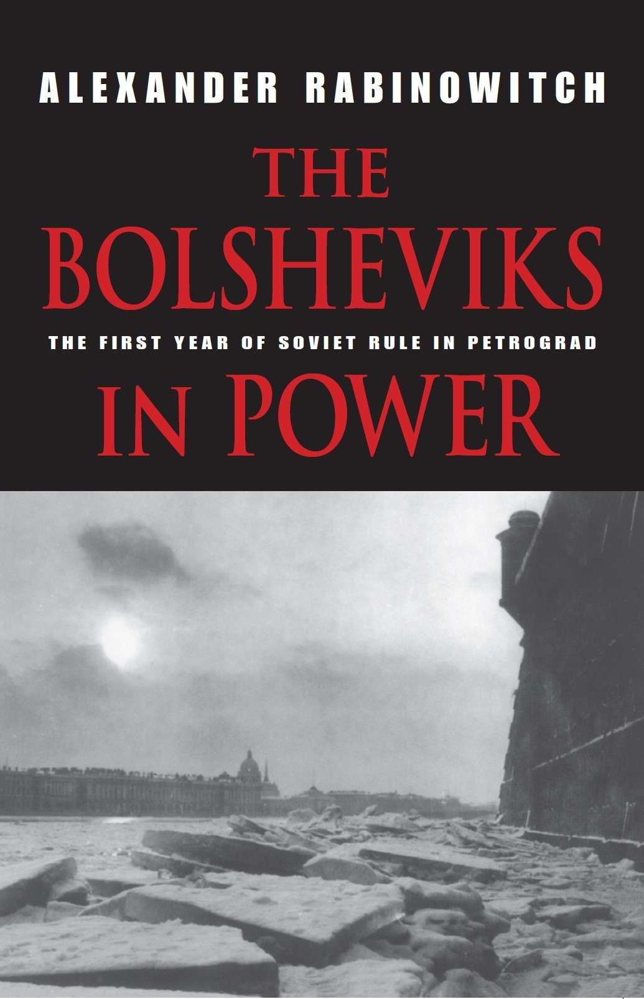

**第一部 温和派的失败** 

**第1章 组建政府** 

全俄苏维埃第二次代表大会开幕会议上的严重挫折，并不能阻止布尔什维克温和派（和其他左翼社会主义团体的人）在苏维埃代表大会期间及随后，努力组建一个清一色社会主义多党政府。此间，他们试图恢复旨在建立广泛的社会主义联盟的运动——在列宁的领导下，恰于苏维埃代表大会开幕前，用暴力推翻了临时政府，这一运动因而遭到严重破坏。事败之际，他们又奋力斗争，以确保由代表大会最终批准的清一色布尔什维克内阁——人民委员会（Совнарком）——严格地向多党的中央执行委员会[^1]负责。

---

25日夜至26日凌晨举行的混乱的代表大会开幕会议，在认可政权转交苏维埃之后便告休会，没有对新政府做出规定。一时间，俄国实际上没有中央政府在运作。10月24日，在推翻临时政府前的最后一次布尔什维克中央委员会会议上，加米涅夫和扬·别尔津[^2]被指派与左翼社革党进行有关后者参加苏维埃政府的谈判。[^3]次日，又就与布尔什维克结盟问题，打探了左翼社革党领导人的口风。[^4]留在还是退出代表大会，以及是否加入新政府，成了10月26日左翼社革党党团会议讨论的主要议题。尽管对已密切共事数周的布尔什维克抱有好感，但左翼社革党党团成员仍然相信这条原则：要使革命继续下去，就必须组建一个广泛的、各苏维埃政党按其在苏维埃代表大会中的代表比例参加的联合政府。为促成这一结果，他们一方面坚称，与布尔什维克和革命群众保持联系是重要的，另一方面又拒绝与布尔什维克共组政府。[^5]26日傍晚，布尔什维克中央委员与左翼社革党领导人举行会谈。其间，左翼社革党表示，除非建立一个成分广泛的社会主义联盟，否则拒绝入阁。[^6]

在与左翼社革党组建政府的努力失败后，加米涅夫最终于10月26日夜9点召开了苏维埃代表大会的第二次会议。他在一片赞同声中，宣布主席团已按照代表大会的决议，签署了如下命令：在前线废除死刑，释放因政治罪入狱的士兵；释放被前政府监禁的土地和农民委员会成员；逮捕克伦斯基。授权实施上述措施的例行法令被欢呼通过。[^7]

当晚的首要议程是政府问题，但由于左翼社革党方面抵制与布尔什维克单独结盟，这一问题的解决变得复杂起来。显然，为了在讨论组成问题之前先确定苏维埃政府的纲领，重新调整了议程。列宁走上讲台，向“一切交战国的人民及其政府”发表了一份和平宣言[^8]。这是列宁首次在代表大会上露面。所有资料都显示，他获得了一阵雷鸣般的掌声。在爆发的掌声的时而打断之下，他的宣言发誓结束秘密外交，建议一切交战国人民及其政府立即休战，并开始就缔结公正民主的和约进行谈判。这份宣言还为世界各地被统治的民族（无论其何时被更大的国家吞并）提供了自决权的理据。[^9]在晚些时候的演讲中，托洛茨基指出，这份宣言首先面向的是全世界革命群众。“我们当然不打算以自己的呼吁来影响帝国主义政府，但只要它们还存在，我们就不能忽视它们，”他说道，“我们的全部希望寄托在我们的革命能够引发欧洲革命之上。如果欧洲人民的起义不能粉碎帝国主义，那我们就将被粉碎。”[^10]

在和平宣言和接踵而至的讨论中，列宁全力强调，“10月24-25日的革命”而非苏维埃代表大会是苏维埃政府的合法性来源。这会成为他此后的主要话题之一。此外，与神话般的十月武装起义的联系成了布尔什维克身份认同的核心。列宁还强调，和苏维埃代表大会的一切法令一样，和平宣言是“临时的”，有待立宪会议的批准。可在代表大会之后，对其纲领支持与否，却成了各政治团体和机构（包括立宪会议）可否被接纳的评判标准。和平宣言包含的方方面面是极左翼多年来的头号主张。因此，它得到全票通过是不足为奇的。在进入下一议题前，集会的代表又给了列宁一阵响亮的掌声，并唱起社会主义的世界圣歌《国际歌》。[^11]

列宁随后提交了一项有关土地改革的法令。这项法令将废除土地私有制，将一切私人和教会土地转交给土地委员会和农民代表苏维埃，由后者根据需要分配给个体农民。这一法令违背了布尔什维克长期主张的公有土地纲领的基本原则，实际上是模仿广受欢迎的社会革命党土地纲领而拟定的。在几名代表指出这一点后，列宁回复道：“就让它这样吧。……我们既是民主政府，就不能漠视群众的感受，即使我们并不同意他们。”[^12]经左翼社革党人于会议间隙审议之后，这项法令不经讨论，便以压倒性多数通过。[^13]

直到10月27日将近凌晨2点半的时候，代表大会才终于开始考虑新一届中央政府的架构和组成。加米涅夫负责阐述列宁的看法。他曾领衔反对布尔什维克单方面夺取政权，并仍然坚定地致力于建立理论和实践意义上的广泛的社会主义联盟。[^14]列宁的看法体现于一项附有清一色布尔什维克“临时”政府组成名单的简短法令当中。根据这项法令，将由代表大会建立的工农政府——人民委员会将只运行到立宪会议召开时为止。政府的各主要部门或称“人民委员部”将由一个理事会议领导。各会议主席和政府首脑组成为人民委员会。它与群众组织密切合作，并保证执行苏维埃代表大会的纲领。监督人民委员会以及撤换委员的权力属于将由代表大会选举产生的新一届中央执行委员会。加米涅夫最后宣读了清一色布尔什维克的人民委员提名名单。名单中，列宁担任首脑，托洛茨基为负责对外事务的人民委员。引人注意的是，名单中没有列宁早年最亲密的战友之一——季诺维也夫。[^15]

加米涅夫宣读完毕后，鲍里斯·阿维洛夫[^16]代表统一社会民主党人-国际派和一群尚未退出代表大会的孟什维克国际派，对于立即组建清一色布尔什维克政府，发表了一通极富预见性的、与相当一部分布尔什维克代表（包括近半数被提名的内阁阁员）看法相同的反驳意见。阿维洛夫极为怀疑清一色布尔什维克政府有能力缓解食品供应短缺。由于得不到盟国政府的承认，再加上欧洲工农依然不会在短期内举行决定性的起义，这样的政府不能带来和平。因此，要么同盟国与协约国之间以俄国为代价而达成和约，要么俄国被迫接受单独与德国达成苛刻的和约。阿维洛夫提出决议，呼吁推迟批准布尔什维克政府，并代之以一个临时执行委员会，由后者以参加苏维埃代表大会的各革命民主派团体（包括那些离开了会场的团体）的协议为基础，组建政府。[^17]但这项决议未得通过。

阿维洛夫强调创建一个代表全体革命民主派的政府，这样的立场与左翼社革党以及布尔什维克温和派相近。左翼社革党领导人弗拉基米尔·卡列林[^18]随后起而宣称“形势要求创建一个清一色民主派政府”，并且“如果没有离开大会的党派的支持，清一色[社会主义]政府将不可能推行它的政策”。同时就昨天孟什维克-社会革命党出走的责难，他为布尔什维克做了开脱，并宣称：“整个革命的命运[如今]不可避免地与他们的[布尔什维克的]命运联系在一起，他们的毁灭将意味着革命的毁灭。”虽然如此，他仍然批评布尔什维克：组建一个“既成的政府”而非临时委员会来试图解决刻不容缓的关键问题；做出对其他革命-民主党派（包括左翼社革党）的不友好举动；侵犯言论自由。此外，他还阐述了左翼社革党长期以来的原则：任何新的中央执行机构都应隶属于多党的中执委，并严格地向后者负责。[^19]

由于仍在主持会议的加米涅夫同情阿维洛夫和卡列林的看法，托洛茨基被叫来为立即任命清一色布尔什维克政府做辩护。后者如今是一种现实的可能性，而托洛茨基并不比列宁更愿意失掉机会。对于阿维洛夫坚称只有基础广泛的联盟才能克服俄国日益加深的危机，托洛茨基予以驳斥。他宣称，跟费奥多尔·唐恩[^20]和米哈伊尔·李伯尔[^21]（两人都是杰出的孟什维克）这样的人物结盟绝不会壮大革命的力量，反而必然造成革命的垮台。托洛茨基以类似的话驳斥了卡列林。他警告称，如果试图挑战与贫农团结一致的布尔什维克，那么左翼社革党会失去群众的支持，并被贫农孤立。此外，他宣称布尔什维克已经公开“举起了起义的旗帜”，并通过将10月24-25日采取军事行动的责任推给克伦斯基，抹除了布尔什维克抢占苏维埃代表大会先机的指控。他将离开代表大会的孟什维克和社会革命党人打成“我们永不会和他们走在一起的革命叛徒”，声称对任何有意帮助执行代表大会纲领、愿意始终与布尔什维克站在街垒同一边的团体，表示欢迎。[^22]

托洛茨基讲完后，一位来自全俄铁路工会执行委员会（Викжель）[^23]的代表提出宣读一份电报。这份电报坚决反对“任何党派独自夺取政权”，并强烈支持建立一个对“整个革命民主派”负责的“革命社会主义”政府。这份电报声明，全铁工执委有意控制整个俄国铁路网，直到成立这样的政府。全铁工执委的代表甚至进一步威胁布尔什维克，明确表示，在苏维埃新老领导层之间的斗争中，全铁工执委会支持老领导层。[^24]他结束讲话后，两名基层铁路工人质疑全铁工执委有权干涉全国政治，其中一人斩钉截铁地宣称，全铁工执委是一具“再也无法代表其成员态度的政治僵尸”[^25]。列宁有关任命清一色布尔什维克政府的法令轻松过关，而阿维洛夫的动议在600余票中，仅得到150余票的支持。[^26]但是，政府如不扩大自身的广泛性则有可能出现灾难性的铁路停运，这样的威胁给全俄苏维埃第二次代表大会的闭幕时刻带来了不详的阴云。

在选出了由62名布尔什维克、29名左翼社革党、6名统一社会民主党人-国际派、3名乌克兰社会党和1名社会革命党-最高纲领派组成的新一届中执委之后，代表大会同意，这个由加米涅夫领导的机构可以吸收农民苏维埃、军队组织和昨日出走的团体的代表，从而扩大自己的规模。[^27]农民苏维埃的代表能够进入中执委，对于政府增加自身的广泛性而言具有特别重要的意义，因为农村的大部分苏维埃仍然受控于社会革命党。随后，历史性的全俄苏维埃第二次代表大会闭幕。

---

随着全俄苏维埃第二次代表大会于10月27日晨闭幕，来自全国各地的代表离开了斯莫尔尼宫。他们中的大多数人（包括布尔什维克温和派）预料，一旦头脑冷静下来，人民委员会就会根据布尔什维克在十月前的政治纲领进行重组，成为一个反映着苏维埃代表大会开幕时各党派和团体力量对比的清一色社会主义多党联合政府。他们认为，只有这种得到苏维埃支持的、基础广泛的中央政权，才能够避免经济灾难、抵御反革命，并避免全面内战。但列宁和托洛茨基并不这么认为。他们现在最关心的是，维护自己的行动自由，以使俄国的暴力社会动乱尽可能地刺激外国革命工人。

大部分代表离开斯莫尔尼宫时，还带着这样的印象：正如代表大会有关新临时政府的架构的法令所示，临时政府会向中执委负责，而后者已经包括了左翼社会革命党人、统一社会民主党人-国际派、乌克兰社会党人和社革党最高纲领派（一个从社革党中分裂出来的激进小团体）的代表，并且还会吸收所有其他苏维埃团体（包括那些或者离开了代表大会或者在会上未得到充分代表的团体）加入。无论如何，建立人民委员会的法令似乎使这一点确定无疑，即人民委员会不久就会将自己的权威让给资产阶级已经靠边站了的立宪会议，而后者会批准代表们自觉已经采取的初步措施，并以此为基础走向光明的未来。托洛茨基证实，在苏维埃代表大会之后的起初几小时里，列宁有意推迟立宪会议的选举，以待其组织得更利于极左翼。[^28]但大部分党的领导人，因为要么像加米涅夫那样拒斥列宁的理论观点和战略，要么像雅科夫·斯维尔德洛夫那样，唯恐违背十月前的承诺、扰乱选举会引起广泛的抗议，坚持兑现他们关于立宪会议的诺言。因此在10月27日，列宁签署法令，确定11月12-14日举行选举，11月28日召开立宪会议。[^29]

在推翻克伦斯基后的最初几天里，消灭清一色布尔什维克人民委员会的努力是最为激烈的。那时在彼得格勒和莫斯科，被废黜的临时政府的支持者与苏维埃政权的拥趸之间爆发了激烈的武装战斗。对于无论哪个党的国际派而言，除非签订协议并立即建立某种全面的社会主义“统一战线”，否则革命似乎将处于分崩离析、血流成河的边缘。另一方面，卡杰特以及孟什维克和社革党的右派与中派认为，布尔什维克是毫无道德原则的篡权者。对于布尔什维克政府以及无产阶级与贫农专政的非常想法，他们深恶痛绝。在十月的高潮，这些反对派团体得到了团结于彼得格勒市杜马周围的官员、军校士官生和哥萨克部队的支持。而在彼得格勒市杜马看来，自己以及自己创建的全国性机构——由温和社会主义者控制的、成分更为广泛的全俄拯救祖国与革命委员会（全拯委）[^30]是俄国现行的最高中央政治当局。[^31]另一方面，一俟得到第二次代表大会的批准，列宁和托洛茨基（现在是布尔什维克中排位第二的人物）便使自己的政府摆出革命俄国唯一合法政治当局的架势。所有反对它的个人和机构都被定为反革命，成了彼得格勒苏维埃军事革命委员会——它得到了工厂武装民兵（赤卫队）、波罗的海舰队水兵和不甚可靠的彼得格勒卫戍部队的支持——理所当然的打击目标。

首都的大部分报纸站在全拯委一边，反对布尔什维克政府，完全可以被控鼓动推翻布尔什维克政府。军事革命委员会立刻解决了这个问题。在10月26日夜，当苏维埃第二次代表大会还在进行时，它突袭并查封了几份反对派报纸。[^32]随后几天里，又查封了其他特别敌视布尔什维克的报纸。10月27日，列宁以人民委员会的名义[^33]签署法令，正式支持查封上述媒体，并解释称，暂时侵犯言论自由是正当的，因为在那样关键的时刻，反对派报纸的“危险不亚于炸弹和机关枪”[^34]。

到10月28日，在全拯委和市中央杜马以及大部分区杜马的鼓动下，大多数中央和市政官僚拒绝承认人民委员会和市区革命机构的权威，并且要么静坐罢工要么离开岗位。这使得彼得格勒的政府陷于瘫痪。彼得·克拉斯诺夫将军[^35]在克伦斯基的跟随下，率领一支据说纪律严明、约700名哥萨克组成的反左部队，在加特契纳与皇村之间，扫荡了彼得格勒士兵、水兵和赤卫队的无组织的部队。这里距彼得格勒不到20英里[^36]。此时，在整个1917年都不可靠、不稳定的彼得格勒卫戍部队各单位无视了军事革命委员会的动员请求。雪上加霜的是，赤卫队的许多部队没有组织，缺乏领导。列宁和托洛茨基不得不亲自干预，给革命部队的混乱现状带来了一些表面的秩序，并且最重要的是，使一些革命部队进入在普尔科沃高地（这里俯瞰彼得格勒南郊）周边匆匆构筑的防线。[^37]与此同时，还动员工厂女工前往彼得格勒的农村地区，动员当地农民支持苏维埃政府。[^38]

29日，克拉斯诺夫和克伦斯基在皇村等待支援，并宣称有意于次日对首都发起总攻。作为接应，全拯委与社革党军事委员会共同谋划，准备于克拉斯诺夫的进攻开始时，在彼得格勒市内发起暴动。这次暴动主要由彼得格勒几所军校的士官生参加。他们将利用军革委会专注于克拉斯诺夫，夺取关键军事设施和通讯设备。但在28日晚些时候，由于一名携带着计划副本的暴动领导人非常偶然地被捕，军革委破获了暴动计划。于是决定不等克拉斯诺夫的牵制，提前一天起事。但是，彼得格勒卫戍部队的正规军（regular troop）和驻扎于彼得格勒的哥萨克部队无视了全拯委代表要求支持的恳求。这样一来，委员会的部队注定要灭亡。他们的叛乱于29日傍晚遭到毫不留情的镇压。在10月29日彼得格勒的街头战斗中，总共约有200名参战人员死伤。[^39]这一伤亡数字远高于二月和十月革命期间首都的伤亡数字。

与此同时，彼得格勒布尔什维克当局指挥的武装力量太过分散，以至无力迫使人们服从命令。许多十月革命后立即被查封的反对派报纸稍微改了一下名字，便迅速恢复了发行。它们的版面上充斥着这些骇人听闻的描述：布尔什维克的暴行，随意搜查逮捕，广泛存在的掳掠和街头暴力，持续入夜的长时间枪击。占领冬宫时被俘女兵遭到强奸，军革委的俘虏在街头被处决，以及所有被捕者的处境都非笔墨所能形容，也得到了大肆报道。在市杜马夜以继日的会议上，也流传着类似骇人的报道。[^40]甚至到今天，对于布尔什维克早期的“恐怖”，也很难将虚构与事实分辨开来。彼得格勒是一个充斥着焦虑、恐惧和激烈对立的战区。尽管新政府是那样的虚弱、那样的缺乏组织，以至在首都几个特权阶级聚居的中心城区，虽然已正式建立“人民政权”，但仍然无法控制例行辱骂工人和赤卫队员的哥萨克。富裕市民、已被夺权的“剥削者”，从他们的阳台上看着装备步枪和铲子的士兵、水兵和赤卫队员排成纵队向南方涌去。波罗的海舰队的战舰停在涅瓦河上，炮口指向被克萨斯诺夫规模不大的哥萨克部队占领的南郊的目标。匆忙筑起的街垒、挂着倒钩的铁丝团、市内挖掘的壕沟。在这种情况下，常常非理性的流言获得了持久的信用。

当时最轰动的几项对布尔什维克的指控经过调查，确定是假的。但反对派媒体报道的一部分布尔什维克暴行得到了可靠证据的支持。在镇压了士官生暴动后，军革委依靠匆忙组织起来的“克拉斯诺夫战线”的部队来维持彼得格勒的秩序，它在相当程度上必须依靠像区苏维埃这样的机构，而后者自己又要依靠激进的、常常难以控制且富于报复性的工人赤卫队。

10月29日晨，在全俄拯救祖国与革命委员会计划的暴动开始时，军革委宣布彼得格勒戒严。当日晚些时候，军革委任命左翼社革党人米哈伊尔·穆拉维约夫中校[^41]负责指挥彼得格勒防务。穆拉维约夫是位富有才华但狂热的军事领导人，他在九个月后将因背叛布尔什维克而被枪杀。看上去，他已经成为有意肩负此责的最高军衔的军官。他上任后签署的《第1号命令》，授权工人对反革命嫌犯可以不经审判即处以私刑。[^42]

彼得格勒的局势已经够乱了，但后来莫斯科的报告表明，那里的情况更糟。在莫斯科，忠于临时政府的公安委员会和布尔什维克控制的军革委之间为争夺政权爆发了全面的斗争，其结果持续了可能超过一周。10月28日开始的激烈巷战和猛击炮击严重破坏了建筑物，其中一些还发生于克里姆林宫内和周边，且伤亡数以百计。作为对莫斯科战事报告的回应，尚未在战斗双方中坚定站队的彼得格勒主要的工人组织和社会主义政治团体发出紧急呼吁，要求停火，并立即开始组建双方均能接受的、具有包容性的清一色社会主义联合政府。这些团体中最重要的是孟什维克国际派和（尤其是）左翼社革党。鲍里斯·卡姆科夫在10月31日的《劳动旗帜报》（它是彼得格勒左翼社革党的喉舌）上悲痛地写到，实际上，“旧联合政府垮台了，但我们还没有一个新政府。对于人民委员会，你可以随便怎么叫它，反克伦斯基总参谋也好，布尔什维克中央委员会也罢，但它并不是一个可行的政府”。和卡姆科夫的编者按一道的头版文章呼吁“每个人”都去结束内战，并“团结一致，要求立即建立由所有社会主义党派代表组成的清一色革命政府”。

---

除了左翼社革党外，全铁工执委是此时试图调和对立双方的另一关键组织。正如其发给全俄苏维埃第二次代表大会的电报所预告的，它于10月29日邀请各主要“民主”团体参加其支持下、于当日开始的谈判，旨在创建一个全面包容从极左翼的布尔什维克到右翼的民粹社会主义派的清一色社会主义政府。此外，全铁工执委宣称，除非在彼得格勒和莫斯科宣布休战，并就重建政府展开严肃对话，否则将于当日午夜呼吁开始全国铁路罢工。[^43]立即停止内部武装冲突，并重组广泛的清一色社会主义政府，全铁工执委这样的要求引起了了彼得格勒农民代表苏维埃、各工会和彼得格勒工会理事会以及布尔什维克占多数的工厂委员会中央理事会[^44]的共鸣。[^45]

此时列宁和托洛茨基正专心于剿灭全拯委叛乱和抵御克拉斯诺夫的哥萨克。在他们缺席的情况下，布尔什维克中央委员会于全铁工执委发布最后通牒后不久，连忙宣布赞同该党参加被提议的谈判，并确定了自己的谈判立场。最重要的是，在其10月29日的会议上，中央委员会一致同意，应当扩大政府的代表性，并允许所有苏维埃党派参加政府。本着苏维埃代表大会授权的精神，同意新政府都应当由中执委组建，并对其负责，还受制于全俄苏维埃第二次代表大会的法令。对于特定个人加入新政府这一必定非常敏感的问题（因为温和社会主义者和市杜马要求，列宁和托洛茨基没有资格占据政府首脑职务），中央委员会以5票支持、3票反对、1票弃权，通过了模糊的结论：“某些对党的提名的反应是可以接受的。”[^46]在数小时后的中执委全会上，加米涅夫就此更明确地宣称：“建立一个清一色社会主义政府”的关键不在于其组成或个体成员，而是在于“认可[苏维埃]第二次代表大会的基本主张”[^47]。这一声明延续了加米涅夫在临时政府被推翻前的立场。它在当时的局势下意味着，列宁和托洛茨基并非不可触碰，并且即便在一个接纳了全部社会主义党派的政府当中，布尔什维克占多数也不是绝对必需的。列宁随后宣称，布尔什维克在这几天里对以谈判解决政府问题的兴趣是一种“军事行动的外交掩护”[^48]。他和托洛茨基无疑是这么看的。但由于他们的缺席，这显然不是中央委员会大多数人的看法。10月29日中央委员会通过的有关人民委员会的立场作为党的官方政策被迅速传达给全国的主要党组织。[^49]

尽管在苏维埃代表大会结束之初的混乱时期，布尔什维克中央委员会对急剧扩大人民委员会包容性的支持力度达到了它的顶峰，但对那些在整个1917年都支持临时政府并为抗议布尔什维克推翻后者而离开苏维埃第二次代表大会的社会主义团体（首先是孟什维克和社会革命党的中派和右派），话却不能这么说。实际上，那些使布尔什维克中央委员会中的“动摇”分子倒向妥协的主要因素——全铁工执委的威胁，党孤立于所有其他政治团体，以及它似乎没有能力要么进行治理要么独力捍卫革命——让温和社会主义者觉得，布尔什维克正濒临失败，因此更应该抵制而非迎合他们。

孟什维克中央委员会于10月28日通过的一份立场强硬的决议反映了上述看法。这份决议禁止在完全肃清其“冒险行径”之前，与布尔什维克进行任何形式的谈判。此外，它呼吁全拯救委与临时政府、预备议会[^50]和工人组织讨论新政府的组建问题。孟什维克中派和右派对事遂己愿是如此自信，以至在决议中呼吁全拯委提议军革委立即投降——以换取对其领导人人身安全的保障，直到立宪会议有机会决定他们将如何受审。[^51]

10月29-30日全铁工执委对话最初三次会议上温和社会主义团体和全拯委代表的表现，以及30日上午由与会者委任的“特别委员会”进行的有关新政府组成与纲领的协议草案的起草工作，反映了上述坚定的反布尔什维克立场。[^52]在这些讲坛上，孟什维克和社革党领导人要求：立即解散列宁政府，代之以排除布尔什维克和特权阶层代表的清一色社会主义联合内阁；解除工人的武装；解散军革委；应当宣布苏维埃第二次代表大会所做的一切（包括它的存在）都是无效的。作为回报，应努力确保克拉斯诺夫的部队入京后，不进行报复。[^53]

反而是参加全铁工执委对话的布尔什维克为建立具有广泛代表性的苏维埃新政府而据理力争。10月29/30日夜[^54]，加米涅夫回复孟什维克，坚称工人不会支持一个排除了布尔什维克的政府。[^55]后来，眼见温和社会主义者正将达成协议的可能性消灭尽净，布尔什维克中央委员会代表格里戈里·索科利尼科夫[^56]宣称，该党并不“寻求掌权”，并且“接受铁路人提出的”条件，即新政府应当对中执委负责，并[忠于]苏维埃第二次代表大会的纲领。“我们无意推迟立宪会议”，他坚称，“苏维埃政权将被转交给它。”[^57]布尔什维克温和派达维德·梁赞诺夫作为工会领导层的代表参加了对话。他准备为社会主义党派的团结而放弃保留以苏维埃为基础的政府。[^58]但他担心，如果像唐恩所要求的那样，解除工人的武装，那么工人会遭到屠戮。因此在全铁工执委谈判的这次会议上，他的讲话聚焦于这种危险。[^59]

在这个关节点上，彼得格勒和莫斯科街头、彼得格勒南部普尔科沃高地的激战报告不断打断着组建新政府的谈判。对话首日（10月29日）的士官生暴动以及对它的无情镇压也破坏了对话。从一开始，对政府架构和组成的讨论就伴随着互相指责和为立即休战竭力寻求可接受条件的努力。[^60]代表统一社会民主党人-国际派发言的阿·阿·布卢姆[^61]、代表孟什维克国际派的马尔托夫和代表左翼社革党的鲍里斯·马尔金[^62]呼吁全拯委的支持者保持理性。“你们有没有想过，布尔什维克的失败意味着什么？”布卢姆问道，“布尔什维克的行动是工人和士兵的行动。工人和士兵会和这个无产阶级政党一道被毁掉。……建立一个统一革命战线是至关重要的。”[^63]马尔托夫附和道：“通过双方谈判来和平消除危机是绝对必要的。”在他看来，只有组建团结了整个民主派（不仅是苏维埃）的政府，而非排除特权阶层的代表，才有可能避免可怕的内战、民主派的瓦解和右派专政的来临（imposition）。[^64]

马尔金也激烈地恳求支持全铁工执委的倡议。尽管赞同布尔什维克所坚持的新政府应由中执委监督并承认苏维埃第二次代表大会的法令，但为了使温和社会主义者更能接受这一条件，他还是提议改组中执委和政府，以使布尔什维克与“护国派”的代表人数相同，并赋予中派以相当的权力（尤其是在成员占比中，40%给予布尔什维克，40%给予“护国派”[很大程度上即是孟什维克和社会革命党]，20%给予“国际派”[首先是左翼社革党和孟什维克国际派]）。[^65]鉴于如果没有其他“国际派”的支持，布尔什维克在苏维埃第二次代表大会开幕时不会占据多数，这一提议不像它或许看上去的那样离谱。但更重要的是，在最初两次全铁工执委的全体会议和10月30日的“特别委员会”会议上，孟什维克和社革党坚持必须完全将布尔什维克排除于政府之外，从而全力阻止了妥协的达成。

全拯委组织的起义于10月29日夜被镇压下去了，普尔科沃附近被认为忠于克伦斯基的部队的威胁出人意料地得到迅速消除，并且（同样重要的是）跨部门基层工人代表坚持要求达成妥协协议。[^66]伴随于此，在10月30/31日夜的中执委会议上，孟什维克软化了将布尔什维克完全排除于政府之外的立场。[^67]10月31日，孟什维克中央委员会以1票之差批准参与组建一个包括布尔什维克在内的社会主义联合政府，尽管孟什维克和社革党仍然坚决反对列宁或托洛茨基加入新政府。[^68]看到有望达成协议，布尔什维克温和派作出了进一步妥协。全铁工执委对话中的孟什维克和社革党代表在10月30/31日夜提议创建一个名为“临时人民会议”的代表机构，清一色社会主义新内阁将向其负责。为了使布尔什维克不可能占多数，除其他人之外，这个机构将包括来自第一届中执委、彼得格勒和莫斯科市杜马、全俄农民代表苏维埃执行委员会、工会中央理事会[^69]以及全铁工执委的代表。加米涅夫及其同事对此的回应是，坚持这一新实体应当以第二届中执委为核心。列宁后来指责他们放弃了这一原则。尽管这一问题的相关证据相互矛盾，但毫无疑问的是，这次会议的大多数与会者接受了建立临时人民会议且所有社会主义党派代表组成的政府向之负责的总体计划。[^70]

次日夜（10月31日/11月1日），加米涅夫、索科利尼科夫和梁赞诺夫参加了另一个委员会的讨论。组建这个委员会的目的，在于就（向临时人民会议负责的）新政府的组成准备推荐名单。30名奥布霍夫工厂工人的代表突然怒气冲冲地打断了讨论，他们要求不再拖延，立刻达成协议，组建一个向中执委负责、致力于实现全俄苏维埃第二次代表大会纲领的社会主义联合政府。[^71]一名奥布霍夫的代表用拳头敲着桌子，叫道：“结束掉，你们听着，结束掉……人们已经在白刃战了……领袖和党都下地狱去吧……把列宁、克伦斯基和托洛茨基这些人统统绑起来……我们要一份协议，没有它我们就不走了！”[^72]

此后经过数小时的激烈争论，委员会最终以多数票决定，将列宁和托洛茨基排除于部长职务的候选人之列，并在提议的新内阁当中将布尔什维克的代表仅限于教育部（卢那察尔斯基）、工商业部（列昂尼德·克拉辛[^73]），以及还有可能劳动、外交与内务部（可能的布尔什维克候选人分别是亚历山大·施略普尼柯夫、米哈伊尔·波克罗夫斯基和李可夫）。根据这次会议起草的部长候选人初步名单，维克托·切尔诺夫[^74]是总理的主要候选人，他的社革党同事、全拯委领导人、曾公然参与该委员会起义的尼古拉·阿夫克先季耶夫[^75]是外交部长的头号候选人。[^76]许多年后，委员会杰出的孟什维克成员拉斐尔·阿布拉莫维奇[^77]回忆到，对于将列宁和托洛茨基排除于部长候选人之列，委员会里的布尔什维克是同意的。[^78]

在加米涅夫的鼓励下，全铁工执委的官员现在宣布接受组建新政府的最终协议的基础。全铁工执委还宣布，与会各方都承认，必须立即休战。[^79]此时，在发给莫斯科同事的消息中，全铁工执委的彼得格勒官员有把握地表示，肯定能达成双方都满意的协议。[^80]即便彼得格勒的苏维埃媒体也似乎对于协议快要达成颇有信心。所以11月1日，布尔什维克控制下的彼得格勒苏维埃报纸《工人与士兵报》在首席社论中告诉读者：“[参加全铁工执委对话的]各派已达成基于这一原则的协议：应当由苏维埃当中的所有社会主义党派组建政府。”“布尔什维克在提倡政权应属于革命民主派的时候，”社论继续写道，“一直把它理解为所有社会主义党派的联盟……而非单独一党的支配地位。”

---

对于自己的中央委员会同事在镇压了士官生暴动后的10月29/30日夜就组建政府达成妥协协议的努力，列宁最初似乎保持全面的警惕。俄国的社会革命和内战即将在欧洲引起决定性的社会主义革命，列宁对此抱有极大的信心。在过去的一个半月里，他不顾一切地推动自己的党单方面夺取政权，并拜克伦斯基之助，经11小时而取胜。随后在苏维埃代表大会上，部分由于孟什维克和社革党的退出，他又巧妙地占据了布尔什维克温和派和左翼社革党的上风。此外，在工人、士兵和水兵——他们受到苏维埃代表大会纲领所描绘的光明前景的鼓舞——的支持下，他和托洛茨基指挥镇压了全拯委暴动，并准备好遏止克拉斯诺夫的进攻。

从工厂、工人组织和卫戍部队军事单位那里，决议如潮水般喷涌而出。这反映出，紧随这些最初的胜利之后，人民空前强烈地支持清一色社会主义苏维埃政权，前所未有地厌恶与资产阶级的哪怕一丝一毫的合作。例如，布尔什维克彼得堡委员会在10月29日第一次考量了党对全铁工执委谈判的立场。[^81]在那天会前，它征求并收到了各区党委有关所在地一般政治情绪的简报。这些报告中有一小部分强调了有理由退却。比如，在市中心上层阶级聚居的铸造厂区，即便布尔什维克基层党员都强烈支持，为了就拓宽政府组成达成协议，可以向温和社会主义者做出重要的让步。但散布着工厂的纳尔瓦区的信息更具代表性。它报告称，“群众是从维护十月革命的胜利并使之发挥效用的角度来看待协议的……对社革党和孟什维克抱着敌视的态度。”[^82]

新提交的地方报告开启了彼得堡委员会10月29日的会议。恰在此时，全拯委暴动处于最危险的阶段，而普尔科沃附近与克拉斯诺夫部队的冲突也迫在眉睫。所以这些报告一心关切的是，诸如控制具有战略意义的铁路、可用的武器和载具、赤卫队和工人总体的力量和战斗精神这类问题，此外还有各区苏维埃的军事行动和地方安全状况。但这些报告都提出，随着他们在苏维埃第二次代表大会上的成果，工人的战斗精神是高昂的。部分由于这些报告的影响，彼得堡委员会的成员虽然希望拓宽政府的组成以接纳其他国际派团体（比如左翼社革党和孟什维克国际派），但对党内温和派在全铁工执委对话中采取的原则——不惜一切代价达成协议——却鲜有支持。此外，大部分委员坚持，党必须继续维护苏维埃政权和苏维埃代表大会的纲领。在他们讨论的最后，通过了一项决议，确认此时的首要任务是在中央和地方都落实“全部政权归苏维埃”的口号，并且苏维埃政权的目标是实现全俄苏维埃第二次代表大会所采纳的纲领。任何牺牲这一目标的妥协都是不可接受的。[^83]

毫无疑问，正如十月革命前一样，就拥护甚至偏向布尔什维克一党统治而言，人民的普遍情绪不是特别亲布尔什维克的。但从上述报告和全铁工执委对话会议上工人代表的激烈抗议来看，列宁的这种说法是正确的：群众会把有损苏维埃政权和十月成果的妥协视为布尔什维克背信食言。但在这里，那些拒斥他的基本理论信条并从二月革命起就反对他曾热烈论证的诸多战略指示的党内同事正操纵着党走向政治协议。而在列宁看来，这将使温和社会主义者恢复对政府的巨大影响，并因此毁掉他给俄国引爆决定性的国际革命所下的赌注。

11月1日，在彼得堡委员会（其中包括数名中央委员）和中央委员会（其中包括彼得堡委员会、布尔什维克军事组织和布尔什维克工会领袖的代表）的会议上，列宁表达了他对这种事态的愤怒。[^84]在彼得堡委员会的会议上，列宁显然在努力保持冷静，但却不甚成功。他指责中央委员会代表在全铁工执委会议上的表现是背叛。唯一得到他赞扬的布尔什维克领导人是托洛茨基。“很久之前，托洛茨基就承认，联合是不可能的。从那时起，就没有更好的布尔什维克了。……如果[党内]一定要分裂，那就分裂吧，”列宁愤怒地说道，“如果你们[在整个中央委员会当中]取得了多数，就在中执委里掌权并保持下去吧。但我们会到水兵那里去。”[^85]

党的中央领导层围绕未来政府问题在他们眼前爆发的激烈斗争，把彼得堡委员会的委员们惊得目瞪口呆。列宁极少参加他们的会议；实际上，在此前7个月里，他只参加过三次。可如今，委员会直接听到列宁对政府、对革命的未来和对党的上层的内部危机的看法。卢那察尔斯基随后起而为温和派的观点辩护。托洛茨基继续着列宁的攻势，猛烈地、毫不留情地攻击加米涅夫、季诺维也夫及其支持者，而紧随其后的诺金则为妥协做了最后热烈的恳求。

卢那察尔斯基坚称，清一色社会主义政府比起清一色布尔什维克甚或苏维埃政府更为必要。针对列宁明确拒斥妥协，他辩称，如果没有现存国家机器的合作，那布尔什维克“会什么都没法管理”。他承认，党还有“诉诸恐怖”的选项。“但为什么？”他质问道。在他看来，逮捕解决不了任何问题——国家官僚集团太过庞大、太过复杂，以至难以用恐怖手段加以掌控。唯一可行的办法，他坚称，是“遵循阻力最小的路线”而非“用刺刀冲锋拿下每一站”。[^86]

*布尔什维克温和派列夫·加米涅夫、维克托·诺金和阿纳托利·卢那察尔斯基。尤·康·阿尔齐布舍夫绘，载《“无产阶级专政”在俄国：尤·康·阿尔齐布舍夫生活素描》（&quot;Диктатура пролетариата&quot; в России: наброски с натуры Ю. К. Арцыбушева）,莫斯科，1922年。*

在托洛茨基看来，卢那察尔斯基偏爱谈判甚于武装暴力和恐怖，以及他对渐进主义而非决定性的直接行动的强调，是“小资产阶级心理”的遗存。拒绝站边的“中等阶级虱子”（包括全铁工执委）一旦看到布尔什维克政府的力量，就会倒向布尔什维克。“官僚有自己的利益和习惯”，他说道，“必须将之粉碎再加以恢复。只有到那时我们才能够工作。”在政府当中与温和社会主义者的妥协只会不断动摇并消灭布尔什维克在群众中的威信。[^87]

诺金是莫斯科市党组织的关键领导人，并从10月2日以来担任莫斯科苏维埃主席。在筹备苏维埃代表大会期间，他尤为热烈地支持将大会的讨论与创建清一色社会主义政府联系在一起。在莫斯科的布尔什维克处境最为严峻的非常时刻，他启程前往彼得格勒报告当前事态，有理有据地为妥协辩护，并在工商业人民委员会担任了职务。他在11月3日人民委员会第一次会议上的讲话记录表明，莫斯科阶级战争的残酷无情和那里盛行的无政府状态使他确信，除非布尔什维克向全铁工执委做出让步，从而分裂反对派，否则他们“注定要在一场持久内战中浪费掉自己的全部力量，而后毁灭”。[^88]在彼得堡委员会11月1日会议上，他呼吁立刻停止流血。他还高声自问，为什么“妥协”这个字眼对列宁和托洛茨基来讲那么刺耳。他认为，党是无法独力自存的，他所谓的“少数中央委员”如果试着这么做，便会不可避免地造成一场漫长的内战、饥荒、苏维埃的瓦解、党的毁灭以及反革命的胜利。[^89]

相互对立的中央委员在这次会议上的争论是如此漫长激烈，以至一贯激进的记者和执委会委员安东·斯卢茨基[^90]成了少数几位能插上话的彼得堡委员会委员之一。斯卢茨基支持列宁和托洛茨基，攻击妥协是“伪装起来的放弃政权”，并高声重申了继续捍卫清一色苏维埃政权的极端重要性。对除此之外，他提出，没有什么会得到革命群众的响应。[^91]在他讲话结束后，同意于次日召集增加了区委员会代表参加的彼得堡委员会扩大会议（这次会议到11月4日才召开），来解释该市布尔什维克领导层的立场。不久后，因为几名与会者要参加将要召开的中央委员会扩大会议，会议结束。

正如彼得堡委员会的情况那样，在11月1日中央委员会的会议上，列宁再次与托洛茨基联手攻击被提出的全铁工执委妥协案。托洛茨基称，那些甚至都没参加起义的党派正利用谈判从如今已占上风的党的手中夺取政权。他坚称，布尔什维克应当主导新政府，列宁应当成为政府首脑。[^92]托洛茨基不落列宁之后，也惦记着俄国的革命重拳会在最先进的欧洲国家立即引发决定性的社会主义革命。根据他的发言，可以毫不夸张地说，这一首要关切最大程度地塑造了他对俄国政治的思考。[^93]而列宁则再次明确无疑地表示，坚决反对与孟什维克和社革党展开**任何** 进一步的谈判。[^94]

在这波猛攻的重压之下，包括加米涅夫、李可夫、卢那察尔斯基与梁赞诺夫在内的布尔什维克温和派领导人与悬而未决的全铁工执委协议的某些方面拉开了距离。但是在论证有必要根据10月29日中央委员会达成的路线而向其他社会主义团体做出重大妥协时，他们和列宁以及托洛茨基一样激烈。以梁赞诺夫为例。他像加米涅夫、李可夫和卢那察尔斯基一样，在1917年夏季和初秋，领导了遏制列宁的激进主义影响的激烈（且常常成功的）斗争。基于这一经验以及全俄苏维埃第二次代表大会期间与本党同事的讨论，他觉得，莫斯科和外省的大部分布尔什维克领导人赞同他的看法。在为具有广泛代表性政府做辩护时，作为彼得格勒工会理事会主席的梁赞诺夫可以理直气壮地声称代表彼得格勒45万工会工人。11月6日彼得格勒工会理事会会议期间，他在与列宁激辩时，就强调了这一点。[^95]在11月1日，面对中央委员会，他尤为卖力地为妥协辩护：“如果放弃协议，”他一度宣称，“我们就将处于彻底的、绝望的孤立之中……没有左翼社革党，就什么也没有……我们将面临这样的事实：我们欺骗了群众，曾答应过他们会有一个苏维埃政府的……[某种]协议是必须的。”[^96]

曾于10月29日投票赞成参加全铁工执委讨论的中派中央委员（包括扬·别尔津、莫伊塞·乌里茨基[^97]、安德烈·布勃诺夫[^98]和雅科夫·斯维尔德洛夫），也不接受托洛茨基和列宁对于跟反对派谈判的明确的消极态度。但是，受到党在彼得格勒的处境发生突变的鼓舞，再加之列宁和（也有可能）彼得堡委员会中层领导人的推动，即便他们也觉得，加米涅夫和其他参加全铁工执委对话的布尔什维克超出了中央委员会10月29日的授权，预备协议中的一些条款是不可接受的。例如，乌里茨基宣称：“我们决不能让出列宁或托洛茨基，因为这将等于宣布放弃我们的纲领。”[^99]

在11月1日的中央委员会扩大会议上，斯卢茨基被任命为彼得堡委员会发言人。他又和列宁以及托洛茨基站到了一起，坚称党的谈判员正“反对全体工人”。只要想到群众，[即苏维埃政权的]问题就能解决，他补充道：“我们不应该谈论任何形式的拓宽苏维埃的组成。”[^100]

这次会议快闭幕时，中央委员会以10票对4票拒绝了列宁立即终止全铁工执委对话的要求。反而决定，党应当最后一次参加对话，以最后通牒的形式表达自己的最低要求，哪怕只是为了向左翼社革党表明协议是不可能的。这一最后通牒坚称，在其他事情中，新政府必须承认第二次代表大会的法令不可侵犯，以及第二次代表大会和中执委是唯一的政府权威。它还重申了这样的原则，只有此前在苏维埃之中的团体才能够派代表参加拓宽了的中执委。因此，市杜马的代表以及一些像人民会议这样的杂交组织是不能参加的。[^101]尤其重要的是，弗·沃洛达尔斯基（莫伊塞·戈利德施泰因）[^102]而非加米涅夫被授权向当日夜（11月1/2日）的中执委会议宣布党拒绝全铁工执委委员会的提议以及它新的最后通牒。

尽管年仅26岁，但沃洛达尔斯基已是一名老革命家了，他以论战技巧、精力充沛和善于鼓动大批群众而著称。在1917年5月回到俄国后，他成了布尔什维克彼得堡委员会的重要成员。作为一名衷心的列宁主义者，沃洛达尔斯基在十月革命前夕，成了那种策略上讲求实际的彼得格勒布尔什维克。这些人要求小心谨慎，认真做好准备工作，然后再尝试推翻临时政府。之所以持这种立场，是因为对于可能要给俄国人民提供面包，以及要么结束“帝国主义”战争要么动员支持一场革命战争，他是颇为不安的。对于欧洲可能发生社会主义革命，他也有所怀疑。“我们必须明白，一旦掌权，我们将不得不降低工资、增加失业，并实行恐怖，”他警告道，“我们无权拒绝这些办法，但也没必要向它们冲去。”[^103]在中央委员会休会后不久召开的11月1日的中执委会议上，他委婉地表示，在我们[布尔什维克]中间，“很少有人不希望达成协议。……可是，我们不能为了达成协议而不惜一切代价。……我们决不能让出数十万工农兵为之战斗的立场。”沃洛达尔斯基之后向仍然由加米涅夫任主席的中执委提交了一份决议，这份决议内容紧密地坚持前述中央委员会最后通牒的条款。[^104]

对布尔什维克突然从昨天全铁工执委谈话的更为调和得多的立场上后退，弗拉基米尔·巴扎罗夫[^105]显然大吃了一惊。他代表统一社会民主党人-国际派提交了一份措辞严厉的决议，谴责布尔什维克食言，并宣布他的团体有意退出中执委，直到布尔什维克放弃不妥协的态度。此前达成和平政治协议的光明前景突然坍塌瓦解，这给卡列林带来的惊愕不亚于巴扎罗夫。他试图为协议找寻新的基础，建议在重组后的政府向其报告的革命议会中，比昨日夜达成的试探性协议，苏维埃代表应该拥有更大得多的优势，并且新政府应当保证忠于第二次代表大会各项法令所体现的原则。在初步投票中，沃洛达尔斯基的决议得38票，卡列林的决议得29票。但略经修订之后，沃洛达尔斯基的提案得到了左翼社革党人的投票支持。[^106]后者的最大关切仍然在于，建立包括布尔什维克在内的广泛的社会主义联盟。[^107]

与此同时，又展开了争夺布尔什维克党领导权的斗争。因为据悉于11月2、4以及5或6日召开的中央委员会会议实际上并无记录可用，所以重建此间围绕政府问题的冲突及其在中央委员会造成的反响是复杂困难的。[^108]全铁工执委谈判无疑是11月2日中央委员会会议长时间激烈争论的主题。这次争论最终以1票之差通过列宁提出的决议，痛斥温和派屈从苏维埃少数派重建政府的压力，从而违背了全俄苏维埃第二次代表大会的意志。决议还认为，唯有现政府的政策才能使社会主义在俄国和欧洲取胜，并因此对之加以支持。[^109]

可列宁取得如此险胜的办法却是冒险的。此前两次就是否向温和社会主义者做出重大让步进行的投票，都以平手告终。此后，列宁向彼得堡委员会求援。[^110]11月2日彼得堡委员会会议的一条不甚明了的记录显示，会议在开始后不久突然中断，以便宣读一份列宁的紧急便条[^111]。便条说，应当立即通过反对妥协的决议，并提交于当时正在进行的中央委员会会议。转达列宁诉求的雅科夫·费尼格施泰因[^112]解释道，“莫斯科人”（显然指诺金和李可夫）正要求与孟什维克和社革党达成协议，需要彼得堡委员会帮忙回绝他们。[^113]

收到列宁便条的时候，斯大林未来的外交部长维亚切斯拉夫·莫洛托夫正在做关于“当前形势”的报告。作为回应，彼得堡委员会派出其1917年间的领导人之一格列布·博基[^114]通知中央委员会：强烈反对削弱苏维埃政权或背离苏维埃第二次代表大会通过的改革纲领的妥协。博基离开后，一群富于战斗性的地方领导人声言反对吸收温和社会主义者进入政府。没人支持继续进行全铁工执委对话。因此，中央委员会和中执委前一天通过的最后通牒得到了批准。稍后，从中央委员会会议返回的博基报告称，他无权声明彼得堡委员会支持列宁。于是，彼得堡委员会急忙派遣莫洛托夫和斯卢茨基去告知中央委员会它的最新动作。[^115]

彼得堡委员会的干预是否推动了中央委员会倒向列宁？我们不得而知。我们所能知道的是，列宁对温和派所作所为的攻击并没有使他们放弃维持有关重建政府的谈判。这在11月2日中执委的深夜会议上得到了明显的表现。[^116]当这次会议转到全铁工执委谈判时，看上去已经明白列宁占据温和派上风的马尔金起而宣读了一份左翼社革党的声明。这份声明攻击布尔什维克在政府谈判中缺乏灵活性，“将国家投入内战的深渊”，并在结尾处向布尔什维克发出最后通牒：要么采纳更能为人所接受的条款，要么单打独斗。[^117]可以想见，布尔什维克温和派为了加强自己的地位，确实有可能鼓动左翼社革党发出这份最后通牒。在几周后的左翼社革党第一次代表大会上，卡姆科夫回忆称，正是在那个时候，[布尔什维克]党的“负责代表”找到他们，并说道：“左翼社革党的同志们，努力争取你们的目标——我们支持你们，希望我们能够达成协议。”[^118]

在11月2日的中执委会议上，作为对马尔金的回应，季诺维也夫尽职地阐明了中央委员会在当日夜早些时候采纳的列宁反对与温和社会主义者达成协议的立场。但他随即声明，这不是布尔什维克的最终立场，并解释称，这一立场尚未得到该党中执委党团的讨论，并需要休会一小时来讨论。休会期间的布尔什维克党团会议虽然记录缺失，但却草草拼凑了一份有关组建新政府的提案，并立即由加米涅夫提交给中执委。这无疑表明，经过他和季诺维也夫后来所称的“异乎寻常的努力”，他们成功说服了大多数党团成员软化中央委员会更为强硬的新谈判立场。尽管仍然包括由中央委员会11月1日最后通牒中的许多最低要求（有关中执委的最高地位，承认苏维埃代表大会的法令，拒绝创建任何全新的议会机构），但它同意彼得格勒市杜马的社会主义党派代表加入中执委（从而为拓宽中执委组成、吸纳非苏维埃团体打开了大门），并约定“至少半数”（而非布尔什维克11月1日最后通牒所称的那种压倒性多数）政府部长职位属于布尔什维克。提案坚持列宁和托洛茨基参加新政府，但职位待定。[^119]

最重要的是，11月1日中央委员会的最后通牒以及列宁对温和派毫不含糊的攻击，旨在立即停止有关重组政府的谈判。而加米涅夫的提案，其主旨则在于继续谈判。对于左翼社革党来说，这些可谓进步。他们撤回了自己的最后通牒，并在原则上支持布尔什维克的新提案。[^120]加米涅夫、梁赞诺夫和季诺维也夫代表布尔什维克，卡列林和普罗什·普罗尚[^121]代表左翼社革党，将代表中执委参加有关组建新政府的进一步谈判。[^122]

在11月3日全铁工执委的下一次会议上，梁赞诺夫向与会者提交了上述提案。这次会议开幕时，温和社会主义者 形势不妙。他们以为，10月31日/11月1日夜全铁工执委委员会达成的初步协议会成为组建新政府的基石，并且因此使新政府受控于布尔什维克的影响被降至最低的人民会议。可是，会议主席亚·马利茨基[^123]宣读了一份由数千普提洛夫工厂工人派出的代表团刚刚提交给他的决议。像几天前奥布霍夫工厂工人的要求一样，这份决议申明，建立清一色社会主义政府是至关重要的，但是它必须：接受有关土地、和平、工人监督和立即召集立宪会议的法令所体现的苏维埃政府的纲领；承认有必要对反革命展开无情斗争；承认农民参加的第二代表大会是政权的唯一合法性来源；拒绝未参加苏维埃的组织加入中执委。简言之，像梁赞诺夫之后提交的中执委提案那样，普提洛夫工人的决议拒绝了10月31日/11月1日夜全铁工执委谈判临时达成的许多重大妥协。阿布拉莫维奇代表统一社会民主党人-国际派（或许还有孟什维克国际派，但未提及孟什维克和社革党主流），宣称梁赞诺夫提交的提案阻碍了协议的达成，并且其后果由中执委承担责任。在会议余下的时间里，温和社会主义者对布尔什维克的“恐怖”展开攻击；还通过了一项决议，要求组建具有全面代表性的、向整个“民主派”的代表机构（即临时人民会议）负责的社会主义政府。[^124]

---

尽管全铁工执委对话显然土崩瓦解了，但人们还是大可想见，对于加米涅夫和季诺维也夫领导中执委布尔什维克党团继续为组建新政府而展开政治谈判，列宁是愤怒的。在列宁看来，这种公开的政治悖逆是压垮骆驼的最后一根稻草。前几天激烈的党内争论表明，在他的一些最有权威的同事看来，妥协协议仍然具有巨大的吸引力。因此，他如今要求所有未与加米涅夫公开结盟的中央委员签署正式声明，誓言如果“中央委员会少数派”不以书面形式明确表示服从支持列宁政府的构成和政策的11月2日决议的文字和精神，那么将把与温和派的争端提交给党最高层级的地方和全国委员会以及（如有必要）非常党代会。[^125]除列宁之外，签署了这份声明的还有托洛茨基、斯维尔德洛夫、斯大林、乌里茨基、捷尔任斯基、索科利尼科夫、布勃诺夫、阿道夫·越飞和马特维·穆拉诺夫[^126]。[^127]对现有证据的分析表明，尽管后者当中一些人仍然倾向于妥协（并且显然曾投票支持10月29日的重大妥协），但内战萌芽之际，很少有人准备在不许公然违反党纪这一方面挑战列宁。

在另一方面，深感自己事业绝对重要的温和派领导人——加米涅夫、李可夫、季诺维也夫、诺金和弗拉基米尔·米柳亭——立即辞去了中央委员职务，以便如他们对列宁声明的书面回复所称：“我们将能在群众面前自由地阐述我们的观点……并寻求他们支持我们的诉求——立即就代表[全体]苏维埃党派的政府达成协议。”[^128]

加米涅夫和他的同事们显然希望，自己的辞职能够为他们积聚党内的支持。据斯维尔德洛夫称，他们的所作所为引起了一些震动。[^129]但回过头来看，留在仍然将进行至关重要且有胜算的战斗（例如，有关立宪会议的政策）的中央委员会，并用列宁提出的让党的代表大会或代表会议裁决党的领导层的分歧来挑战列宁，或许本会对他们更有利。因为全国党代会未必支持列宁。退出中央委员会并对召集全国紧急党代会的看法不做积极回应，布尔什维克温和派这样便离开了革命最重要的战场之一，其有助于“确保列宁全部路线的胜利”是毫不下于孟什维克和社革党离开苏维埃第二次代表大会的。

实际上由于军革委的过火行为此时仍在继续，温和社会主义者对于与布尔什维克合作的态度又变得强硬起来。在孟什维克和社革党看来，布尔什维克中央委员会的辞职意味着，布尔什维克不出所料地开始瓦解了。[^130]这种想法自然破坏了他们残存的无论何种对与布尔什维克妥协的兴趣。他们于11月5/6日夜出席了此前已确定的、布尔什维克和左翼社革党缺席的全铁工执委会议，但却没有表现出任何谈判意愿。由此，全铁工执委对话被无限期推迟。[^131]

对孟什维克和社革党来说，不幸的是，布尔什维克初期的革命法令以及他们在对于内外反革命方面显而易见的强硬，重新激起了彼得格勒下层阶级的革命精神。这导致地方层面愈发支持列宁立场。11月4日召开的彼得堡委员会各区党组织代表会议为此提供了生动的例证。在这次会议上，来自首都各区的约112名布尔什维克活动家聆听了托洛茨基激动人心的讲话。他的讲话述说了布尔什维克党的伟大，并描述了关于政府问题妥协案的党内斗争。他宣称，只有布尔什维克敢于克服占少数的党内温和派（他们在十月的日子里反对武装起义，并拒斥“全部政权归苏维埃”的口号）的反对，领导一场武装人民起义。只有在布尔什维克党[的列宁派]的领导下，工人才能够取得他们为之斗争已久的目标。“现在发生的”，他继续说道，“是一场社会主义革命，一场工人阶级的革命，我们最高纲领的实现已是指日可待。”[^132]这话还是上头的。会上通过的决议申明，“为了实现自己的纲领，布尔什维克作为苏维埃政权的模范承担者，需要的是被压迫劳动群众全心全意的支持，而非与小资产阶级团体的合作”，并且局势要求“稳定的革命进程、最大程度的纪律……以及绝不离开负责的岗位。”[^133]

与此类似，在11月5日召开的、布尔什维克发起的工厂女工大会（称为 “彼得格勒女工第一次代表会议”[^134]）的开幕会议上，也发生了转向支持列宁立场。这次大会是由数名聚集在《女工》杂志周围的布尔什维克女领导人在十月前就开始组织的，[^135]其首先是要动员女工在立宪会议选举中支持布尔什维克候选人。第一次会议上有大概500名妇女强烈支持布尔什维克温和派有关组建政府的立场。富有激情的演说家、《女工》编辑和坚定的列宁派柳德米拉·斯塔利[^136]说服她们接受，保留目前清一色布尔什维克政府和结束党内争论的极端重要性。[^137]当日夜，会议选出的妇女代表团来到斯莫尔尼宫，向布尔什维克领导人传达上述态度。[^138]

从支持布尔什维克温和派的立场转向支持列宁的立场，这在进行中的彼得格勒工会理事会中表现得最为明显。10月31日，由布尔什维克温和派梁赞诺夫和洛佐夫斯基领导的理事会通过了一份措辞强硬的决议，呼吁立即建立一个代表所有苏维埃政党且向中执委负责的清一色社会主义政府。[^139]参加理事会的大多数工会也已分别通过了类似决议。在列宁严惩温和派以及全铁工执委对话瓦解后的11月6日，工会理事会领导层对于相互斗争的两个社会主义阵营之间迅速达成协议的极端重要性，立场仍然不变。[^140]但这决不能代表基层工会会员的看法。这在11月9日变得显而易见，当时理事会召集所有成员工会的代表开会。将近200名彼得格勒工会会员参会。列宁做了主要的发言《目前形势》。之后，理事会成员严厉指责他将攻击矛头指向孟什维克和社革党而非卡杰特。一位身份不明的孟什维克国际派坚称，列宁和托洛茨基的镇压政策是虚弱而非强大的表现，是在逢迎群众，并且“一个给无产阶级面前摆出不可能之挑战的党不是它的朋友”。从这次会议的记录来看，没人帮列宁说话。但是在会议闭幕时，以112票对33票通过了一份支持现政府为“真正反映了绝大多数人民利益”的决议。[^141]显然，至少在当时，在工会地方分会和基层工人看来，布尔什维克坚决解决阶级敌人是富有吸引力的。

这是彼得格勒工会理事会最后一次讨论有关创建广泛的清一色社会主义政府的党内谈判问题。在全铁工执委对话瓦解数日后，中执委于11月6日对该问题做了最后一次讨论，但毫无进展。[^142]因此，持续一周、常常夜以继日的政府问题谈判以及布尔什维克党内对此进行的激烈斗争，最终一无所获。如今，人民委员会里全是布尔什维克。

---

尽管在彼得格勒苏维埃政权的最初几周里，全铁工执委谈判在重组人民委员会方面毫无进展，但社会主义多党政府的支持者（包括布尔什维克温和派）还是可以有所慰藉的，因为事实上根据创建人民委员会的法令，它向所有（包括那些退出了苏维埃第二次代表大会或在会上没有代表的）苏维埃党派、团体和机构都有权参加的中执委负责。此间布尔什维克中央委员会有关政府问题的决议（无论是由温和派还是列宁派提出的）一直重申，中执委具有**超乎** 人民委员会的至上地位。布尔什维克温和派和左翼社革党都进而认为，这意味着中执委将是最高立法机构，而人民委员会将是首先在于落实中执委政策的执行机关。[^143]至少可以理所当然地认为，任何未得中执委批准的政策都不会成为法律。

即便列宁也承认，人民委员会原则上向中执委负责。实际上，人民委员会从一开始就无视对自身独立权力的限制以及中执委的专权和感受。人民委员会是在11月中旬之前开始定期开会的。那时，列宁和其他人民委员抛开中执委而自行颁布法令。实际上，在这最初几周里，源源不断地颁布了一系列法令（主要是匆忙草就的革命原则声明）。它们的主要目的在于加强彼得格勒和俄国其他地区对苏维埃政权的支持，并帮助引发国外决定性的革命起义。

军革委的所作所为也有着类似的专横。在推翻克伦斯基后的最初几周里，军革委成了维持彼得格勒安保并在全国扩大苏维埃统治的主要司令机构。除此之外，在彼得堡，由于下一章将考察的原因，军革委开始负责许多民事服务，并迅速演变成了政府内的政府。[^144]随着临时政府被推翻，军革委在全国和地方政治生活中的独立作用已经得到了学界应有的关注。但毫无疑问的是，针对政府各部、金融机构和市政机构不愿承认苏维埃政权的合法性，军革委颁布法令、下达命令，并往往以强力执行。而这些法令和命令并未（并且有时本不会）得到人民委员会的批准，更不用说中执委了。

在10月29日宣称俄国没有中央政府在运作时，卡姆科夫大体上是正确的。卡姆科夫搞错的地方在于暗示，整个布尔什维克中央委员都会被纳入政府之中。总的来讲，在一段时间内，无论中央委员会还是地方党组织都尚未在政府中发挥重要的决策作用。上述党与政府机构在这一苏维埃统治初始阶段的关系，当时曾得到中央委员会书记处书记斯维尔德洛夫的间接承认。在10月28日致地方党组织的信中，他建议道：“如果你们要了解中央委员会的路线，我们推荐人民委员会的法令。”[^145]

十月革命后的最初几天里，在内外反革命的威胁之下，布尔什维克政府或许还有理由具有特设性质。在许多中执委委员（包括大部分布尔什维克和所有左翼社革党人）看来，以人民委员会和军革委的名义发布的第一批镇压法令是临时应急的非常措施。他们继续将中执委视为革命俄国的主要立法机构和政治权威的来源，并预计一旦彼得格勒局势稳定，人民委员会便会作为中执委的执行机关来活动。

到11月初，彼得格勒革命克服了所面临的急迫的生存威胁。但以强力推行任意法令的统治方式却没有出现缓解的迹象。中执委11月2日会议开始时，布尔什维克温和派尤里·拉林在委员中一马当先，正式对此提出异议。拉林曾是颇有影响的左翼孟什维克，在布尔什维克第六次全俄党代会后不久转而加入该党。那时，他就已含蓄地表达出对布尔什维克加米涅夫派的支持，和对“鲁莽的方法”以及主张这种方法的布尔什维克的反对。[^146]11月2日，拉林在中执委集中谈及穆拉维约夫臭名昭著的《第1号命令》。这份命令在未经中执委或人民委员会批准的情况下，便以粗体刊登于《消息报》头版。[^147]他和看法相似的党内同事（更不用说大部分左翼社革党人）极为厌恶，穆拉维约夫批准私刑司法。拉林注意到，第二次代表大会的政府法令明确了中执委的专权。他在梁赞诺夫的支持下，敦促中执委干脆将它废除了事。这一措施得到了严肃的考量。但在这个党内关系和政府内部关系的微妙时刻，大部分中执委委员不愿与列宁和人民委员会直接发生面对面的冲突。在中执委的请求（而非命令）之下，内务人民委员李可夫在几天后废除了穆拉维约夫的法令。[^148]

在11月4日紧接着的下一次中执委会议上，人民委员会和中执委之间的关系问题又浮现了出来。这次是有关列宁的出版控制法令。[^149]又是拉林发起了讨论。他承认，在十月后最初不稳定的几天里，严控出版或许有其合理性。他坚称，情况已完全不同了，新闻媒体只要不直接煽动颠覆或者暴动，就应当不受限制。他提出一项决议，撤销列宁的媒体法令，并禁止未经中执委为此目的专门设立的特别代表法庭的批准而采取任何镇压行动。[^150]左翼社革党这次显然准备比上次走得更远。他们敦促以解决出版法令为契机，进一步考量人民委员会篡夺中执委立法权的问题，并要求撤销列宁和其他人民委员十月以来用法令颁布的所有镇压措施。[^151]

作为回应，布尔什维克的中执委秘书、列宁派瓦尔拉姆·阿瓦涅索夫[^152]争辩道，人民委员会仍然需要无限权力，因为捍卫革命的斗争尚未结束。他提出了一项决议，禁止恢复出版自由，并承认人民委员会迄今采取的所有措施。[^153]此后，听闻中执委正酝酿的冲突，首先是托洛茨基然后是列宁急忙赶到会上，以极端紧急时期的绝对必要性为出版法令辩护。因此，拉林的动议很快就引起了中执委与人民委员会之间结构性的激烈冲突，以及布尔什维克温和派与左翼社革党为一方、布尔什维克列宁派为另一方，围绕根本政府权力的直接冲突。

问题付诸表决时，阿瓦涅索夫的决议胜过了拉林，但事情没有在此打住。在他们拓宽政府组成或使政府行为温和化的希望落空之后，左翼社革党宣布退出军革委和其他所有除中执委之外的政府机构。[^154]由此造成的轰动，较于之后事情引起的反应，简直小巫见大巫了。诺金情绪激动地恳求就政府问题达成妥协，并紧接着发表了一通其预见性与惊人程度相当的声明。他宣称，舍此以外的唯一可能是“一个由政治恐怖维持的布尔什维克政府……这会使无产阶级群众组织远离那些指导我们政治事务的人物，会导致建立一个不向谁负责的政权，并毁掉革命和俄国。”他宣称布尔什维克温和派不能接受为这样一种进程承担责任，并公开宣布人民委员会的4名人民委员——李可夫、米柳亭、伊·泰奥多罗维奇和诺金自己——以及其它7名重要的布尔什维克官员辞职，以示抗议。[^155]

固然，辞职的官员中，三人（诺金、李可夫和米柳亭）是在理论和策略问题上与加米涅夫相近的布尔什维克中央委员。他们在退出中央委员会后离开政府，是合乎逻辑的。此外，正式支持这一声明但没有辞职的人，大部分属于布尔什维的温和派。但也并非完全如此。例如，劳动人民委员亚·施略普尼柯夫此前常常支持列宁派。

布尔什维克温和派对列宁和托洛茨基此时推动的对政治妥协的强硬路线的最雄辩的控告之一由洛佐夫斯基在11月4日中执委会议之前一次布尔什维克的党团会议上提出。洛佐夫斯基的每一条控诉都反复以“以党的原则的名义，我无法保持沉默”为开头。它攻击列宁派支持表现于穆拉维约夫煽动暴民暴力的军革委的过火行径；镇压反对派媒体，骚扰、检控、搜查和逮捕；限制结社自由；军革委篡夺民事政府的权力；欺骗曾为苏维埃[多党]政府而战的劳动群众，结果他们发现不知为何，成了清一色布尔什维克政府；并且在拖延达成协议的每时每刻都会造成进一步流血的时候，把容纳特殊个人[即列宁和托洛茨基]作为重组政府协议的条件。[^156]

洛佐夫斯基在布尔什维克党团会议上对列宁派的控告搅动并抓住了那里明显普遍的情绪化的紧张氛围。党团会议无疑讨论了拉林对限制出版的反对，以及人民委员会即将出现的辞职。但对于后来中执委会议上的非布尔什维克来说，诺金辞去政府职务的声明具有爆炸性的作用。突然之间，布尔什维克中央委员会和人民委员会看上去处于混乱之中。左翼社革党试图利用这种情况，再次宣示中执委对于人民委员会的权威。在一份给列宁的正式书面质询中，一位身份不明的左翼社革党人直接了当地指出，苏维埃代表大会已经任命中执委为最高权威，人民委员会完全对之负责。他要求立即解释，人民委员会基于何种原因，不经中执委授权和讨论便颁布法令，人民委员会在未来是否有意停止以法令统治的不容许的行为。[^157]列宁回应称，撤换部长的专权足以使中执委保持对人民委员会政策的监督，所有被质疑的法令都是解决危急情况的关键。如果这还不够，他说道，那么中执委可以在它愿意的任何时候召集另一次苏维埃全国代表大会。[^158]

左翼社革党立即转而宣称，这一答复并不令人满意。一份针对这一结果的决议以25票反对、20票支持、6名左翼社革党和6名布尔什维克弃权而未得通过。[^159]这次冲突的高潮是随后由乌里茨基代表布尔什维克中央委员会提出的、对列宁政府的信任投票。历史地来看，人们可以发现，这是苏维埃体制初期演变的一个关键时刻。布尔什维克在人民当中的权威，首先来自于它对苏维埃的认同，并将苏维埃作为革命的化身而加以捍卫。此时人民委员会与中执委的公开决裂，即便仅仅是暂时的，也可能极大地破坏前者的权威，并增加恢复全铁工执委对话的可能性。

在这次会议上，以布尔什维克温和派、孟什维克国际派、统一社会民主党人-国际派和左翼社革党为一边，列宁能够依靠的布尔什维克为另一边，双方之间的力量对比是如此接近，以至为了确保获得多数票，列宁被迫坚称，到场的布尔什维克人民委员应当被允许参与投票——这实际上是允许政府成员参与对自己的信任投票。[^160]唱名表决结果为29票对23票，另有3票弃权。梁赞诺夫和其他与会的布尔什维克温和派领导人（包括拉林、诺金和加米涅夫）没有现身投票，以及4名人民委员（列宁、托洛茨基、斯大林和尼古拉·克雷连柯）的“赞成”票，是决定性的。[^161]

---

在11月4日中执委会议上安全过关后，列宁亲自向加米涅夫、季诺维也夫、梁赞诺夫和拉林发出最后通牒，威胁要把他们驱逐出布尔什维克党，除非他们要么立即同意以书面形式表示坚定支持中央委员会的政策，并在他们的所有讲话中提倡这些政策，要么退出一切公众活动，等待党代会的决定。[^162]加米涅夫、梁赞诺夫和拉林（尽管不包括季诺维也夫）立刻一道作出了桀骜不驯的回应，质疑列宁坚持要求他们提倡自己极为反对的政策的正当性，因为这种空前的要求是在强迫他们违背良心说话。[^163]

同时需要注意的是，在他的几位最杰出的盟友辞去政府职务后，加米涅夫继续留在他那仍然可能有着很大权力的中执委主席职位上，甚至在已有其他几位布尔什维克官员同情他们的时候，还避免正式表示与叛逆者团结一心。但是这种谨慎并不足以使他免于列宁的怒火。一旦列宁决定不惜一切代价与党内温和派决裂，他就一定会寻求将加米涅夫赶出中执委的领导层和布尔什维克中执委党团，并代之以一名更为顺从、更为可靠的党内同志。主要因为其在中央委员会书记处书记任上对列宁忠心耿耿、毕恭毕敬，斯维尔德洛夫成了这份工作显而易见的人选。

在列宁的倡议下，11月8日晨布尔什维克中央委员会会议的与会者决定将加米涅夫赶出中执委领导层。[^164]当日晚些时候处置该问题的党团会议记录缺失。加米涅夫是否不战而败呢？鉴于其几天前决定留在自己的职位上，这似乎不大可能。从11月9日《新生活报》的一篇报道来看，加米涅夫宣布辞去中执委主席职务时，明确表示自己是被迫下台的。尽管如此，列宁挑选斯维尔德洛夫替代加米涅夫，从而得遂所愿。在左翼社革党的压力下，直接面对人民委员会争取中执委专权的斗争短暂地重新展开，而左翼社革党似乎也取得了一些进展。[^165]但是长期来看，在斯维尔德洛夫紧紧的控制下，中执委沦为了一片“遮羞布”[^166]。

---

全俄农民代表苏维埃（第二次）非常代表大会[^167]承认全俄工兵代表苏维埃第二次代表大会的纲领，以及之后全俄农民苏维埃执行委员会与全俄工兵苏维埃中央执行委员会的合并，也加强了列宁在11月中旬的战略地位。11月11日在彼得格勒召开的全俄农民代表苏维埃（第二次）非常代表大会的历史是错综复杂的。这里仅极为简单地指出，在很大程度上，代表大会是在布尔什维克和左翼社革党的倡议下，专门为进一步加强苏维埃政权的合法性而召开的——这通过全俄工兵代表苏维埃中执委和全俄农民代表苏维埃执行委员会的合并而部分得到了实现。记录还表明，与1917年5月的全俄农民苏维埃第一次代表大会不同，当时的控制会议的是社革党的中派和右派，农民代表们的第二次全国性集会则是左翼社革党拥有稳定的多数。[^168]

在11月14/15日夜布尔什维克中央委员会和左翼社革党中执委党团局的联合会议上，讨论了组建合并的中执委的问题，而在不久后的一次中执委会议和农民非常代表大会上，也有此议。在当日夜代表大会主席团和中执委的联席会议上，确定了合并的条件。后者于次日得到整个代表大会的批准，由此使苏维埃政权成了俄国大多数人民象征性的代表。根据合并条件，除现有的108名代表外，中执委还将加入同样数目的农民代表大会代表、100名士兵和水兵委员会代表以及50名工会代表。11月15日，在盛大的仪式上，农民代表大会的108名代表正式加入中执委。[^169]

在来自农民代表大会的中执委新委员当中，左翼社革党占据优势。因此有将近两周时间，他们在中执委当中的人数是超过布尔什维克的。左翼社革党同意，不利用自己的多数地位来重组政府，以待其他新委员的到来。[^170]结果，随着工会代表以及士兵和水兵委员会代表的加入，布尔什维克在中执委占据了主导地位。因此到11月底，布尔什维克在合并后的中执委中占据多数。鉴于传统上社革党在农民-士兵当中的威信，人们自然会问，在最终组建的新中执委当中布尔什维克重获多数是否合法地表达了人民的态度，还是说是布尔什维克耍手腕的结果，尤其考虑到来自武装力量的新成员。无论这一问题的答案如何，人们必须仔细想一想，为什么左翼社革党在执委会暂时获得多数之后不加以利用，以及（尤其是）为什么他们不试图建立一个左翼社革党占多数的内阁。

至于来自武装力量的新代表的合法性，布尔什维克在加入中执委的士兵代表中占多数，是与1917年夏末和秋季军队大规模从支持温和社会主义者转向布尔什维克相符的。[^171]至于第二个问题，左翼社革党看上去有意放弃利用其在合并后的中执委当中的多数，似乎在此时，左翼社革党领导层只是缺乏挑战布尔什维克对政府的领导地位的信心和意愿。就此来讲，需要注意的是，左翼社革党恰在此时召开了建党代表大会（11月19-28日）。在1918年10月的左翼社革党第四次全俄代表大会上，卡列林在谈到这一时期时，将他所谓的左翼社革党在1917年末的权力恐惧（властебоязнью）归因于这样的事实：尽管其影响力不断增长，但他们才刚刚开始作为一个独立实体而存在，而且缺乏发达的党组织。“这种权力恐惧及其造成的苦行和隐修，”他回忆道，“是我们[左翼社革党人]很长一段时期的特点。”[^172]

这种自我察觉到的弱点的影响和保持对革命的影响的意愿是那样强烈，以至尽管不断有迹象表明，列宁领导的苏维埃政府将随心所欲地行事，但左翼社革党如今还是就组建联合政府与布尔什维克展开了谈判。在11月14/15日夜的布尔什维克中央委员会和左翼社革党中执委党团局的联席会议上，首次明确提出了加入政府的问题。[^173]两天后再次讨论了这一问题，那时斯维尔德洛夫在合并后的中执委参加了一次左翼社革党党团的会议。[^174]正是在左翼社革党第一次代表大会的会议上，玛丽亚·斯皮里多诺娃代表左翼社革党发声，为与布尔什维克的密切合作做了辩护。1906年，22岁的斯皮里多诺娃刺杀了坦波夫省的一位高级警官并因此承受了巨大痛苦，从此以后便成了俄国农民的传奇人物。[^175]在1917年，她是左翼社革党最为杰出的人物之一。在这次左翼社革党代表大会上，她坚称：“我们正处于历史巨变的起点。我们将经历许多难以预料的事情。正因此我们必须接近布尔什维克。但是我们厌恶他们的粗陋行径。我们之所以和他们保持密切联系，是因为群众……追随他们。”[^176]另一位左翼社革党领袖将近一年后、上述手段失败后回忆道：“我们加入布尔什维克的阵营，是为了把他们变得更为温和。”[^177]由于上述原因，到1917年11月中旬，在左翼社革党领导人当中，与布尔什维克合作的意愿是如此强烈，以至对于布尔什维克当局这样或那样的镇压措施的厌恶仅仅加强了它。因此，在11月17日的中执委会议上，斯皮里多诺娃在一次讲话中公开发出了左翼社革党有意加入人民委员会的信号。在这次讲话中，她痛斥布尔什维克不经中执委事前批准便解散彼得格勒市杜马。[^178]

紧接斯皮里多诺娃之后，在左翼社革党的坚持下，斯维尔德洛夫提出了一份宪法草案，规定了未来中执委与人民委员会之间的关系，以此作为进一步就联合内阁的组成展开谈判的前提条件。根据这部经过最少讨论即通过的宪法，人民委员会将完全向中执委负责。在制定法律之前，“所有立法活动，以及具有重要政治性质的法令将[由人民委员会]提交于执委会审议和批准”。打击反革命的相关措施则可例外，条件是人民委员会应就此向中执委做出解释。每一位人民委员有责任每周向中执委作报告，并对后者的质询必须立刻回复。[^179]

11月22日，在布尔什维克重获中执委多数派几天前，卡姆科夫在左翼社革党第一次代表大会上向自己的同事胜利地报告称，今后“没有中执委的进一步批准，一项法令都颁布不了。因此，中执委是立法权威，而人民委员会是执行政权。这是左翼社革党立场的巨大胜利。”[^180]其实不然。时间会表明，这种看法有赖于对部分布尔什维克的充分信任，并将巨大的任意权力留给了人民委员会。但在一段时期里，人民委员还会尽责地向中执委报告自己的工作情况。[^181]许多（尽管绝非全部）重要法令也在人民委员会通过后被转交中执委批准。

---

1917年10月25日至11月4日标志了俄国革命发展进程的一个重要转折点。此间，结束了由全俄工兵代表苏维埃第二次代表大会创建清一色社会主义多党政府的运动，建立了完全由布尔什维克组成政府。苏维埃代表大会采纳布尔什维克革命纲领的大部分内容，以及苏维埃政府对反革命的初步胜利，巩固了彼得格勒人民对布尔什维克的支持。在左翼社革党、孟什维克国际派以及中执委的其他左翼社会主义团体的支持下，布尔什维克温和派试图削弱人民委员会的任意权力，却横遭碰壁。布尔什维克温和派被逼出党的中央委员会，并退出了人民委员会。此外，全俄农民代表苏维埃第二次代表大会的承认，以及执行委员会的合并，加强了苏维埃政府的合法性。

当然，克伦斯基对左派为时已晚的攻击、温和社会主义者退出全俄苏维埃第二次代表大会及其在全铁工执委对话中不现实的立场，为上述发展铺平了道路。但显而易见的是，造成它们的最重要的因素是（得到了托洛茨基支持的）列宁——他极为自信与自己对俄国和国际革命形势的判断力，他的钢铁意志以及不顾反对力量而达到自己目标的顽强决心，他高超的政治技巧，以及他没有顾虑。尽管彼得格勒十月革命背后有着人民的推动，但1917年10月25日至11月4日彼得格勒的政治发展进程却表明，有时个人会在历史当中起到了决定性作用。

## 参考

[^1]: 指全俄苏维埃代表大会选举产生的全俄中央执行委员会（Всероссийский Центральный Исполнительный Комитет，简称ВЦИК，拉丁字母转写VTsIK）。第二届全俄中执委的委员和候补委员分别来自布尔什维克（62名委员，29名候补委员）、左翼社会革命党（30名委员，5名候补委员）、统一社会民主党人-国际派（6名委员）、乌克兰社会党（3名委员）和社会革命党-最高纲领派（1名委员），故称“多党”。——译者注
[^2]: 扬·卡尔洛维奇·别尔津（Ян Карлович Берзин，1889-1938），拉脱维亚人，1905年加入俄国社会民主工党，1917年俄国革命后加入布尔什维克，当年底加入契卡，此后长期领导苏维埃军队的政治、情报和肃反工作，曾参加援助西班牙内战，1938年死于大清洗，1956年平反。——译者注
[^3]: 苏共中央马克思列宁主义研究院：《俄国社会民主工党（布）中央委员会会议记录，1917年8月—1918年2月》（Протоколы центрального комитета РСДРП (б), август 1917–февраль 1918），莫斯科，1958年，第120页。
[^4]: 阿·伊·拉兹贡（Анатолий Израилевич Разгон）：《被遗忘的名字》（Забытые имена），《第一届苏维埃政府》（Первое Советское правительство），莫斯科，1991年，第455页。
[^5]: 《劳动旗帜报》，1917年10月27日，第4页。另参见谢·姆斯季拉夫斯基（Сергей Дмитриевич Мстиславский Sergei Mstislavskii），《改变俄国的五天》（Five Days Which Transformed Russia，即Пять Дней. Начало и конец Февральской Революции一书的英译.），布卢明顿，1988年，第130页。
[^6]: 阿·伊·拉兹贡，《政府阵营》（Правительственный блок），载《历史札记》（Исторические записки），第117卷，1989年，第108页。另参见赖·马·萨维茨卡娅（Раиса Малаховна Савицкая），《弗·伊·列宁在筹备和召开全俄苏维埃第二次代表大会期间活动的材料》（Источники одеятельности В. И. Ленина по подготовке и проведению II всероссийского съезда советов），载《伟大十月：历史、历史编纂学、史料学》（Великий Октябрь: история, историография, источниковедение），莫斯科，1978年，第263页；波克罗夫斯基、雅科夫列夫：《全俄苏维埃第二次代表大会》，第26、83页。至于卡姆科夫事后对拒绝原因的解释，见《左翼社会革命党（国际派）第一次代表大会记录》（Протоколы первого съезда партии левых социалистов-революционеров (интернационалистов），彼得格勒，1918年，第43页。
[^7]: 波克罗夫斯基、雅科夫列夫：《全俄苏维埃第二次代表大会》，第13、56-57页。
[^8]: 即《和平法令》——译者注
[^9]: 波克罗夫斯基、雅科夫列夫：《全俄苏维埃第二次代表大会》，第15-16、59-62页。
[^10]: 波克罗夫斯基、雅科夫列夫：《全俄苏维埃第二次代表大会》，第29、86-87页。（参见托洛茨基：《在第二届全俄苏维埃代表大会上的三次讲话·关于组织政权》，载《托洛茨基亲述十月革命》，施用勤译，西安：陕西人民出版社，2008年，第374页。为忠实于拉宾诺维奇的英译文，此处中译文在施用勤译文的基础上，略作了调整。施用勤的译文是忠实于俄文原文的。——译者注）
[^11]: 波克罗夫斯基、雅科夫列夫：《全俄苏维埃第二次代表大会》，第15-21、59-68页。
[^12]: 列宁：《关于土地问题的报告》，《列宁全集》第33卷，中央编译局编译，北京：人民出版社，1985年，第20页。为忠实于拉宾诺维奇的英译文，这里的译文在编译局译文的基础上，略作了调整。——译者注
[^13]: 波克罗夫斯基、雅科夫列夫：《全俄苏维埃第二次代表大会》，第21-25、69-77页。
[^14]: 列宁：《全集》，第35卷，第28-29页。（参见列宁：《关于成立工农政府的决定》，《列宁全集》第33卷，中央编译局编译，北京：人民出版社，1985年，第22-23页。——译者注）
[^15]: 除列宁与托洛茨基之外，被提名在政府中任职的还有：阿列克谢·李可夫，内务；伊万·泰奥多罗维奇，食品供应；弗拉基米尔·米柳亭，农业；亚历山大·施略普尼柯夫，劳动；弗拉基米尔·安东诺夫-奥弗申柯、尼古拉·克雷连柯和帕维尔·德宾科，陆海军；维克托·诺金，商业与工业；阿纳托利·卢那察尔斯基，教育；伊万·斯克沃尔佐夫-斯捷潘诺夫，财政；格里戈里·洛莫夫，司法；尼古拉·阿维洛夫，邮政与电报；以及约瑟夫·斯大林，民族事务。
[^16]: 鲍里斯·瓦西里耶维奇·阿维洛夫（Борис Васильевич Авилов，1874-1938），1893年参加革命，1897年参加社会民主主义团体，1905年成为布尔什维克，1905年革命时组织了哈尔科夫的武装起义，1912年加入布尔什维克的地下组织，二月革命后退出布尔什维克，加入新生活派，参与建立了统一社会民主党人-国际派。立宪会议解散后，逐渐退出政治生活，此后从事经济工作。1938年死于大清洗，1958年平反。——译者注
[^17]: 波克罗夫斯基、雅科夫列夫：《全俄苏维埃第二次代表大会》，第25、80-82页。
[^18]: 弗拉基米尔·亚历山德罗维奇·卡列林（Владимир Александрович Карелин，1891-1938），左翼社会革命党领导人，1907年参加社会革命党，二月革命后成为社会革命党在哈尔科夫的领导人之一。1917年7月任哈尔科夫市杜马主席，11月当选左翼社会革命党中央委员，12月任国家财产人民委员，并兼任司法人民委员部的工作。1918年参与组织了左翼社会革命党暴动。1919年被捕，释放后放弃反布尔什维克立场。余生从事法律工作，1938年死于大清洗。——译者注
[^19]: 波克罗夫斯基、雅科夫列夫：《全俄苏维埃第二次代表大会》，第25-26、82-83页。
[^20]: 费尔奥多·伊里奇·唐恩（Фёдор Ильич Дан，1871-1947），原名古尔维奇（Гурвич），孟什维克领袖，斯托雷平反动时期为取消派，一战后为护国派，1922年流亡国外，后在美国去世。——译者注
[^21]: 米哈伊尔·伊萨科维奇·李伯尔（Михаил Исаакович Либер，1880-1937），原名戈利杰曼（Гольдман），孟什维克护国派和崩得领导人，1897年加入崩得，1906年随崩得加入孟什维克，斯托雷平反动时期为取消派，一战爆发初期为温和国际派，二月革命后转为革命护国派，此后积极支持克伦斯基政府，1937年死于大清洗。——译者注
[^22]: 波克罗夫斯基、雅科夫列夫：《全俄苏维埃第二次代表大会》，第26-30、83-87页。
[^23]: 全俄铁路工会执行委员会（Всероссийский исполнительный комитет железнодорожного профсоюза）是全俄铁路工会的中央管理机关，于1917年公历7月28日由莫斯科举行的全俄铁路员工第一次代表大会选举产生。该执委会由40名委员组成，其中社会革命党14人、孟什维克6人、布尔什维克3人，右翼占多数。科尔尼洛夫事件时，在全铁工执委的指示下，俄国铁路工人阻止了军队的运输和集结，为粉碎科氏的政变企图做出了巨大贡献。十月革命后，该执委会不支持布尔什维克政权，并将铁路管理权据为己有。在试图斡旋各社会主义党派就政权问题展开磋商失败后，全铁工执委以保留对铁路的管理权为条件，承认苏维埃政权。1917年12月25日，在彼得格勒和莫斯科铁路枢纽站工会的发起下，召开了全俄铁路工人与工长特别代表大会。这次布尔什维克占优势的大会通过了对全铁工执委的不信任案。1918年1月18日至2月12日举行的全俄铁路紧急代表大会宣布解散全铁工执委，代之以布尔什维克占多数的全俄铁路员工执行委员会（Викжедор）。此后不久，人民委员会从全俄铁路员工执委会手中收回了对全俄铁路的管理权。——译者注
[^24]: 波克罗夫斯基、雅科夫列夫：《全俄苏维埃第二次代表大会》，第30、87-89页。
[^25]: 波克罗夫斯基、雅科夫列夫：《全俄苏维埃第二次代表大会》，第30-31、89-90页。
[^26]: 苏汉诺夫：《革命札记》，第3卷，第361页。
[^27]: 波克罗夫斯基、雅科夫列夫：《全俄苏维埃第二次代表大会》，第90-92页。
[^28]: 列·托洛茨基：《论列宁》（Lenin），纽约，1959年，第110页。（参见托洛茨基：《论列宁》，王家华、张海滨译，北京：生活·读书·新知三联书店，1980年，第82页。——译者注）
[^29]: 苏共中央马克思列宁主义研究院：《苏维埃政权法令》（Декреты Советской власти），第1卷，莫斯科，1957年，第25-26页。
[^30]: 全俄拯救祖国与革命委员会（Всероссийский комитет спасения родины и революции），又译“全俄救国救革命委员会”，是十月革命当日夜成立的反布尔什维克机构，其成员主要来自资产阶级政治力量和孟什维克、社会革命党右翼，主席为右翼社会革命党领导人阿布拉姆·拉斐洛维奇·戈茨（Абрам Рафаилович Гоц，1882-1940）。11月末，该委员会转变为保卫立宪会议联盟（Союз защиты Учредительного собрания）。随着立宪会议的解散，该联盟自动瓦解。——译者注
[^31]: 全拯委成立于10月25-26日夜，由来自彼得格勒市杜马、前预备议会、全俄工兵代表苏维埃“老”中央执行委员会、全俄农民代表苏维埃执行委员会以及苏维埃第二次代表大会中的孟什维克和社革党党团的代表组成。
[^32]: 俄罗斯国家社会-政治史档案馆，5号全宗，1号目录，2857号案卷，第1张。
[^33]: 人民委员会于11月3日首次开会，此后直到11月15日都未再开会（俄罗斯国家社会-政治史档案馆，19号全宗，1号目录，1、1a号案卷）。就此，参见人民委员会秘书尼·彼·戈尔布诺夫未刊回忆材料（中央国家历史-政治文献档案馆，4000号全宗，5号目录，2220号案卷，第8张）。
[^34]: 《苏维埃政权法令》，第1卷，第24-25页。（《苏维埃政府关于查禁敌对报刊的法令》，《国际共产主义运动史文献史料选编》第4卷，中国人民大学科学社会主义系编，北京：中国人民大学出版社，1985年，第117页。此处中译文按拉宾诺维奇的英译文略作改动。——译者注）
[^35]: 彼得·尼古拉耶维奇·克拉斯诺夫（Пётр Николаевич Краснов，1869-1947），生于哥萨克高级军官世家，十月革命后多次发动和指挥反苏维埃叛乱，1919年流亡国外，继续从事反苏活动。二战期间组织傀儡军胁从纳粹德国入侵苏联。1945年以不被引渡至苏联为条件，向英军投降。但不久后英国食言，将其交予苏联。1947年被处以绞刑。——译者注
[^36]: 20英里约合32公里。——译者注
[^37]: 参见由布尔什维克组织的10月29日卫戍部队各单位代表会议的记录（《1917年10月29日彼得格勒卫戍部队团级代表会议》〔Совещание полковых представителей Петроградского гарнизона, 29 октября 1917 г.〕，载《红色编年史》〔Красная летопись〕，1927年第2期〔总第23期〕，第220-225页）。那次会上，列宁、托洛茨基和自称游击战专家的马克思主义历史学家米哈伊尔·波克罗夫斯基成功地求得了支持。
[^38]: 中央国家历史-政治文献档案馆，1号全宗，1号目录，26号案卷，第19、26张。
[^39]: 《新生活报》，1917年10月31日，第3页。
[^40]: 圣彼得堡俄罗斯国家图书馆手稿部（РНБ СПб РО），《1917年8月20日彼得格勒中央市杜马速记记录》（Стенографические отчеты Петроградской центральной городской думы созыва 20 августа 1917 г.），第368-369张。
[^41]: 米哈伊尔·阿尔捷米耶维奇·穆拉维约夫（Михаил Артемьевич Муравьёв，1880－1918），1898年进入喀山步兵士官学校，开始了在帝俄军队的服役生涯，后参加日俄战争和第一次世界大战。二月革命后，穆拉维约夫组织了一批突击营和妇女营，此后被克伦斯基任命为临时政府保卫事务负责人，并被提拔为中校。科尔尼洛夫事件后，加入左翼社会革命党。十月革命后，为苏维埃政府服务，指挥了保卫彼得格勒的战斗。1918年初，指挥苏维埃军队在乌克兰战斗。1918年7月左翼社会革命党暴动后，率部叛变，7月11日在辛比尔斯克被当地赤卫队和契卡击毙。——译者注
[^42]: 《消息报》，1917年11月2日，第1-2页。
[^43]: 约翰·莱·霍·基普（John Leslie Howard Keep）编译：《关于苏维埃政权的争论：第二届全俄中央执行委员会会议记录》，牛津，1979年，第44-45页；《第二届工人、士兵、农民和哥萨克代表苏维埃全俄中央执行委员会会议记录》（Протоколы заседаний Исполнительного Комитета Советов Р., С., Кр., и Каз. Депутатов II созыва）（译者注：拉宾诺维奇委员此处书名漏了“全俄中央”字样），莫斯科，1918年，第9-10页。基普以文献为基础对新中执委会议的重建比后者要全面得多。另参见帕·翁佩（Павел Александрович Вомпе）：《十月革命的日子与铁路员工》（Дни Октябрьской революции и железнодорожники），莫斯科，1924年，第21-22页。
[^44]: 工厂委员会中央理事会（Центральным советом фабрично-заводских комитетов，简称ЦСФЗК），即彼得格勒工厂委员会中央理事会（ЦС ФЗК Петрограда，以下简称“理事会”），由彼得格勒工厂委员会第一次代表会议于1917年6月3日（16日）选举产生。第一届理事会由25人组成，其中包括19名布尔什维克。随着此后全俄其他城市相继建立起工厂委员会，理事会成为全俄工厂委员会实际上的中央指导机关。在当年8月彼得格勒工厂委员会第二次代表会议闭幕后，理事会负责组织了全俄工厂委员会代表会议。此后，理事会积极参与了十月革命的组织和准备工作，并派代表参加军事革命委员会。革命成功后，又参与了保卫苏维埃政权、创建苏维埃经济制度和组织工人监督的斗争。1918年，分别于1月和2月召开全俄工会第一次代表大会和彼得格勒工厂委员会第六次代表会议做出决定，将工厂委员会并入工会。此后，理事会解散。理事会的首任主席为布尔什维克格里戈里·费奥多罗维奇·费奥多罗夫（Григорий Фёдорович Фёдоров，1891-1936），1917年8月后由尼古拉·伊万诺维奇·杰尔比舍夫（Николай Иванович Дербышев，1879-1955）接任理事会主席职务直至理事会解散。——译者注
[^45]: 安斯基（А. Л. Анский）编：《1917年彼得格勒工会理事会会议记录》（Протоколы Петроградского совета профессиональных союзов за 1917 г.），彼得格勒，1927年（译者注：拉宾诺维奇此处原文误为1928年），第128-129页；彼·阿·加尔维（Петр Абрамович Гарви）：《革命初年的俄国工会》（Профессиональные союзы в России в первые годы революции）（译者注：拉宾诺维奇此处原文漏去“革命初年的”字样），纽约，1981年，第29页、第128-129页第1段。
[^46]: 《俄国社会民主工党（布）中央委员会会议记录》，第122-123、269-270页。
[^47]: 基普：《争论》，第46页；《第二届工人、士兵、农民和哥萨克代表苏维埃全俄中央执行委员会会议记录》，第10页。
[^48]: 《俄国社会民主工党（布）中央委员会会议记录》，第127页。（列宁：《在俄国社会民主工党（布）中央委员会会议上的发言》，《列宁全集》第33卷，中央编译局编译，北京：人民出版社，1985年，第38页。——译者注）
[^49]: 安·布勃诺夫：《布尔什维克中央委员会十月公报》（Октябрьский бюллетень ЦК большевиков），《无产阶级革命》（Пролетарская революция），1921年，第1期，第10-11页。
[^50]: 预备议会（Предпарламент）指全俄民主理事会（Всероссийский демократический совет），后改称俄罗斯共和国临时议会（Временный совет Российской республики），是1917年10月根据全俄民主会议主席团决议成立的机关，旨在于制宪会议前代行议会职能，但实际上成了临时政府的咨议机关。起初，预备议会宣称将按照民主会议各团体代表比例，从民主会议成员中选举成员。但实际上，最终形成的预备议会却吸纳了大量未曾出席民主会议的资产阶级和地主的政治代表，从而使之成为右翼主导的政治机构。十月革命爆发后，预备会议被军事革命委员会解散。——译者注
[^51]: 齐瓦·加利利（Ziva Galili）、阿·涅纳罗科夫（Альберт Павлович Ненароков）主编：《1917年的孟什维克》（Меньшевики в 1917 году），第3卷，第2分册，莫斯科，1997年（译者注：拉宾诺维奇原文误为1994年），第261-262页；斯·瓦·秋秋金（Станислав Васильевич Тютюкин）：《孟什维主义：历史篇章》（Меньшевизм: страницы истории），莫斯科，2002年，第435页。
[^52]: 对于这些活动的详细记录，参见俄罗斯联邦国家档案馆，5498号全宗，1号目录，67号案卷，第1-31张。这份记录在俄罗斯国家社会-政治史档案馆（275号全宗，1号目录，43号案卷）的副本刊于加利利、涅纳罗科夫：《1917年的孟什维克》，第3卷，第2分册，第602-628页。另参见秋秋金：《孟什维主义》，第437-440页。
[^53]: 参见例如唐恩在开始时的激烈攻击，俄罗斯联邦国家档案馆，5498号全宗，1号目录，67号案卷，第6-7、10张。
[^54]: 即20日与30日之交的夜晚。以下凡出现“甲日期/乙日期”的情况，均表示甲日期与乙日期之交的意思。——译者注
[^55]: 俄罗斯联邦国家档案馆，5498号全宗，1号目录，67号案卷，第1-2、11张。
[^56]: 格里戈里·雅科夫列维奇·索科利尼科夫（Григорий Яковлевич Сокольников，1888-1939），俄国犹太裔革命家，1905年加入布尔什维克，1906-1907年在莫斯科从事宣传工作，1907年秋被捕后流放西伯利亚。1909年逃亡国外，后从事研究和宣传工作。二月革命后返回俄国，起初在莫斯科工作，后至彼得格勒从事政治工作，当选全俄工兵代表苏维埃中央执行委员会委员，1917年8月成为布尔什维克中央委员。1918年参加布列斯特谈判。内战爆发后，在红军中从事政治工作。1922年担任财政人民委员。1925年起成为斯大林的公开反对派，称苏联的经济为国家资本主义，1939年死于大清洗。——译者注
[^57]: 俄罗斯联邦国家档案馆，5498号全宗，1号目录，67号案卷，第8-9张。另参见一位身份不明的全铁工执委代表对这些讨论的日记记录，俄罗斯联邦国家档案馆，5498号全宗，1号目录，56号案卷，第7-8张。
[^58]: 梁赞诺夫之所以这样不顾一切，是因为他急切地感到，此时此刻，所有社会主义团体迫切需要立即达成协议在。关于这一点，参见谢·安-斯基（Семен Акимович Ан-Ский）：《1917年10月25日政变之后》（После переворота 25-го Октября 1917 г.），载《俄国革命档案》（Архив Русской Революции），第8卷，第47页。
[^59]: 俄罗斯联邦国家档案馆，5498号全宗，1号目录，1号案卷，第11-12张。
[^60]: 圣彼得堡俄罗斯国家图书馆手稿部，《彼得格勒市杜马速记记录》，第369-405张。
[^61]: 阿尔图尔·阿达莫维奇·布卢姆（Артур Адамович Блюм，1877-1938），1890年代参加社会民主主义运动，俄国社会民主工党分裂后为布尔什维克，一战爆发后成为护国派，1917年成为统一社会民主党人-国际派组织中央委员，后参加经济工作，1938年死于大清洗。——译者注
[^62]: 鲍里斯·费奥多罗维奇·马尔金（Борис Фёдорович Малкин，1891-1938），左翼社会革命党领导人，1918年加入俄共（布），1938年死于大清洗，1956年平反。——译者注
[^63]: 俄罗斯联邦国家档案馆，5498号全宗，1号目录，67号案卷，第3-4张。
[^64]: 俄罗斯联邦国家档案馆，5498号全宗，1号目录，67号案卷，第4-6张。
[^65]: 俄罗斯联邦国家档案馆，5498号全宗，1号目录，67号案卷，第9张。
[^66]: 关于这一点对孟什维克的意义，参见拉·阿布拉莫维奇（Рафаил Абрамович Aбрамович）：《历史篇章：全铁工执委（1917年11月）》（Страницы истории: Викжель (ноябрь 1917)），载《社会主义通讯》（Социалистический вестник），1960年5月号，第99页，和1960年6月号，第118-119页；以及鲍·伊·尼古拉耶夫斯基（Борис Иванович Николаевский）：《十月政变期间的孟什维克》（Меньшевики в дни Октябрьского переворота），纽约，1962年，第5-9页。另参见俄罗斯联邦国家档案馆，5498号全宗，1号目录，56号案卷，第9张。
[^67]: 俄罗斯联邦国家档案馆，5498号全宗，1号目录，67号案卷，第24-25、29张。尼古拉耶夫斯基：《孟什维克》，第6-7页。
[^68]: 加利利、涅纳罗科夫：《1917年的孟什维克》，第3卷，第2分册，第271页；尼古拉耶夫斯基：《孟什维克》，第4页；阿布拉莫维奇：《历史篇章》，第119页；秋秋金：《孟什维主义》，第439页。
[^69]: 即全俄工会中央理事会（Всероссийский Центральный Совет Профессиональных Союзов，简称ВЦСПС），由1917年6月的全俄工会代表会议选举产生，是全俄工会的中央领导机关。后发展为全苏工会中央理事会（Всесоюзный центральный совет профессиональных союзов，简称ВЦСПС）。——译者注
[^70]: 俄罗斯联邦国家档案馆，5498号全宗，1号目录，67号案卷，第24-29张；5498号全宗，1号目录，57号案卷，第31张；圣彼得堡俄罗斯国家图书馆手稿部，《彼得格勒市杜马速记记录》，第456-458张；《消息报》，1917年11月3日，第4页。另参见阿·拉兹贡（Анатолий Израилевич Разгон）：《无产阶级专政最初数月里的苏维埃全俄中央执行委员会》（ВЦИК Советов в первые месяцы диктатуры пролетариата），莫斯科，1977年，第130页；翁佩：《十月革命的日子》，第37页。
[^71]: 10月31日奥布霍夫工厂的群众大会通过了一份体现这些要求的决议。这份决议看上去似乎反映了一大批工厂工人的态度。（俄罗斯联邦国家档案馆，5498号全宗，1号目录，70号案卷，第3张。）
[^72]: 圣彼得堡俄罗斯国家图书馆手稿部，《彼得格勒市杜马速记记录》，第463-464张。
[^73]: 列昂尼德·鲍里索维奇·克拉辛（Леонид Борисович Красин，1870-1926），1890年加入俄国社会民主工党，1900年在巴库从事组织工作，参与组织了1903年的巴库罢工，俄国社会民主工党分裂后反对布尔什维克，1905-1907年负责领导俄国社会民主工党中央委员会战斗装备组，参与创办了《新生活报》，参与组织了1907年梯弗里斯银行抢劫案，1908年流亡国外，1918年任最高国民经济会议主席团成员、工商人民委员，1919年任交通人民委员会，1920年任对外贸易人民委员，此后主要从事外交工作，1926年病亡。——译者注
[^74]: 维克托·米哈伊洛维奇·切尔诺夫（Виктор Михайлович Чернов，1873-1952），俄国社会革命党创建者之一， 1890年代初加入民粹派，1894年被捕。1895年出狱后主要在坦波夫省从事民粹派的宣传和组织工作，1900年参与组建农民社会主义联盟，1901年加入新成立的社会革命党，成为该党机关报《革命俄罗斯报》的编辑。1905年革命后返回俄国，担任第二届杜马社会革命党党团领袖。1908年流亡国外，一战爆发后持国际派立场。二月革命后返回俄国，任彼得格勒苏维埃副主席、克伦斯基临时政府农业部长，科尔尼洛夫事件之初辞去部长职务，后反对十月革命，参与组建全俄拯救祖国与革命委员会。1920年代流亡国外，1952年病亡于纽约。——译者注
[^75]: 尼古拉·德米特里耶维奇·阿夫克先季耶夫（Николай Дмитриевич Авксентьев，1878-1943），社会革命党中央委员，二月革命后曾任全俄农民代表苏维埃中央执行委员会主席、克伦斯基政府内务部长、全俄临时政府首脑，1918年流亡国外，此后在侨民中从事组织工作，1943年病亡于纽约。——译者注
[^76]: 安·利·弗赖曼（Антон Львович Фрайман）在《社会主义革命的前哨：苏维埃政权最初数月里的彼得格勒》（Форпост социалистической революции: Петроград в первые месяцы Советской власти），列宁格勒，1969年，第86-87页，引用了这次会议的一份速记稿和《赫尔辛格福斯苏维埃消息报》（Известия Гельсингфорсского совета）（译者注：赫尔辛格福斯即赫尔辛基）1917年11月2日号外的一篇报道。但我无法找到这些资料。一份与弗赖曼所述相近的未来部长名单草稿保存于俄罗斯联邦国家档案馆，5498号全宗，1号目录，57号案卷，第31张。会议结束数小时后，彼得格勒市杜马收到了口头报告（圣彼得堡俄罗斯国家图书馆手稿部，《彼得格勒市杜马速记记录》，第456-473张）。这份报告对会议的描述与弗赖曼的说法相吻合。另参见基·弗·古谢夫（Кирилл Владимирович Гусев）：《维·米·切尔诺夫：勾勒政治肖像》（В. М. Чернов, Штрихи к политическому портрету）
[^77]: 拉斐尔·阿布拉莫维奇·阿布拉莫维奇（Рафаил Абрамович Aбрамович，1880-1963），原姓赖恩（Рейн），俄国犹太裔革命家，1899年加入崩得，1903年逃亡国外，1904年成为崩得中央委员，1906年崩得加入俄国社会民主工党后成为该党中央委员会，追随孟什维克，1905年革命失败后为取消派，1910年再次逃亡国外，一战后持温和的国际派立场，二月革命后回国，全俄苏维埃第一次代表大会上当选中央执行委员会委员。全铁工执委谈判失败后，持反布尔什维克立场，1918年被捕，1919-1920年作为反对派在莫斯科继续从事政治活动，1920年离开俄国后，在侨民当中继续从事孟什维克的组织工作，1963年在纽约去世。——译者注
[^78]: 阿布拉莫维奇：《历史篇章》，载《社会主义通讯》，1960年6月号，第119页。
[^79]: 俄罗斯国家社会-政治史档案馆，275号全宗，1号目录，208号案卷，第46-47张。
[^80]: 参见例如主持全铁工执委对话的亚·马利茨基在11月1日上午就迅速达成协议的前景的乐观报告，俄罗斯联邦国家档案馆，5598号全宗，1号目录，57号案卷，第40张。
[^81]: 塔·亚·阿布罗西莫娃（Тамара Александровна Абросимова）及其他人编：《1917年俄国社会民主工党（布）彼得堡委员会：会议记录与材料》（Петербургский комитет РСДРП(б) в 1917 году: Протоколы и материалы заседаний）（译者注：拉宾诺维奇原文此处遗漏“1917年”字样），圣彼得堡，2003年，第523-534页。这部后苏联时代的彼得堡委员会1917年会议记录汇编注解精善，其全面性和准确性超过了最初俄共（布）十月革命史委员会（Истпарт）的版本，即普·弗·库杰利主编：《1917年第一个合法的布尔什维克彼得堡委员会》（Первый легальный Петербургский комитет большевиков в 1917 г.），莫斯科-列宁格勒，1927年。
[^82]: 中央国家历史-政治文献档案馆，1号全宗，4号目录，92号案卷，第6张背面、第10-15、22-25张。
[^83]: 《彼得堡委员会》，第523-530页。
[^84]: 《彼得堡委员会》，第535-550页；列·托洛茨基：《斯大林伪造学派》（The Stalin School of Falsification），纽约，1972年，第107-123页；《俄国社会民主工党（布）中央委员会会议记录》，第124-130页。
[^85]: 《彼得堡委员会》，第533-538页；托洛茨基：《斯大林学派》，第108-111页。（参见托洛茨基：《斯大林伪造历史》，《俄国局势真相》，刘珙译，北京：生活·读书·新知三联书店，1963年，第128页。——译者注）
[^86]: 《彼得堡委员会》，第538-540页；托洛茨基：《斯大林学派》，第112-115页。
[^87]: 《彼得堡委员会》，第540-544页；托洛茨基：《斯大林学派》，第112-115页。
[^88]: 俄罗斯国家社会-政治史档案馆，19号全宗，1号目录，1号案卷，第1张。另参见尼·彼·戈尔布诺夫（Николай Петрович Горбунов）：《人民委员会的工作机构是如何在十月的日子里产生的》（Как создавался в Октябрьские дни рабочий аппарат совета народных комиссаров），载《苏维埃国家的早晨》（Утро страны советов），米·帕·伊罗什尼科夫（Михаил Павлович Ирошников）编，列宁格勒，1988年，第149-150页。
[^89]: 《彼得堡委员会》，第543-544页；托洛茨基：《斯大林学派》，第120页。
[^90]: 安东·约瑟福维奇·斯卢茨基（Антон Иосифович Слуцкий，1884-1918），犹太裔俄国革命家，生于华沙，1905年参加革命，二月革命后在彼得格勒的奥布霍夫工厂从事组织工作，使该厂工人从支持社革党转为支持布尔什维克，曾任布尔什维克彼得堡委员会委员、乌克兰苏维埃人民共和国中央执行委员会委员、塔夫里苏维埃社会主义共和国人民委员会主席，领导建立了克里米亚的苏维埃政权，1918年被反苏维埃暴乱分子逮捕并杀害。——译者注
[^91]: 《彼得堡委员会》，第544-545页；托洛茨基：《斯大林学派》，第121-122页。
[^92]: 《俄国社会民主工党（布）中央委员会会议记录》，第125页。
[^93]: 参见例如俄罗斯国家社会-政治史档案馆，67号全宗，1号目录，46号案卷，第175张。
[^94]: 《俄国社会民主工党（布）中央委员会会议记录》，第126页。
[^95]: 《1917年彼得格勒工会理事会会议记录》，第136页。
[^96]: 《俄国社会民主工党（布）中央委员会会议记录》，第128页。
[^97]: 莫伊塞·索洛蒙诺维奇·乌里茨基（Моисей Соломонович Урицкий，1873-1918），犹太裔俄国革命家，出生于乌克兰，早年曾为孟什维克，一战期间持中派立场，1917年加入区联派，后加入布尔什维克，参与组织了十月革命，1918年被社会革命党暗杀。——译者注
[^98]: 安德烈·谢尔盖耶维奇·布勃诺夫（Андрей Сергеевич Бубнов，1883-1938），1903年加入俄国社会民主工党，该党分裂后支持布尔什维克，1917年参与组织十月革命，曾参加托洛茨基反对派，1938年死于大清洗，1956年平反。——译者注
[^99]: 《俄国社会民主工党（布）中央委员会会议记录》，第124-129页。
[^100]: 《俄国社会民主工党（布）中央委员会会议记录》，第126页。
[^101]: 《俄国社会民主工党（布）中央委员会会议记录》，第130、274-275页。
[^102]: 弗·沃洛达尔斯基（В. Володарский，1891-1918），原名莫伊塞·马尔科维奇·戈利德施泰因（Моисей Маркович Гольдштейн），犹太裔俄国革命家，生于乌克兰，1905年加入崩得，1913年流亡美国，1917年回国后加入布尔什维克，在彼得格勒从事宣传鼓动工作，1918年遇刺身亡。——译者注
[^103]: 参见拉宾诺维奇：《走向政权的布尔什维克》（The Bolsheviks Come to Power），第197-198页。
[^104]: 基普：《争论》，第51-53页；《第二届工人、士兵、农民和哥萨克代表苏维埃全俄中央执行委员会会议记录》，第12-13页。
[^105]: 弗拉基米尔·亚历山德罗维奇·巴扎罗夫（Владимир Александрович Базаров，1874-1939），1896年参加革命，1899年流亡海外，1901年回国，1904年加入布尔什维克，参与翻译出版了《资本论》俄文版，后因信奉经验批判主义而脱离布尔什维克，1917年成为统一社会民主党人-国际派的组织者和理论家，1921年起在国家计划委员会工作，成为苏联计划经济的先驱，1939年死于大清洗。——译者注
[^106]: 沃洛达尔斯基修订后的提案得到1票弃权之外的全票通过。——译者注
[^107]: 基普：《争论》，第53-58页；《第二届工人、士兵、农民和哥萨克代表苏维埃全俄中央执行委员会会议记录》，第13、15页。
[^108]: 《苏共中央通报》（Известия ЦК КПСС），1989年，第1期，第231-232页，再次确认了处理领导权斗争的中央委员会会议是在那几天召开的。
[^109]: 《俄国社会民主工党（布）中央委员会会议记录》，第131-132页。
[^110]: 《俄国社会民主工党（布）中央委员会会议记录》，第275页。
[^111]: 即《致俄国社会民主工党（布）彼得格勒委员会（1917年11月2日〔15日〕）》，《列宁全集》第48卷，中央编译局编译，北京：人民出版社，1987年，第2、5页。
[^112]: 雅科夫·亨里科维奇·多列茨基（Яков Генрихович Долецкий，1888-1937），原名费尼格施泰因（Фенигштейн），生于波兰，1904年加入波兰王国和立陶宛社会民主党，1916年加入布尔什维克，1917年成为全俄中央执行委员会委员，1919年担任立陶宛-白俄罗斯苏维埃社会主义共和国人民委员会内务人民委员，1925年起领导塔斯社的工作，1937年死于大清洗。——译者注
[^113]: 《彼得堡委员会》，第555、560页。
[^114]: 格列布·伊万诺维奇·博基（Глеб Иванович Бокий，1879-1937），生于乌克兰，1897年加入工人阶级解放斗争协会，1900年加入俄国社会民主工党，该党分裂后追随布尔什维克，1917年二月革命后领导布尔什维克彼得堡委员会，参与组织了十月革命，1918年参加契卡，后主要从事秘密警察工作，1937年死于大清洗。——译者注
[^115]: 《彼得堡委员会》，第556-559页。
[^116]: 基普：《争论》，第59-67页；《第二届工人、士兵、农民和哥萨克代表苏维埃全俄中央执行委员会会议记录》，第17-22页。
[^117]: 基普：《争论》，第60-61页；《第二届工人、士兵、农民和哥萨克代表苏维埃全俄中央执行委员会会议记录》，第20-21页。
[^118]: 《左翼社会革命党第一次代表大会会议记录》，第44页。
[^119]: 基普：《争论》，第62-63页；《第二届工人、士兵、农民和哥萨克代表苏维埃全俄中央执行委员会会议记录》，第21-22页。
[^120]: 《第二届工人、士兵、农民和哥萨克代表苏维埃全俄中央执行委员会会议记录》，第22页。
[^121]: 普罗什·佩尔切维奇·普罗尚（Прош Перчевич Прошьян，1883-1918），又译“普罗相”，生于亚美尼亚，1903年加入社会革命党，1913年逃亡国外，1917年回国后成为左翼社会革命的领导人之一，全俄苏维埃第二次代表大会上被选为全俄中央执行委员会委员，当年末担任邮电人民委员，1918年因布列斯特和约而辞职，后参与领导左翼社会革命党暴动，同年逝世。——译者注
[^122]: 《第二届工人、士兵、农民和哥萨克代表苏维埃全俄中央执行委员会会议记录》，第22页。另参见《俄国社会民主工党（布）中央委员会会议记录》，第275-276页注释176。
[^123]: 亚历山大·列昂尼多维奇·马利茨基（Александр Леонидович Малицкий），律师，左翼社会革命党人，曾任莫斯科铁路枢纽站法律顾问、全俄铁路工人工会中央执行委员会主席。——译者注
[^124]: 俄罗斯联邦国家档案馆，5498号全宗，1号目录，67号案卷，第34-39张；俄罗斯国家社会-政治史档案馆，71号全宗，34号目录，88号案卷，第2张。
[^125]: 《俄国社会民主工党（布）中央委员会会议记录》，第133-134、275页注释175。
[^126]: 马特维·康斯坦丁诺维奇·穆拉诺夫（Матвей Константинович Муранов，1873-1959），生于乌克兰，曾为铁路工人，1904年加入布尔什维克。1912年当选杜马代表，1915年因持国际主义立场而被流放西伯利亚。二月革命后回到彼得格勒，成为彼得格勒苏维埃执委会委员，并进入《真理报》编辑部。1917年8月当选布尔什维克中央委员。参加十月革命，并在此后进入全俄苏维埃中执委主席团。1920年代布尔什维克党内斗争中支持斯大林，1922年当选俄共（布）中央监察委员会委员。大清洗期间退休。——译者注
[^127]: 《俄国社会民主工党（布）中央委员会会议记录》，第134页。
[^128]: 《俄国社会民主工党（布）中央委员会会议记录》，第135-136页。另参见安·利·弗赖曼：《社会主义革命的前哨》，第94页；拉·阿布拉莫维奇：《历史篇章》，第123页。
[^129]: 参见苏共中央马克思列宁主义研究院：《俄国社会民主工党（布）中央委员会书记处与地方党组织通信集》（Переписка секретариата ЦК РСДРП (б) с местными партийными организациями），第2卷，莫斯科，1957年，第27页；别·叶洛夫（Б. Елов）：《关于俄共彼得格勒组织的党的代表会议》（О партийных конференциях петроградской организации РКП），载《彼得格勒鼓动员手册》（Справочник Петроградского агитатора），1921年，第10期，第96页；俄罗斯国家社会-政治史档案馆，60号全宗，1号目录，26号案卷，第31张。
[^130]: 参见例如，《十月后第一届工兵代表苏维埃中央执行委员会常务局与中央执行委员会会议记录》（Протоколы заседаний ЦИК и Бюро ЦИК С. Р. и С. Д. 1-го созыва после Октября），载《红色档案》（Красный архив），1925年，第10卷，第99页。
[^131]: 11月中旬，为恢复对话，全铁工执委召集莫斯科的铁路线代表开了两天的大会。这次大会批准恢复对话，但却没有造成任何结果（俄罗斯国家社会-政治史档案馆，71号全宗，34号目录，88号案卷，第49-79张）。
[^132]: 俄罗斯国家社会-政治史档案馆，67号全宗，1号目录，46号案卷，第173-175张；苏共中央马克思列宁主义研究院：《弗拉基米尔·伊里奇·列宁年谱》（Владимир Ильич Ленин, Биографическая хроника），第5卷，莫斯科，1974年，第32页。
[^133]: 《工人与士兵报》（Рабочий и солдат），1917年11月6日，第4页。
[^134]: 彼得格勒女工第一次代表会议（Первой конференции работниц Петрограда）起初定于1917年10月29日（11月11日）召开，后推迟至11月5日（18日）。——译者注
[^135]: 《女工》（Работница）是一份面向女性工人的布尔什维克小型期刊。它由数名党的女性领导人编辑，创刊于1914年2月。截至当年6月，共出版7期。此后因沙皇当局而中断发行。1917年5月复刊后，对于酝酿夺取政权期间布尔什维克在彼得格勒工厂妇女当中的工作，发挥了核心作用。但在1918年1月，由于新闻用纸和油墨短缺，被迫停刊。参见芭芭拉·埃文斯·克莱门茨（Barbara Evans Clements）：《布尔什维克女性》（Bolshevik Women），剑桥，1997年，第131-132页。（译者注：《女工》杂志于1923年1月再次复刊，且迄今仍在发行。）
[^136]: 柳德米拉·尼古拉耶夫娜·斯塔利（Людмила Николаевна Сталь，1872-1939），俄国女革命家，1890年代参加革命，1907年流亡国外，二月革命后在彼得格勒为布尔什维克从事鼓动工作，1918-1920年在红军中从事政治教育工作，1921-1923年在共产国际执委会从事妇女工作，此后主要从事教育、文化、宣传和研究工作，1939年病亡。——译者注
[^137]: 《新生活报》（Новая жизнь），1918年11月7日，第4页；《消息报》，1918年11月7日，第3页；伊丽莎白·安·伍德（Elizabeth Ann Wood）：《婆娘与同志：革命俄国的性别与政治》（The Baba and the Comrade: Gender and Politics in Revolutionary Russia），布卢明顿，1997年，第69-70页。（译者注：这里的“婆娘”〔баба/baba〕是对落后女性的蔑称。）
[^138]: 《消息报》，1918年11月7日，第7页。
[^139]: 《1917年彼得格勒工会理事会会议记录》，第129-130页。
[^140]: 《1917年彼得格勒工会理事会会议记录》，第134-135页。
[^141]: 《1917年彼得格勒工会理事会会议记录》，第137页。
[^142]: 基普：《争论》，第91-94页；《第二届工人、士兵、农民和哥萨克代表苏维埃全俄中央执行委员会会议记录》，第35页。
[^143]: 卡姆科夫对这一观点的阐述，参见《左翼社会革命党第一次代表大会会议记录》，第46页。
[^144]: 见本书第三章。
[^145]: 《苏共中央通报》，1989年，第1期，第229页。
[^146]: 苏共中央马克思列宁主义研究院：《1917年8月俄国社会民主工党（布尔什维克）第六次代表大会会议记录》（Шестой съезд РСДРП (большевиков), август 1917 года: Протоколы），莫斯科，1958年，第69-70页。   《消息报》，1918年11月2日，第1页。参见上文。
[^147]: 《消息报》，1918年11月2日，第1页。参见上文。
[^148]: 基普：《争论》，第59-60页；《第二届工人、士兵、农民和哥萨克代表苏维埃全俄中央执行委员会会议记录》，第18页。
[^149]: 见上文。
[^150]: 基普：《争论》，第68页；《第二届工人、士兵、农民和哥萨克代表苏维埃全俄中央执行委员会会议记录》，第23页。
[^151]: 基普：《争论》，第69页。
[^152]: 瓦尔拉姆·亚历山德罗维奇·阿瓦涅索夫（Варлаам Александрович Аванесов，1884-1930），亚美尼亚革命者，出生于今土耳其，1890年代末加入亚美尼亚革命联合会（即“达什纳克楚琼”），1901年转入亚美尼亚社会民主党，1903年加入俄国社会民主工党，并在军队中从事宣传工作，后流亡瑞士，1913年回到莫斯科从事地下工作，1914年由孟什维克转为布尔什维克。二月革命后成为莫斯科工兵代表苏维埃执委会主席团成员，后至彼得格勒参与组织十月革命，全俄苏维埃第二次代表大会上当选全俄中执委委员，后成为全俄中执委秘书。1918-1921年担任民族事务委员会亚美尼亚事务委员，1920-1924年任副工农检察人民委员、全俄肃反委员会委员，1924-1925年任苏联副外贸人民委员，1925年起成为苏联最高国民经济会议主席团成员，1930年病亡。——译者注
[^153]: 基普：《争论》，第69-70页；《第二届工人、士兵、农民和哥萨克代表苏维埃全俄中央执行委员会会议记录》，第23-24页。
[^154]: 基普：《争论》，第77页；《第二届工人、士兵、农民和哥萨克代表苏维埃全俄中央执行委员会会议记录》，第27页。
[^155]: 基普：《争论》，第77-78页；《第二届工人、士兵、农民和哥萨克代表苏维埃全俄中央执行委员会会议记录》，第27-28页。除施略普尼柯夫之外，其他布尔什维克官员还有：尼古拉·杰尔比舍夫（出版事务委员）、阿尔布佐夫（С. В. Арбузов）（国家印刷厂委员）、伊利亚·尤列涅夫（赤卫队委员）（Илья Юренев）、格奥尔吉·费多罗夫（劳动人民委员会部冲突司司长）、拉林和梁赞诺夫。
[^156]: 《新生活报》，1917年11月6日，第1-2页。
[^157]: 基普：《争论》，第78-79页；《第二届工人、士兵、农民和哥萨克代表苏维埃全俄中央执行委员会会议记录》，第28页。
[^158]: 基普：《争论》，第80-81页；《第二届工人、士兵、农民和哥萨克代表苏维埃全俄中央执行委员会会议记录》，第28-29页。
[^159]: 基普：《争论》，第86页；《第二届工人、士兵、农民和哥萨克代表苏维埃全俄中央执行委员会会议记录》，第31-32页；拉兹贡：《苏维埃全俄中央执行委员会》，第162页。
[^160]: 基普：《争论》，第86页；《第二届工人、士兵、农民和哥萨克代表苏维埃全俄中央执行委员会会议记录》，第32页；拉兹贡：《苏维埃全俄中央执行委员会》，第155页，可用于分析此次会上的投票力量。值得注意的是，在这次会议初期人民委员们没投票时，列宁主义者少了一张程序票。
[^161]: 基普：《争论》，第86页；《第二届工人、士兵、农民和哥萨克代表苏维埃全俄中央执行委员会会议记录》，第32页。
[^162]: 这一威胁位于列宁11月5或6日向四人写的正式短信中。《俄国社会民主工党（布）中央委员会会议记录》，第137页。
[^163]: 《俄国社会民主工党（布）中央委员会会议记录》，第142页。
[^164]: 弗·邦奇-布鲁耶维奇（Владимир Дмитриевич Бонч-Бруевич）：《在二月和十月革命的战斗岗位上》（На боевых постах февральской и октябрьской революции），莫斯科，1931年，第164页；《俄国社会民主工党（布）中央委员会会议记录》，第146页。
[^165]: 见下文。
[^166]: 这是叶连娜·斯塔索娃（Елена Дмитриевна Стасова）的描述（俄罗斯国家社会-政治史档案馆，17号全宗，4号目录，1号卷宗，第24-26张）。（原文为“无花果叶”。在西方传统视觉艺术中，常以无花果叶遮挡裸体形象的私处。故此，无花果叶有遮羞布的意思。——译者注。）
[^167]: 全俄农民代表苏维埃非常代表大会是农民代表苏维埃第二次召开的全俄代表大会。这次会议于11月25日（公历12月8日）闭幕，并决定于次日召开全俄农民代表苏维埃第二次代表大会。全俄农民代表苏维埃第二次代表大会在代表人数上是非常代表大会的一倍多，并批准了非常代表大会有关执委会合并的决议。因此，非常代表大会不能冠名为第二次代表大会。拉宾诺维奇原文径直称作第二次非常代表大会，易造成混淆。故翻译时，将“第二次”字样放入括号内，以为区分。——译者注
[^168]: 330名代表中，195人是左翼社革党，65人是右翼社革党，37人是布尔什维克，14人无党派，7人是最高纲领派，4人是人民社会党，3人是左翼孟什维克，另有2人是无政府主义者。（弗·伊·拉夫罗夫〔Владимир Михайлович Лавров〕：《俄罗斯的“农民议会”：1917—1918年的全俄农民代表苏维埃代表大会》〔"Крестьянский парламент" России: Всероссийские съезды Советов крестьянских депутатов в 1917-1918 годах〕，莫斯科，1996年，第130页）。
[^169]: 弗·伊·拉夫罗夫：《俄罗斯的“农民议会”：1917—1918年的全俄农民代表苏维埃代表大会》，第169、172-176页。另参见《苏共中央通报》，1989年，第1期，第234页。
[^170]: 《左翼社会革命党第一次代表大会会议记录》，第46页。
[^171]: 对于这一点，参见艾伦·凯·怀尔德曼（Allan Kenyon Wildman）：《帝俄军队的终结：通向苏维埃政权与和平之路》（The End of the Russian Imperial Army: The Road to Soviet Power and Peace），普林斯顿，新泽西州，1987年，尤其是第9章。
[^172]: 俄罗斯国家社会-政治史档案馆，564号全宗，1号目录，5号案卷，第74-75张。
[^173]: 《苏共中央通报》，1989年，第1期，第234页；《列宁年谱》，第5卷，第59页。
[^174]: 见上文。
[^175]: 萨莉·博尼切（Sally Boniece）在《玛丽亚·斯皮里多诺娃，1884—1918：女性殉道与革命神话的创造》（Maria Spiridonova, 1894–1918: Feminine Martyrdom and Revolutionary Mythmaking）（博士论文，印第安纳大学，1995年）中对斯皮里多诺娃神话的产生和发展做了令人信服的分析和阐释。
[^176]: 《左翼社会革命党第一次代表大会会议记录》，第36页。
[^177]: 俄罗斯国家社会-政治史档案馆，564号全宗，1号目录，4号案卷，第280张。
[^178]: 《第二届工人、士兵、农民和哥萨克代表苏维埃全俄中央执行委员会会议记录》，第71页。
[^179]: 《劳动旗帜报》（Знамя труда），1918年11月18日，第3页；基普：《争论》，第141-142页；《第二届工人、士兵、农民和哥萨克代表苏维埃全俄中央执行委员会会议记录》，第71页。
[^180]: 《左翼社会革命党第一次代表大会会议记录》，第46页；另参见拉兹贡：《苏维埃全俄中央执行委员会》，第203-204页。
[^181]: 参见例如基普：《争论》，第100-108页。