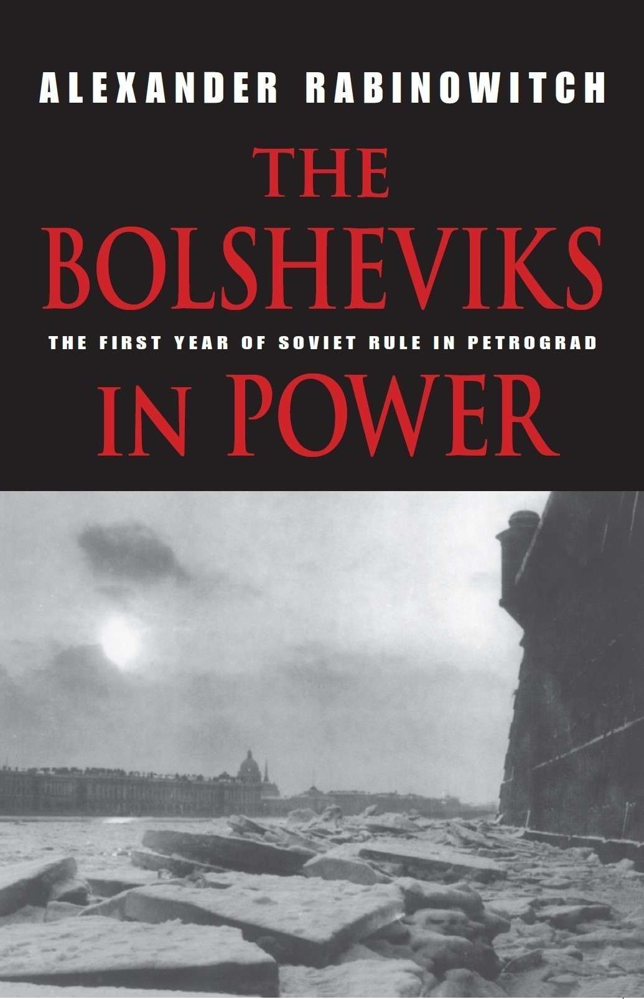
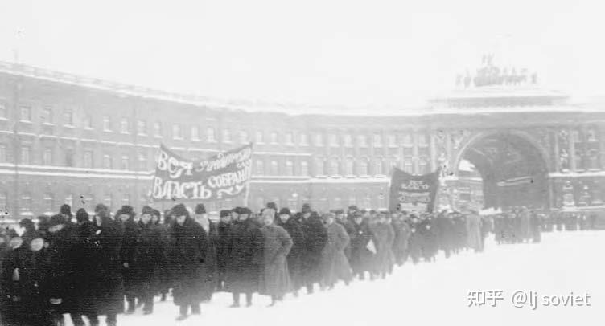
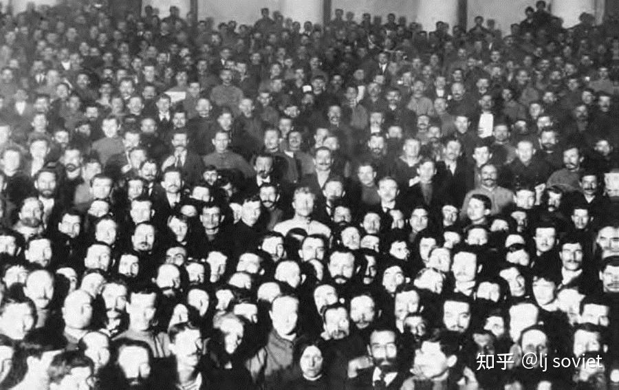
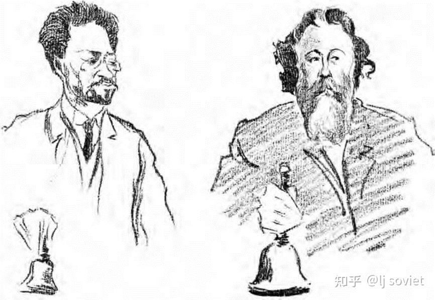

**4. 立宪会议的命运** 

1918年1月5日到了。对20世纪的大部分时间来说，这一天将标志着俄国建立西式多党民主制努力的终结。立宪会议定于下午1点召开。根据卫宪联盟制定并广为流传的计划，当天上午，该联盟群众游行的参与者将在9个集会点集合。他们从那里出发，游行至战神广场的集体墓地[^1]，汇合为一支庞大的队伍，马不停蹄地经过塔夫利达宫那白雪覆盖的大花园，然后继续前行至涅瓦大街，并在返回起点前穿过首都的心脏地带。

前一日夜的晚些时候，苏维埃政权听闻了令人不安的流言，称卫戍部队的一些单位有在最后关头倒向立宪会议的情绪。[^2]这似乎印证了彼得格勒驻军情况不稳，于是疯狂地从外地搜寻其他忠诚的部队。11月28日塔夫利达宫之乱尤在脑际的彼得格勒苏维埃当局相信，存在一个推翻苏维埃政权的阴谋，而卫宪联盟计划中的游行正是其中一部分。对前者来讲，首先要维持对关键政府建筑、国家银行和通讯设施的控制。他们还决心防止游行人员在塔夫利达宫附近聚集，以便控制那里的局势。在铸造厂大街的各个十字路口、塔夫利达宫的东西通路（壁毯街[^3]、撒迦利亚街[^4]、谢尔吉街[^5]、辎重队街[^6]和路德宗教堂街[^7]的拐角）和宫外小广场的战略要点，树起了圆木街垒。清晨，政府军——主要由工人赤卫队员、波罗的海舰队水兵和为数不多的彼得格勒卫戍部队士兵组成——进驻工事；武装分遣队开始在临近的大街小巷巡逻；附近建筑的楼顶架起了机枪。那些被发现力量薄弱的地点，则于当日晚些时候，匆忙部署上从赫尔辛基和喀琅施塔得赶来的水兵。

由于大量最称职可靠的军事力量已经乘船离开首都，或者去外省帮助巩固革命，或者南下和安东诺夫-奥弗申柯的部队一道打击反革命，这些安保部队便大多是在匆忙之间征召和集结起来的。他们毫无控制人群或对付民事动乱的经验或训练，被派遣时仅配备了武器和足量的弹药供应，并被灌输了这样的观念：聚集在立宪会议周围的敌人决心恢复过去的不公，要保卫苏维埃政权免受他们的危害。他们那些一样缺乏技术准备的指挥官，也接受了相同的倾向，并且只被给予了不可靠的指示。他们被组织起来，在指定区域周边巡逻，预备迅速增援出现麻烦的地点，并且不能让任何人未经许可进入塔夫利达宫和斯莫尔尼地区。一位“自由曙光”号战列舰[^8]的水手的未刊回忆确证了这些事实。1月5日黎明，他受命指挥一支由几百人混编而成的部队，并且每隔一定时间，便收到若干简短的、更适于部队前线临敌而非维持本土秩序的命令。游行人员如执意前行，则将被解除武装，并加以逮捕（假定游行人员携有武器）。如发生枪击，将“毫不留情地”开火还击。工人则另当别论。对于他们，一切可能的说服办法用尽之后，才能诉诸暴力。[^9]这些指示没有说明，如果大量**非武装** 人群试图冲破[^10]或绕过街垒，应采取何种适当措施。此外，各安保部队（或它们与为时已晚的紧急军事指挥部）之间几乎没有建立通讯体系。

当日清晨起，立宪会议的支持者唱着革命歌曲，高举像“全部政权归立宪会议！”、“不要政治恐怖！”和“人民的兄弟情谊万岁！”这样的横幅，涌向卫宪联盟指定的9个集会点。参加游行的大多是大学生、公务员、办公室职员（许多是女性）、小店主和专家。所有记录都表明，除了零星例外（例如来自政府印钞厂、奥布霍夫工厂和涅瓦区其他工业企业的工人），工厂工人和士兵都遵照彼得格勒苏维埃的请求，待在了自己的工厂和兵营里。游行人员也按照游行组织者坚持的禁令，没有携带武器。即便要给游行人员提供护卫的装甲车也被布尔什维克工人征用，从而使他们毫无防卫。[^11]

与政府巡逻队最初的冲突，是在郊区游行人员被禁止进城的时候发生的。[^12]但规模最大、最血腥的冲突，却爆发于封锁着战神广场通向塔夫利达宫主干道的圆木街垒处，以及塔夫利达宫和周边公园所在区域的小街巷。当时（大概上午10点左右），一支赤卫队把约千余名从彼得格勒[^13]一侧跨过了涅瓦河的游行人员挡了下来。被勒令停止前进、打道回府的游行人员，唱着《马赛曲》，高举红旗，继续前行。赤卫队向空中鸣枪示警。这并未使游行队伍停止前行。于是他们向游行人员胡乱开火。[^14]1小时后，赤卫队员和士兵突然从铸造厂大街和壁毯街拐角处的街垒跳出来，打开步枪扳机，勒令约200名来自维堡区、刚跨过涅瓦河的游行人员原路返回。但几乎紧接着，他们便向空中鸣枪，驱散了游行人员。他们没收了游行人员的旗帜，把它们从旗杆上扯下来，或者丢进火堆里或者扔下铸造厂桥。[^15]法国使馆武官路易·德·罗比昂[^16]伯爵看到旗帜飘入“涅瓦河闪耀的冰封河面，宛如巨大的红蝴蝶”[^17]。杰出的未来主义作家维克托·什克洛夫斯基后来看到，守院子的人（дворники）把旗杆当做扫帚把用。[^18]一方面游行者故意使用红旗这样的革命符号，另一方面苏维埃政权的卫兵带着胜利的情绪，自发地将这些旗帜占为己用，是1918年1月5日彼得格勒主要冲突中的突出现象。

*在宫殿广场支持立宪会议的游行队伍，1918年1月5日。俄罗斯国家政治史博物馆，圣彼得堡。*

以这样一些无人丧生的事件为前奏，大约同一地点发生几起对和平示威者更为血腥的攻击。下午，铸造厂大街北端，尤其是与通向塔夫利达宫周边地区的东西向要道交叉的拐角处，着实成了战区。在那里，倒下的游行人员的鲜血迅速染红了齐膝深的、晶莹的积雪。大约1万名在路德宗教堂被街垒挡住去路的游行人员高举旗帜、唱着革命歌曲，试图通过辎重队街冲向塔夫利达宫，但被全副武装的赤卫队员和士兵拦了下来。后者实际上未加警告，便用步枪和机枪开火驱散了他们。密集的射击持续了足有15分钟，期间有数名游行者中弹。[^19]

第一批为人所知的死者当中包括有格·洛格维诺夫[^20]。他从坦波夫来到彼得格勒，参加支持立宪会议的全俄农民代表苏维埃代表大会。[^21]在下午1点过后不久，许多游行队伍离开了战神广场。洛格维诺夫便扛着巨大的红旗，走在其中一支队伍的前头。抵达铸造厂大街和路德宗教堂街的拐角处时，他和自己的同志被勒令返回。随后，街垒后面的步枪和附近一栋建筑楼顶的机枪几乎立刻向他们开火。据报道，这次事件中有5名示威者被杀（洛格维诺夫、2名学生和2名红十字救护员）、8人受伤。[^22]大约同时，从位于南面市中心莫斯科区的皇村火车站和亚历山大剧院的集合点向战神广场进发的游行人员，在经过花园街[^23]和涅瓦大街的拐角处时，遭到了杜马大楼附近狙击手的射击。不久后，约1.5万名从东南面涅夫斯基区[^24]出发的游行人员（包括了相当数量来自奥布霍夫工厂、帕利工厂[^25]和该区其他工业企业的工人）在继续向战神广场进发前，于征兆广场[^26]停了下来，举行即兴集会。城市远郊的示威者频繁受到亲苏维埃政权的士兵和工人（有些人还和家人一道）的骚扰和咒骂，而在这个更为繁荣的商业区，他们获得的却是欢呼。这支由奥布霍夫工厂的黄铜厂徽引领的队伍两次遭遇枪击。第一次攻击没有造成伤亡，政府的巡逻人员只是朝天鸣枪。第二次是在当天大部分最血腥事件的发生地——铸造厂大街北端，9名游行者中弹，其中7人伤势严重。[^27]

试图绕道绕过这一区域的游行人员的进展也好不到哪儿去。例如，数千试图沿普列奥布拉任斯基街[^28]从南面进抵塔夫利达宫的游行人员在工兵胡同[^29]被士兵挡住去路。当他们拒绝返回的要求时，士兵开火，致2死11伤。[^30]大约同时，当天最大的游行队伍之一也试图沿铸造厂大街北端的街垒边缘行进，并试图从南面（这次是走池塘街[^31]）进抵塔夫利达宫。最初的鸣枪示警没有止住游行人员。但在普列奥布拉任斯基街和格罗德诺胡同[^32]的交叉口，几乎在塔夫利达宫视野之内，雪地壕沟里的赤卫队员用步枪开火，驱散了他们。这次，数名游行者被杀或重伤，另有人被殴。[^33]

入夜，塔夫利达宫的社革党和孟什维克立宪会议党团收到了描述这些冲突的签名书面投诉。其中之一被著名的孟什维克马特维·斯科别列夫宣读，并记录在案。“下午4时，我驾车沿着铸造厂大街行驶，在潘捷列伊蒙拐角[^34]，我亲眼目睹了数队赤卫队员向毫无防卫的人群开枪，这些人中有士兵、妇女和儿童……他们和平地向塔夫利达宫游行，来表达自己的诉求，”这份投诉写到，“开火是没有警告的，直接瞄准人群。我看到那些伤员——1名士兵、2名工人和一些妇女——被担架和出租马车送走。”[^35]

尽管对于1918年1月5日的枪击事件，现存描述不准确、不完整、多有重复且不可确证，但加在一起已足够把握对支持立宪会议的游行队伍的攻击的诸多首要特征。首先，游行人员显然远超苏维埃当局估计的1万人，但也远低于卫宪联盟后来宣称的10万人。其次，尽管不像苏维埃当局所暗示的那样，工厂工人和士兵一道抵制了游行，但显然，他们在游行人员中相对来讲仅占少数。第三，尽管游行的领导者及其参与者显然不愿遵守苏维埃政府对塔夫利达宫周边区域下达的游行禁令，但没有任何证据表明，他们中有人携带武器或做出威胁举动。即便遭遇开火，他们也未加抵抗，而是试图躲避。最后，赤卫队员、水兵和士兵的行为非常野蛮。他们从街垒背后向游行人员开火，并在窗口和屋顶用机枪射击；他们还殴打游行人员，夺取并破坏他们的旗帜，以示胜利。同样显而易见的是，苏维埃当局得悉流血事件后，既没有取消塔夫利达宫周边的游行禁令，也没有下令停止射击，而是无所作为。据斯维尔德洛夫在1月11日全俄第三次苏维埃代表大会上的报告，21名游行人员被杀。由于这一数据高于高尔基的亲立宪会议报纸《新生活报》根据冲突结束后彼得格勒医院的排查估算的15人身亡，斯维尔德洛夫的统计显然更接近事实。[^36]

---

随着立宪会议开幕的日益临近，在塔夫利达宫毗邻地区建立了第二条军事防线。这里的人群更为稀疏，在又矮又长的暗黄色宫殿外，布满了赤卫队员、士兵、野战炮、机枪阵地和弹药。围绕宫殿的铁栅栏锁上了所有豁口。[^37]宫殿一楼的临街窗口架上了机枪。

下午1点左右，打开了宫殿的一扇侧门，以便代表进入。这些代表都在身着粗呢上装、胸前挂着机枪带的水兵的严密掩护之下。同样被允许进入的还有大批客人——大部分是遴选出来的工人、士兵和水兵，他们中的许多人带着上了刺刀的步枪和手榴弹，并挂有弹药。首批抵达的代表中，有上午开完会后直接赶来的整个社革党党团。代表们六人一排，神奇地佩戴着与众不同的玫瑰花结，手持蜡烛和三明治。大概半数人西装革履，用厚大衣和胶鞋御寒。其余人则是身着羊皮夹克和毡靴。尼古拉·斯维亚季茨基后来注意到，他的同事们看上去毫无生气，“仿佛判了刑的囚犯”[^38]。弗拉基米尔·津济诺夫[^39]后来回忆道：“我们走进大楼时，确定布尔什维克会强力反对会议……[而且]我们不会活着回家。”[^40]

塔夫利达宫华丽的白厅[^41]——一间走廊环绕、有着玻璃穹顶的宽敞的阶梯大厅——的入口还要被另一队赤卫队员封锁一段时间。沙皇时代末期帝国国家杜马的集会地，在二月革命后成了全俄苏维埃第一次代表大会和代表会议的会址。为了迎接立宪会议，这里“像办丧事一样”（季诺维也夫语），挂上了黑色横幅。横幅的颜色可能是苏维埃当局故意这么选的，以示立宪会议的反动性。社革党代表尽管占据多数，却被转到一间后室。在前日夜和当日上午，他们为会议首日微调了自己的纲领。从党的纲领中删去压舱石，并进一步精简了有关和平和土改的立法内容，以便其能够得到迅速提交和通过。[^42]剩下就没什么可做了。于是社革党代表四下忙乱，紧张地哀叹自己的孤立无援，听着周期性地、有时歇斯底里地描述街头的屠杀。规模小得多的布尔什维克代表团在社革党之后抵达，进驻了一间被窗外晶莹的积雪照亮的宽敞客厅。[^43]

有关布尔什维克立宪会议党团会议（包括一次和左翼社革党的联席会议[^44]，以及立宪会议正式开幕前的一次漫长的单独会议）记录要么尚未刊布，要么不见于俄国档案馆之中。据事后回忆，尽管列宁参加了布尔什维克会议，但主席是斯维尔德洛夫。加米涅夫参加了布列斯特-利托夫斯克和谈代表团。他的缺席妨碍到了布尔什维克温和派。苏维埃方面宣称，会议进展迅速且顺利。这种说法是假的，因为实际上会议持续时间远超预期，并造成立宪会议推迟开幕了很长一段时间。党团会议一开始讨论了立宪会议的日程和议程。一些迹象表明，与立宪会议的地位以及立宪会议与苏维埃政权之间关系相关的根本问题似乎也得到了讨论。通讯困难以及（更重要的是）列宁在11-12月成功阻止党内温和派筹备全国党代会，使得全国各地的布尔什维克领导人此前未能讨论如何对待立宪会议。许多外省的布尔什维克代表一抵达彼得格勒，就直奔党团会议，并且无论如何都没有系统地向他们更新（更不用说叫他们讨论）最近有关立宪会议的政策变化。[^45]于是，由于像梁赞诺夫和洛佐夫斯基这样头脑独立的布尔什维克出席党团会议，列宁的立场肯定会遭受挑战。对于这次会议，拉斯科尔尼科夫回忆称，至少一些党代表考虑过立宪会议会的长期存在。他注意到，当时放弃了组建决裂式的革命会议的主意的布哈林，嘲笑了这样的看法。他说，立宪会议或将有三天的生命。[^46]

正在单独举行会议的左翼社革党不时要求修订《被剥削劳动人民权利宣言》。尽管这些要求的具体内容尚不为人知，但似乎可以合理地推断，它们旨在满足左翼社革党此时的首要关切，即让《宣言》更合乎仍然有可能支持它的社革党农民代表的口味，并让立宪会议一直开下去，直到其自坏名声。无论内容如何，修订被拒绝了。在《宣言》——其专为阻挠达成妥协，并在一开始就挑起与立宪会议的决定性决裂而设计）——由斯维尔德洛夫宣读之后，让立宪会议至少开到全俄工兵代表苏维埃第三次代表大会开幕时的想法被抛弃了。[^47]取而代之的是，同意斯维尔德洛夫作为中执委代表，在正式宣布立宪会议开幕的声明中，宣读（以求立即落实）《宣言》。在《宣言》被置之不理后，布尔什维克（并且他们希望左翼社革党一道）肯定会退出会议，以防带着自己“全铁工执委式的”新纲领的社革党得以消耗苏维埃政权所获得的支持。[^48]

---

下午3点半左右，白厅打开了大门。半小时后，约400名代表在指定区域就座，布尔什维克在最左面，右翼社革党和孟什维克在最右边，左翼社革党被中央走道[^49]分割开来、居中而坐，卡杰特则被悉数排除在外。一方面，党内温和派遭到严厉约束的布尔什维克党团准备按预定剧本行事，左翼社革党坚持苏维埃对于立宪会议的至上地位。另一方面，对于大部分社革党人来讲，苏维埃仿佛并不存在，他们准备着手建设一种新民主秩序，并在当天通过有关和平、土地和未来俄国政治制度的法律。

*在塔夫利达宫白厅的左翼社革党立宪会议代表，1918年1月5日。玛丽亚·斯皮里多诺娃在底部中间。普罗什·普罗尚在她右边。俄罗斯国家政治史博物馆，圣彼得堡。*

这种立宪会议观上的针锋相对，以及当时形势下会议的社革党多数派根本上的虚弱无力，在起初围绕应当由谁正式开启会议的冲突中体现了出来。社革党自然希望从开幕铃起就控制住会程。自视为俄国唯一合法革命当局代表且认为现行立宪会议过时落伍的布尔什维克和左翼社革党，也注意要从一开始就控制会议。所以一到下午4点，来自顿河流域的前民粹派、地方自治局工作人员谢尔盖·什韦佐夫[^50]作为最年长的与会代表，便在社革党议场领袖的指示下，利用斯维尔德洛夫的缺席，走上讲台，要求代表遵守秩序。右边的议席鼓起掌来，布尔什维克和左翼社革党代表则一片抗议。后者涌向讲台，包围了倒霉的什韦佐夫。正在此刻，斯维尔德洛夫现身，把什韦佐夫挤到一旁，摇动起光亮的镀镍主席铃。之后，走道两边的代表斗了起来。曾管理列宁办公室的邦奇-布鲁耶维奇回忆称，在这段混乱的间隙期，立宪会议似乎即将解体为混战。此时，列宁突然表现出他[^51]前所未见的忧虑和失色。[^52]但不知何故，在右边震耳欲聋的反对和嘲弄声中，在左边轰鸣的欢呼声中，在走廊里挥舞着步枪的士兵、水兵和工人的高声赞同之下，斯维尔德洛夫“像一座大理石纪念碑”那样伫立在讲台上，设法使人们安静下来，以便开启会议。[^53]手无寸铁的社革党多数派别无选择，只能接受这种不祥的开端。

起初就是这么不体面的场景，俄国首次立宪会议激烈而短促，便也不足为奇了。斯维尔德洛夫立即利用自己的临时主席身份，宣读了《被剥削劳动人民权利宣言》，并以中执委的名义提议将讨论这份《宣言》作为第一项议程。[^54]据报在列宁的怂恿下，斯维尔德洛夫话刚落音，左翼便劲头十足地唱起了《国际歌》。即便右翼社革党也显然感到有责任假装在唱。[^55]

在这支音乐插曲之后，社革党决定在阐述自己的纲领之前，避免不必要的挑衅，并对《宣言》不予置评。当维克托·切尔诺夫击败玛丽亚·斯皮里多诺娃当选会议主席时，他们获得了一次皮洛士式的胜利[^56]。布尔什维克提名斯皮里多诺娃的本意或许是向左翼社革党做出让步。后者希望有足够多名义上社革党的农民代表给她投票，以抵消社革党的多数地位。无论如何，投票结果——切尔诺夫得244票，斯皮里多诺娃得153票[^57]——准确地表明了竞争双方的力量对比。

*立宪会议开幕时的雅科夫·斯维尔德洛夫（左）和谢尔盖·什韦佐夫。尤·康·阿尔齐布舍夫绘。*

傍晚时分，灯火悉明（这让社革党白拿了蜡烛），切尔诺夫开始了他的主旨讲话。他极为宽泛地简述了一项野心勃勃的改革计划。后者听上去和十月革命前布尔什维克的纲领极为相似——乃至于坚持要求“立刻行动，不要只是言辞”[^58]（“杂耍一般地操弄布尔什维克口号，”奥加诺夫斯基这样说它[^59]）。切尔诺夫小心翼翼地避免直接批评布尔什维克或苏维埃（这让许多投票支持他和他的言论的人感到不安）。他说，在世界上，革命俄国的社会主义者所控制的立宪会议是全世界具主办国际和平大会的声望和权威的机构，这次大会将在不久后带来普遍、民主和公正的和平。为了照顾疲于战争的俄军部队，他呼吁组织一支全新的革命志愿军，来担负改造过时的机构和生活方式的任务，接替前线士兵，保家卫国。谈及工业领域的混乱和日益恶化的失业问题（复员使之雪上加霜）时，切尔诺夫提出了一项公共工作和对工业生产暂时实施国家监督（直到工人有能力自行监督工业）的宏大计划。在民族政策方面，在以个人名义向各少数民族代表恭顺地致敬之后，切尔诺夫描绘了一幅平等的、半独立的民族和区域自由联合为俄罗斯联邦共和国的图景。在这个共和国当中，各区域立宪会议和地方自治机构的网络与全俄立宪会议一道，设计保护少数民族权利且合乎人民意愿的新政治制度。

在至关重要的土地问题上，切尔诺夫支持立即系统地、无偿地将所有土地重新分配给“劳动农民”。此外，针对苏维埃政府指控立宪会议缺乏代表性，以及甚至列宁此前强调召回代表以重新选举，切尔诺夫机智地加以反击，提议大方地信赖全民公决，以保证立宪会议的行动合乎人民的意志。他确实向布尔什维克发出挑战，要求他们如果怀疑立宪会议是否有权表达人民的意志，便立即就如何对待立宪会议举行全民公决。[^60]

尽管在演说中，切尔诺夫恳求民主力量团结一致、退让妥协和结束内战，但他丝毫没有提到跟卡杰特或其他自由主义团体结盟。他的言下之意是，尽管主导革命俄国的仍将是社会主义势力，但苏维埃的统治时期结束了，将由立宪会议创建的新机构开始统治。

在左翼社革党的谢尔盖·姆斯季斯拉夫斯基看来，切尔诺夫的讲话是“书生气的引文、诗句和学究化习语的毫无生气的杂烩”[^61]。对于切尔诺夫模糊他们和布尔什维克之间的路线，右翼社革党人感到愤怒。研究社革党的西方历史学家奥利弗·拉德基[^62]分析这份讲话时，得出了截然不同的结论。在他看来，通过帮助早应在案的立法提案付诸记录，切尔诺夫大大地帮助了自己的党。[^63]或许如此。关键问题是，如今，随着布尔什维克温和派的衰落和列宁派控制该党，已为时太晚。即便在切尔诺夫结束之前，人民委员会中的布尔什维克成员就溜出白厅，在一间休息室开会，并再次确认，立宪会议应在当日中断。[^64]

托洛茨基正从布列斯特返回彼得格勒途中，列宁则更愿意待在幕后，策划而不是参与正式会程。由此，30岁的布哈林承担起回应切尔诺夫的责任。[^65]在一份时长与切尔诺夫讲话相当的热烈讲话中，他呼吁立即通过《被剥削劳动人民权利宣言》并辩称，尽管很难不同意切尔诺夫所勾勒的崇高目标，但问题的关键在于，努力实现这些目标的时候，哪个阶级掌权。临时政府的经验明确表明，对于任何由中派社会主义政党控制的政府，大资产阶级都能发挥决定性的影响，由此就切尔诺夫谈及的各关键领域而言，立宪会议的统治只会使工农重新遭受奴役，陷入如同他们在沙皇时代那样的奴役地位。布哈林坚称，革命俄国所要求的不是在立宪会议支持的民族团结政府之下的国内和平（civil peace），而是像斯维尔德洛夫提交的《宣言》所提出的那样的纯粹的苏维埃工农专政。[^66]

之后，尼古拉·蓬皮扬斯基[^67]简述了由首日委员会制定的会议日程。[^68]于是，委员会的看法被立即公之于众：休会前，立宪会议的首次会议将就革命的核心问题（首先是和平、土地和中央政府架构的问题）采取预备措施。作为对蓬皮扬斯基的答复，左翼社革党的司法人民委员施泰因贝格要求立宪会议不要打太极，而是讨论并支持斯维尔德洛夫的《宣言》。“现行苏维埃政权承认并不断解决着革命面临的所有问题，”他说道，“立宪会议如果希望与劳动人民的苏维埃同心同德，就不能逃避立即讨论和承认中执委《宣言》这一首要责任。”[^69]

紧接施泰因贝格走上讲台的是格鲁吉亚的孟什维克伊拉克利·策烈铁里。自俄国社会民主主义运动之初，策烈铁里就参与其中，是作风稳重、直言不讳的老资格。在1907年6月斯托雷平对第二届杜马的臭名昭著的攻击中，他是令人崇敬的受害者。二月革命后，他从西伯利亚流放地获释，理所当然地成了1917年温和社会主义苏维埃领导层中最具威信的人物，以及后者与自由派合作的最有影响力的倡导者，并坚决反对布尔什维主义。“敌对阵营当中少数惯常诚实的人之一，”姆斯季斯拉夫斯基如是回忆他。[^70]很大程度上由于其坦率的名声和对布尔什维主义的敌意，并且或许也因切尔诺夫之外的其他著名“护国派”要么入狱要么躲了起来，策烈铁里成了苏维埃政权的主要敌人的典型。他的出现使左边的议席和走廊陷入一片狂乱之中。[^71]

这种骚动一点也没吓住策烈铁里。要说真有什么的话，似乎倒给他以动力。之前的温和社会主义的发言者们，遵循切尔诺夫的方针，有意避免与布尔什维克正面交锋。对于这一策略，奥加诺夫斯基写到，我们觉得“首先必须让自己在塔夫利达宫扎下根来，只有在这之后，才应该攻击”。[^72]策烈铁里以他惯常的直接方式，对此不予接受。他嘲笑立宪会议应当盲目支持苏维埃统治的建议，坚称必须向代表们阐释苏维埃纲领正发挥积极作用。掌权两个多月后，布尔什维克仍试图将所有问题归咎于资产阶级的破坏，并尽可能压制合法的批评。

对于左翼“你恢复了死刑”的吼声，策烈铁里承认道：“或许我们犯了错误或更糟，但我们掌权时，至少知道如何回答各种问题，并且无畏地论证我们的行动。”[^73]但通常，他不顾震耳欲聋的诘难和侮辱性地提及临时政府各种政策，勇敢地一个接一个攻击他认为的苏维埃政策的主要失败。“你们向全体人民承诺了面包，但现在你们能把手放在心上，担保彼得格勒即便几周免于饥荒吗？”他问道。“你们给人民以土地，”他评论道，“但你们确定贫农得到了革命没收的土地吗？”“在对外政策方面，你们对局势的发展满意吗？”他质问道。“如果你们打赌会来帮助俄国革命的外部力量没有出现，那你们关于俄国社会主义的根据、关于巩固和加强俄国民主化的基础的观点会在后面几年落空吗？”“你们真的相信，德国人会觉得，你们是一个有着普遍代表性和被普遍承认的最高权威，而非有赖一场漫长的内战来维持存在，因而不得不加以尊重？”[^74]

每次质问者试图阻止策烈铁里时，他都有一个准备好了的答复，并且重新聚焦于手头的问题。因此，他强调苏维埃当局在和谈方面的固有弱点，因而引起一位特别刺耳的代表大叫着“我想你是要我们找克伦斯基帮忙吧”后，他回击道：“让我们假设克伦斯基比你还糟，但是这并不证明你比立宪会议好。现在你在与之战斗的不是克伦斯基，也不是策烈铁里，而是全体人民表达的意志。”[^75]

在演说结尾，策烈铁里就像切尔诺夫那样，拒绝在未来和民主阵营之外的力量合作（对策烈铁里和切尔诺夫来说，这是与其1917年立场的重大决裂）。策烈铁里还觉得，资产阶级的力量太过薄弱，以至不能对革命构成威胁。对革命来说，真正的危险来自布尔什维克在民主阵营当中制造的分裂。结束乱局、确保革命完成的希望在于立宪会议中“所有负责任的民主人士”的团结。

孟什维克的官方宣言《关于立宪会议的任务》，全面阐释了该党对立宪会议在创建民主共和国当中的重大作用的看法。策烈铁里以这份宣言结束自己的讲话。这份宣言在某些方面主张的改革，与此前社革党的说法类似。不过，这些改革向苏维埃政权提出了正面的挑战。它们明确拒斥了《被剥削劳动人民宣言》当中的设想和政策，并直接请求俄国工人拒绝苏维埃专政，并代之以誓死捍卫立宪会议的无上权力和权威。它们不是像列宁在12月初要求的、大部分左翼社革党领导人仍然支持的那样，让立宪会议支持苏维埃政权，而是呼吁将苏维埃和其他工人阶级机构转变为立宪会议的强大支持堡垒。[^76]

策烈铁里强有力的讲话得到了（甚至对手的）广泛赞誉。姆斯季斯拉夫斯基后来回忆道：“那天在塔夫利达宫做的讲话当中，策烈铁里的显然无论内容还是说服力都是最好的。”奥加诺夫斯基则评之为“人民的真正护民官在他的威严中显现了自己”。美国记者和社会主义者艾伯特·里斯·威廉斯[^77]回忆到，策烈铁里刚开口讲话，同样也是美国记者的路易丝·布莱恩特[^78]就对自己的丈夫约翰·里德（三人都坐在走廊里）耳语道：“他是那样的威严。”[^79]讲话结束后，甚至列宁都似乎不情愿地向策烈铁里致以敬意。策烈铁里的孟什维克同事尤里·杰尼克[^80]称，实际上，几天后，在两名卡杰特领导人（费奥多尔·科科什金[^81]和安德烈·申加廖夫[^82]）被一队喝醉了的水兵和赤卫队员杀死后，列宁通过中间人，建议策烈铁里返回安全的格鲁吉亚。[^83]

策烈铁里结束讲话、走下讲台时，议席的中间和右边爆发出欢呼声——这是他们的时刻。不久后，津济诺夫要求对蓬皮扬斯基提出的议程建议作出决定，并试图证明，在决定政府架构之前，应在和平和土地问题上有所作为。他的目的显然在于，在与布尔什维克和左翼社革党就苏维埃政权问题展开决定性交锋之前，确保通过社革党有关和平和土改问题的立场。莫斯科的布尔什维克、前《社会民主党报》（Социал Демократ）编辑伊万·斯克沃尔佐夫-斯捷潘诺夫[^84]宣布，他的党不会在中执委的《被剥削劳动人民宣言》之外另提出一份宣言。但是令大多数代表吃惊的是，左翼社革党不接受这一立场。与之相反，一位来自远东阿穆尔区的老农费多尔·索罗金[^85]拄着拐杖，蹒跚地走上讲台，不顾左翼社革党向布尔什维克誓言支持斯维尔德洛夫宣读的中执委《宣言》，提交了一份左翼社革党自己的宣言。[^86]索罗金提交的宣言在诸多关键方面与中执委的《被剥削劳动人民宣言》相吻合。它明确承认十月革命和苏维埃政治制度的合法性，并完全否认立宪会议具有独立政治权威。但是，它没有要求立宪会议立即投票解散自己，而是设想它会长期成为苏维埃指导下的革命重建工作的促进者。

两份宣言的上述差异或许仅仅表明，策略上温和的左翼社革党仍然拒绝立即强行解散立宪会议。因为他们坚信，假以机会，立宪会议会迅速败坏自己的名声；他们更希望这种自然的、和平的进程，而非像普罗什这样更为激进的左翼社革党人主张的进程；并且他们有意把自己与在他们看来布尔什维克的过分死板、独裁的趋势区别开来（他们或许已经说服了左翼社革党党团的大部分人接受这一点）。或许由于希望坚持独立身份，索罗金提交的宣言强调个人人权，即尽可能坚定地支持献身于有意义劳动的个人的解放，这样的个人实现自身全部潜能的权利，以及他们获得适宜的生活条件以及必要社会福利的权利。[^87]索罗金所提出的权利当中，并不像中执委《宣言》和列宁派思想中所暗含的那样，不顾其行为而将全体人民严格划分好坏。

但是，索罗金陈述当中最有意思的方面或许是他在读完左翼社革党宣言后的个人评论。对于右边雷鸣般的欢呼和左边爆发的抗议声，他故意将两边混为一谈，毫不含糊地宣称，所有立宪会议的农民代表，**无论来自哪个党** ，被派到彼得格勒时，都是带着获得土地与自由的指示。只有这件事完成了，他们才能光彩地回到自己的村庄。就此，他说道：“在我们农民当中，是没有分歧的。左边和右边的我们都是相似的。”“农民同志们，我的希望，”他补充说道，“是我们将把自己的任务完成到底。”在大部分人看来，这表明决心在立宪会议之中解决土地问题，而对于他的大部分左翼社革党同仁（更不用说布尔什维克）来讲则是“破坏！”[^88]即便如此，索罗金的宣言和评论突然引起了走道两边社革党和左翼社革党的农民代表之间的激烈讨论，并重新造成了妥协的可能性。[^89]

对于在他结束讲话后立宪会议和党团会议对索罗金陈述的讨论，资料阙如。《劳动旗帜报》在对立宪会议会程的详细报道中甚至都没提到索罗金的评论，这表明后者令左翼社革党领导人大为难堪。[^90]他所谓农民代表不分政治归属都有共同性的评论，只是在自发地、激烈地表达数百万农民对派别斗争的厌倦以及对立即实现和平和获得土地的渴望？抑或其讲话所代表的不仅于此？这一点是无法弄清的。实际上只有两份日程提案被付诸表决：《被剥削劳动人民宣言》无条件支持苏维埃政权和政策；蓬皮扬斯基提出的首日日程提案则完全忽视了苏维埃，间接地承认立宪会议是俄国的最高政治权威，并呼吁立即讨论社革党有关和平、土地以及在此基础上的国家政权的立法。尽管有策烈铁里激动人心的讲话和索罗金的评论，但主要竞争各方之间的投票力量对比仍然未有改变。不经讨论，以237票对146票通过了蓬皮扬斯基的提案。[^91]

紧接上述表决之后，首先是左翼社革党然后是布尔什维克要求休会；据姆斯季斯拉夫斯基称，这与其说是要去决定“怎么办，还不如说是要决定以怎样的秩序退出[立宪会议]”[^92]。随后左翼社革党和布尔什维克的党团会议，相关信息匮乏。据《新生活报》对于前者的报道，布尔什维克提议左翼社革党党团立刻退出立宪会议，遭到了农民代表的坚决反对。后者提出，他们的选民不会理解，为什么仅仅因为它不首先讨论中执委的《宣言》就必须解散立宪会议。对这一问题进行了激烈讨论。一些农民代表威胁称，如果接受了布尔什维克退出立宪会议的提议，他们会继续留在自己的席位上。最终达成了妥协：施泰因贝格会仅仅把《宣言》中有关和平的条款作为最后通牒加以提交。要么接受通牒，要么整个左翼社革党党团也退出立宪会议。[^93]

布尔什维克党团的会商显然受到列宁的主导。在此前8个小时的大部分时间里，他躲开公众视线，和人民委员会以及布尔什维克中央委员会挤在一起，从挂着窗帘的走廊观察会议议程。[^94]切尔诺夫和蓬皮扬斯基勾勒的改良主义轨迹，或者索罗金强调的农民代表的共同点，是否使他更难以忍受立宪会议？我们也不得而知。党的领导层不遗余力地将这次党团会议保持为隐秘的闭门会议。会议开始前，布尔什维克的会议室被清空，只有党团成员在检查了证件后才被允许进入。[^95]根据现存资料只能知道，列宁来到时做好了充分准备，他以中央委员会的名义要求布尔什维克立即退出，并在第一次会议后解散立宪会议。

与会者极不可能都赞同这一策略。党团成员梁赞诺夫和洛佐夫斯基一定会再次加以反对。但最终，列宁的提议被接受了。来自喀琅施塔得和莫斯科的拉斯科尔尼科夫和洛莫夫[^96]分别受命返回大厅，提交了列宁起草的、打好交给党团的退出声明[^97]。[^98]据报为了避免可能的混乱，整个党团不会返回会场。据拉斯科尔尼科夫说，党团会议结束后，他和现任政府成员被叫到塔夫利达宫的内阁大臣侧楼[^99]，参加人民委员会的紧急会议。他回忆道，在这次会议上，列宁提议并经所有人同意，无论发生何种情况，都不应强行驱散留下来的代表；此外，还应该允许他们想说多久就说多久，然后再“让他们回家去”（列宁语），此后便不会允许他们重回会场。[^100]

同时在凌晨1点左右，立宪会议终于复会。在布尔什维克和左翼社革党仍然缺席的情况下，代表们开始讨论占据蓬皮扬斯基日程首位的和平问题。讨论不断地被各种异乎寻常的声明所打断——乌克兰社革党人阿法纳西·谢韦罗夫-奥多耶夫斯基[^101]宣布了乌克兰民族主义者和苏维埃当局就乌克兰未来的冲突；来自沃罗涅日的社革党农民党员宣称，农民急不可待地要求立即实现和平和解决土地问题；最后是拉斯科尔尼科夫声明布尔什维克退出会议。[^102]

发表之前的声明时，人们在大厅中不断地说话和活动，代表们和观察员们对会程的反应，要么是懒散地交头接耳，要么是游荡到附近的餐台喝茶、吃点心。但随着拉斯科尔尼科夫走上讲台，大厅里突然变得忙碌起来，空荡荡的布尔什维克席位明确无误地表明了他的目的。一些布尔什维克聚在门口仔细听着，拉斯科尔尼科夫传达了列宁的退出声明：

> 俄国绝大多数的劳动人民——工人、农民和士兵，要求立宪会议承认伟大的十月革命的成果，……并且首先要承认工兵农代表苏维埃政权。……然而，立宪会议的多数竟按照资产阶级的要求，否决了这个提议，这就向俄国全体劳动人民提出了挑战。……我们一分钟也不愿意掩饰人民公敌的罪行，我们声明退出立宪会议，以便把怎样对待反革命的那部分立宪会议代表的问题提交苏维埃政权作最后决定。[^103]

拉斯科尔尼科夫的最后几句话被社革党人的怒吼声淹没了。“一派胡言！”“谎言，全是谎言！”“蠢货”“搞迫害”，他们这样叫道，同时左翼社革党和走廊里爆发出欢呼声和掌声。[^104]在继之而起的混乱中，一位负责保卫工作的水兵举起自己的步枪，瞄准来自莫斯科的、粗壮的社革党代表奥西普·米诺尔[^105]，只是在更冷静的战友最后关头的阻止下，才没有扣动扳机。[^106]不久后，左翼社革党代表猛扑向一位激动的年轻乌克兰同僚阿列克谢·费奥菲拉克托夫[^107]，他的勃朗宁手枪已准备就绪，要对付身边右翼议席的一位质问者。[^108]在恢复了秩序的模样之后，另一位农民代表、前国家杜马代表拉尔夫·叶夫列莫夫[^109]请求布尔什维克和左翼社革党在人民的意愿得以实现之前，不要抛弃立宪会议。除了立宪会议，谁还能实现我们的全部梦想，谁能够结束内战？他绝望地喊道。[^110]

接着，在其党团的指示下，施泰因贝格要求代表们立即表示支持《被剥削劳动人民宣言》。他辩称，为了采纳蓬皮扬斯基的日程，甚至拒绝讨论《宣言》，这便使立宪会议的多数代表显得仿佛反对苏维埃，并意图创建自己的、旨在反对革命所取得的诸多胜利的国家权威。但是，施泰因贝格说到，多数代表的立场并没有那么明确，事情尚有余地。因此，他提出自己党团的最后通牒：立宪会议应当搁置社革党的日程，立即讨论和表决《被剥削劳动人民宣言》有关和平问题（当时正在讨论的问题）的部分，以示与苏维埃政权和十月革命的成果团结一致；否则，对左翼社革党和俄国人民来说，多数会议代表具有反革命的性质和意图，有必要与之分道扬镳，将得到决定性的确证。[^111]

尽管社革党的立宪会议领导层如今承认，立即实现和平至关重要，但可以理解的是，他们不愿向施泰因贝格的“最后通牒”退让，后者正如施泰因贝格自己承认的那样，意味着实质上承认苏维埃当局。这点一经表露，不久后的1月6日凌晨4点左右，左翼社革党便像布尔什维克那样，以立宪会议构成不合理、无意支持苏维埃政权为由，离开了大厅。在左翼社革党人鱼贯而出之时，卡列林宣布：“我们走了，这样在俄国大革命的这个关键时刻，我们能尽全力为苏维埃机构……为各劳动阶级的事业而工作……以确保他们的胜利。”[^112]

在最后几名左翼社革党人离开后，阳台上的杂音震耳欲聋。观众们占据了左边如今空空如也的议席。在上刺刀的铿锵声和开关枪栓的撞击声中，他们叫道：“够了——你们都走吧！”在不断的喧闹声中，切尔诺夫竭尽全力地使人们听到自己的声音，开始疯狂地念起一份有关土地问题的决议草案——这是社革党党团土地委员会（它由许多俄国杰出的农学家组成）数周悉心研究和讨论的成果。宣读时，卫队长、后来被认出是臭名昭著的喀琅施塔得无政府主义共产主义者阿纳托利·热列兹尼亚科夫[^113]轻拍着切尔诺夫的肩膀。“卫兵们累了，”热列兹尼亚科夫宣称，“我们受命清空大厅！”[^114]在走廊里哄堂的同意声中，切尔诺夫答道：“立宪会议的代表都累了，但无论多累，都不能打断宣读全俄罗斯翘首以盼的土地法。”“立宪会议，”他补充道，“只能被武力驱散。”[^115]

可以理解的是，留下来的200余名代表以更大的急迫性继续他们的工作。一位乌克兰社革党人代表被热列兹尼亚科夫的无礼粗野激怒了，宣称由于刚才发生的事情，他所在的人数80的党团不再拥护《被剥削劳动人民宣言》有关和平和土地的条款，转而支持社革党的相应决议。切尔诺夫于是把此前所有为第一天准备的法案匆匆付诸表决。其中包括事先准备的附属于社革党和平纲领和土地纲领的声明，以及俄国重组为“联邦共和国”的法案。[^116]所有这些措施都不经讨论而被一致通过，烦恼的代表们不顾一切地表明自己的意图，并在某种意义上，想在几分钟之内获得他们与卡杰特共同掌权的7个月里没有实现的东西。“我们只是必须结束会议，这样结束便会留下某些有形的东西。”右翼社革党和律师马克·维什尼亚克[^117]后来评论道。[^118]

最后在1月6日凌晨接近5点的时候，立宪会议休会，代表们被允许离开。这显然叫许多代表吃了一惊。当他们在刺骨的寒冷中匆匆回家时，仅有教堂的钟声在打破清晨的静寂，斯维亚季茨基和一位社革党同仁思考着白天的事件。“我们会看到——或许这不是结局，”两人闷闷不乐地总结道。十年后回忆起这个时刻时，斯维亚季茨基评价道，立宪会议在那晚就死了，不是因为部分代表缺乏为之而死的勇气，也不是由于水兵们的要求，而是“人民对我们的解散的漠不关心的结果，这使列宁能够挥手解散我们：‘让他们回家去！’”[^119]

---

当日（1月6日）晚些时候，人民委员会接受、中执委批准正式解散立宪会议。人民委员会会议还通过了另一套由列宁起草的、有关立宪会议的论纲[^120]。这套作为呈交给中执委的法令而被准备的论纲，支持以这样的理由解散立宪会议：布尔什维克和左翼社革党退出后，立宪会议不过是反革命推翻苏维埃政权企图的烟幕。左翼社革党提出了一项修订，呼吁全俄工兵代表苏维埃第三次代表大会考虑建立一个全新的常设立法机构——联邦议会（Федеральный конвент）。这项修订的目的在于，最终将人民委员会转变为一个执行机构，扩大苏维埃政府的基础并由此改善左翼社革党较于布尔什维克的力量对比，并软化人们对解散立宪会议的观感。它被占据多数地位的布尔什维克否决了。[^121]施泰因贝格还在其司法人民委员的职权范围内，敦促任命委员会调查前一日的枪击事件。

由于梁赞诺夫的紧急发言，中执委推迟解散立宪会议（这是其1月6日会议的第一项议程）。在发言中，他以最强烈的措辞抗议前一日的枪击事件，并要求中执委中止会商，直到即将召开的苏维埃代表大会对人民委员会允许这些过激事件是否得当相机做出决定。梁赞诺夫也像施泰因贝格那样，敦促在此期间任命委员会调查枪击事件。这一点不经讨论便得到通过。但梁赞诺夫要求中执委暂停活动则被不予理会——或许部分原因在于，即便施泰因贝格也觉得，枪击事件正被夸大。[^122]

在梁赞诺夫干预后，列宁发言为解散立宪会议申辩。“苏维埃政权和立宪会议的冲突蒙着整个俄国革命史的阴影。”他一开始宣称道。认为革命的进一步发展仅靠一个党或一个人的工作的看法是“可笑的”。“革命的烈火完全是俄国在战争中蒙受的巨大痛苦的结果。”他承认：“在深化革命的过程当中，会犯各种错误。”他坚称：“任何革命运动都会伴随着混乱、破坏和无序。”“社会主义革命不可能整洁、平滑地包裹着交给人民，”他继续说道。“一定会伴随内战、怠工和反抗……人民曾希望召开立宪会议。但他们迅速意识到，它意味着什么……立宪会议已经表明，它会拖延对苏维埃向它呈交的一切紧要问题做出决定。”[^123]因此，推迟解散立宪会议是不可容忍的。[^124]

据《真理报》称，列宁的演说赢得了“雷鸣般的掌声，接着又是长时间的欢呼”[^125]。代表统一社会民主党人-国际派的瓦西里·斯特罗耶夫[^126]指控列宁违背了支持立宪会议特权的苏维埃第二次代表大会的意志时，则相反招致了嘲笑。斯特罗耶夫一面躲开推搡自己的代表，一面设法脱口说出要求中执委坚持允许立宪会议不受干涉地继续进行的决议。这份决议没有付诸表决。梁赞诺夫同样勇敢地宣称，他从不崇奉立宪会议，可是一旦它召开了，就应当假以时日让它暴露出自己的真实面目。苏汉诺夫这样的观点在技术上是有效的：说立宪会议拒绝承认十月革命的成果并不准确的。他还敦促不批准解散立宪会议。洛佐夫斯基同样如此，坚称支持解散立宪会议“将是一个错误，实际上是一种犯罪”——无所助益。左翼社革党的卡列林不情不愿地提交了列宁解散立宪会议的法令，并在1月7日清晨，以压倒性多数通过。[^127]梁赞诺夫和洛佐夫斯基投了反对票。[^128]

这一历史性的步骤，和人民委员会以及中执委的所有其他措施一道，得到了1918年1月10-18日于彼得格勒召开的全俄工兵代表苏维埃第三次代表大会的事后批准[^129]。这次大会在1918年1月13日与全俄农民代表苏维埃第三次代表大会合并。合并后的大会通过了有关政府架构的法令，再次将合并后的中执委批准为苏维埃全国代表大会休会期间的最高中央政府机关。但是，人民委员会和中执委之间的系统性关系又被搞模糊了。法令仅仅规定，中执委有权任命或撤回后者（全部的或部分的）。[^130]在左翼社革党的坚持下，建立了隶属于合并后的中执委的、半自主的农民部，以替代全俄农民代表苏维埃执行委员会。[^131]农民部将改进中执委批准的土地改革计划（“土地的社会化”），监督其执行，并更为广泛地通盘协调与农民相关的各项计划。[^132]斯皮里多诺娃领导的这个部门注定会成为左翼社革党的堡垒，它甚至没有在有关政府架构的法令中被提及。在法令中，制定更为细致的宪制结构的任务被留给了新中执委（在其中布尔什维克占据绝对多数）和下届苏维埃全国代表大会。[^133]或许由于它注目于更加紧迫的、有关或者进行革命战争或者接受“下流的”和平的问题，由全俄苏维埃第三次代表大会选出的中执委从未抽空考虑修改苏维埃政府的架构。

---

1917年12月中旬，布尔什维克温和派尊重立宪会议特权的努力被列宁粉碎了，由此标志着前者不再成为一股有影响力、有凝聚力的党内势力。不到一个月后，列宁解散立宪会议，从而破灭了俄国自由派和温和社会主义者这样的希望：1917年革命会随着在俄国建立西式民主政治制度而达到顶峰。自然，布尔什维克在彼得格勒地区获得的强大民意支持（这在11月中旬的立宪会议选举中得到了反映），社革党领导层拒绝为立宪会议提供军事保障而同时布尔什维克和左翼社革党准备诉诸武力捍卫苏维埃政权，造成了这一结果。但最重要的是，正如斯维亚季茨基或许切中要害地指出的那样，俄国人民根本上对立宪会议的命运漠不关心，使列宁得以命令会议代表们统统打道回府。

## 参考

[^1]: 这里指二月革命后在战神广场中央新建的、埋葬革命牺牲者的集体墓地。该墓地几经改建，今仍存。——译者注
[^2]: 《新生活报》，1918年1月6日，第2版。
[^3]: 壁毯街（Шпалерная Улица）是一条东西向马路，塔夫利达宫即坐落于该街南侧，在19世纪因迁于附近的彼得堡壁毯场（Петербургская шпалерная мануфактура）而得名。十月革命后，更名为“沃伊诺夫街”（Улицей Воинова），以纪念布尔什维克烈士伊万·阿夫克先季耶维奇·沃伊诺夫（Иван Авксентьевич Воинов，1885-1917）。1991年恢复旧名。——译者注
[^4]: 撒迦利亚街（Захарьевская Улица）是一条东西向马路，位于壁毯街以南，西端与铸造厂大街相交。始建于18世纪初，该世纪末因坐落于该街的近卫骑兵团撒迦利亚与以利沙伯教堂（Церковь Захарии и Елизаветы Кавалергардского полка）而得名。1923年更名为“卡利亚耶夫街”（Улица Каляева），以纪念成功刺杀莫斯科总督谢尔盖·亚历山德罗维奇大公的社会革命党烈士伊万·普拉托诺维奇·卡利亚耶夫（Иван Платонович Каляев，1877-1905）。1991年恢复旧名。撒迦利亚是《圣经》中的犹太先知。——译者注
[^5]: 谢尔吉街（Сергиевская Улица），今柴可夫斯基街（Улица Чайковского），是一条东西向马路，其西端与铸造厂大街相交，东端接近塔夫利达花园。该街始建于18世纪，后因道旁的谢尔吉大教堂得名，1923年更为现名。这里的“谢尔吉”指东正教圣徒拉多涅日的谢尔吉（Сергий Радонежский，1314-1392）。——译者注
[^6]: 辎重队街（Фурштатская Улица），是一条东西向马路，西端与铸造厂大街相交，东端直抵塔夫利达花园西门。始建于18世纪，1806年因普列奥布拉任斯基团辎重队驻扎于此而得名。1923年更名为“彼得·拉夫罗夫街”（Улицей Петра Лаврова），以纪念民粹派思想家和革命家彼得·拉夫罗维奇·拉夫罗夫（Пётр Лаврович Лавров，1823-1900）。1991年恢复旧名。
[^7]: 路德宗教堂街（Кирочная Улица），是一条东西向马路，位于辎重队街以南，西端与铸造厂大街相交，塔夫利达花园坐落于该街北侧。始建于18世纪，因坐落于该街的圣亚纳路德宗教堂（Лютеранская церковь Святой Анны）而得名。1939年更名为“萨尔蒂科夫-谢德林街”（Улица Салтыкова-Щедрина），1998年恢复旧名。——译者注
[^8]: “自由曙光”号（Заря свободы）原名“皇帝亚历山大二世”号（Император Александр II），是一艘列装波罗的海舰队的铁甲舰。该舰始建于1883年，1887年下水，排水量9392吨，主炮口径305毫米。二月革命期间，该舰水兵在布尔什维克的领导下发动起义，击毙舰长，并将舰名更为“自由曙光”号。1921年喀琅施塔得起义期间，该舰遭受炮击，次年被拆解。——译者注
[^9]: 中央国家历史-政治文献档案馆，4000号全宗，5号目录，2365号案卷，第1-12张。
[^10]: 原文为breech，不通，疑为breach之误。——译者注
[^11]: 普罗塔索夫，《全俄立宪会议》，第306页。
[^12]: 《我们的时代报》，1918年1月6日，第3版。
[^13]: 这里应该是指彼得格勒区（Петроградский район）。从该区前往塔夫利达宫，需跨过涅瓦河。——译者注
[^14]: 《新生活报》，1918年1月6日，第2版。
[^15]: 《新生活报》，1918年1月6日，第2版。
[^16]: 路易·德·罗比昂（Louis de Robien，1888-1958），法国外交官，1914-1918年在法国驻俄使馆担任武官。——译者注
[^17]: 路易·德·罗比昂，《一位外交官的俄国日记，1917-1918》（The Diary of a Diplomat in Russia, 1917–1918），纽约和华盛顿特区，1969年，第196页。
[^18]: 维·什克洛夫斯基，《感伤的旅行》（Сентиментальное путешествие），莫斯科，1990年，第144-145页。（参见什克洛夫斯基：《感伤的旅行》，杨玉波译，兰州：敦煌文艺出版社，2014年，第140页。——译者注）
[^19]: 《新生活报》，1918年1月6日，第2版。
[^20]: 格里戈里·洛格维诺夫（Григорий Л[亦有文献作И]. Логвинов），第一届全俄农民代表苏维埃执行委员会委员，社会革命党人，死后被葬于易圣容公墓（Преображенском кладбище）。——译者注
[^21]: 见上文，第3章。
[^22]: 《我们的时代报》，1918年1月6日，第3版。
[^23]: 花园街（Садовая Улица）是彼得格勒的重要干道，始建于18世纪，因当时附近花园林立而得名。1923年更名为“7月3日街”（Улицу 3-го Июля），以纪念俄历1917年7月3日爆发的、反对临时政府的大规模游行示威。1944年恢复旧名。——译者注
[^24]: 涅夫斯基区（Невский район）位于彼得格勒东南部，因当地的涅夫斯基关卡（Невская застава）而得名。涅夫斯基关卡设于1730年代，最初位于邻近亚历山大·涅夫斯基修道院（Александро-Невская лавра）和涅瓦河的地方，故此而得名。后来随着彼得堡城区的扩大，该关卡不断南移，故此关卡名逐渐演变为其移驻所经地区的代称。当时，涅夫斯基区是彼得格勒重要的工业区。——译者注
[^25]: 帕利工厂（Фабрики Паля）是由产业家卡尔·雅科夫列维奇·帕利（Карл Яковлевич Паль，1845-1910）创办的棉纺织厂。该厂在1900和1910年代，是工人运动和革命活动的重要中心。1919年，该厂被苏维埃政府收归国有。1922年更名为“无产阶级纺织印花厂”（Прядильно-ткацкой и ситценабивной фабрики «Пролетарий»）。1941年更名为“维·帕·诺金国营全联盟自动纺织厂”（Государственную Всесоюзную Автономную прядильно-ткацкую фабрику им. В. П. Ногина）。——译者注
[^26]: 征兆广场（Знаменская Площадь）是圣彼得堡的主要广场，始建于1840年代，起初取名自该广场最古老建筑“征兆教堂”（Знаменская церковь），十月革命后更名为“起义广场”（Площадь Восстания），并沿用至今。征兆教堂的名称源于东正教中描绘圣母玛利亚举手祈祷、胸中孕有婴儿耶稣的“征兆圣母圣像”。这里的“征兆”出自《圣经·以赛亚书》第7章第14节：“因此，主自己要给你们一个兆头（знамение），必有童女怀孕生子，给他起名叫以马内利。”——译者注
[^27]: 《新生活报》，1918年1月6日，第2版。
[^28]: 普列奥布拉任斯基街（Преображенская улица），今拉季舍夫街（Улица Радищева），是一条南北向的马路，南面与池塘街（今涅克拉索夫街）相交。该街始建于19世纪，初名“医院街”（Госпитальная улица），1858年由普列奥布拉任斯基团更名。1935年，为纪念俄国革命思想家和文学家拉季舍夫而更为现名。——译者注
[^29]: 工兵胡同（Саперный переулок），是一条东西向的小街，东端与普列奥布拉任斯基街相交，附近曾驻有工兵近卫营而得名。——译者注
[^30]: 《新生活报》，1918年1月6日，第2版。
[^31]: 池塘街（Бассейная улица），今涅克拉索夫街（Улица Некрасова），为一条东西向马路，西端与铸造厂大街相交。该街起初因普列奥布拉任斯基团的连队驻扎当地而得名“9连街”（Улица 9 рота），后由于该街通向一方人工池塘而更名为“池塘街”。1918年为纪念涅克拉索夫而更为现名。——译者注
[^32]: 格罗德诺胡同（Гродненский Переулок）是一条东西向的小马路，西端是死胡同，东端与普列奥布拉任斯基街（今拉季舍夫街）相交。该胡同始建于18世纪，名字几经变更，现名取自白俄罗斯城市格罗德诺。——译者注
[^33]: 《我们的时代报》，1918年1月6日，第2版。
[^34]: 这里当指潘捷列伊蒙街的拐角。潘捷列伊蒙街（Пантелеймоновской улицей），今佩斯捷利街（Улица Пестеля）。起初得名于潘捷列伊蒙教堂，1920年代为纪念十二月党人帕维尔·伊万诺维奇·佩斯捷利（Павел Иванович Пестель，1793-1826）而更为现名。——译者注
[^35]: 米·尼·波克罗夫斯基、雅·阿·雅科夫列夫编，《全俄立宪会议》（Всероссийское учредительное собрание），莫斯科-列宁格勒，1930年，第68页。
[^36]: 《新生活报》，1918年1月6日，第2版。
[^37]: 马·文·维什尼亚克，《全俄立宪会议》，巴黎，1932年，第99页。
[^38]: 尼·斯维亚季茨基，《1918年1月5-6日：一位前社会革命党人的回忆》，载《新世界》，1928年第2期，第223页。
[^39]: 弗拉基米尔·米哈伊洛维奇·津济诺夫（Владимир Михайлович Зензинов，1880-1953），生于商人家庭，1901年留学期间加入社会革命党，并于1904年回国。1905年革命之初被捕，流放西伯利亚，后脱逃至西欧。次年返回俄国，继续为社会革命党工作，并当选该党中央委员。此后，多次被捕、流放和脱逃。一战爆发后，持革命护国派立场。1917年参加二月革命，并支持克伦斯基临时政府。此后，反对十月革命，并当选立宪会议代表。立宪会议被驱散后，参加反苏维埃的白色政权。1918年被高尔察克当局驱逐出境。后主要在侨民当中从事出版和文字工作。——译者注
[^40]: 弗·米·津济诺夫，《自革命者的生涯》（Из жизни революционера），巴黎，1919年，第99页。另参见维什尼亚克，《全俄立宪会议》，第100页。
[^41]: 即杜马厅（Думский зал），因该厅的墙体和立柱为白色，故又得名白厅（Белый зал）。——译者注
[^42]: 奥加诺夫斯基，《一位立宪会议代表的日记》，第148页。
[^43]: 费·费·拉斯科尔尼科夫，《海军准尉伊利英的故事》（Tales of Sub-Lieutenant Ilyin），布赖恩·皮尔斯（Brian Pearce）译注，伦敦，1982年，第2页。
[^44]: 《社会民主党报》，1918年1月6日，第3版。
[^45]: 在一份写于1920年代的未刊回忆文章中，波德沃伊斯基指出，布尔什维克的大部分外省代表并没有察觉到列宁关于立宪会议的最新想法。（俄罗斯国家社会-政治史档案馆，146号全宗，1号目录，47号案卷，第12-14张）
[^46]: 拉斯科尔尼科夫，《海军准尉伊利英的故事》，第2-5页。
[^47]: 关于这一点，参见奥·尼·兹纳缅斯基，《全俄立宪会议：召集与政治崩溃的历史》，列宁格勒，1976年，第339页。
[^48]: 奥·尼·兹纳缅斯基，《全俄立宪会议：召集与政治崩溃的历史》，列宁格勒，1976年，第339页。另参见波克罗夫斯基、雅科夫列夫，《全俄立宪会议》，第203页。
[^49]: 原文为isle，当为aisle之误。——译者注
[^50]: 谢尔盖·波尔菲里耶维奇·什韦佐夫（Сергей Порфирьевич Швецов，1858-1930），出生于贵族家庭。早年即参加民意党人的革命活动。1870年代末被捕，后被流放。社会革命党成立后，为该党在托木斯克从事宣传工作。积极参加1905年革命，革命失败后流亡国外，回国后多次被捕。二月革命后当选立宪会议代表。立宪会议被驱散后，脱离政治生活。此后，主要从事科研工作。——译者注
[^51]: 这里指邦奇-布鲁耶维奇。——译者注
[^52]: 邦奇-布鲁耶维奇，《在二月和十月革命的战斗岗位上》，第248页。
[^53]: 邦奇-布鲁耶维奇，《在二月和十月革命的战斗岗位上》，第248页。另参见费·拉斯科尔尼科夫，《白花了的一天的故事》（Рассказ о потерянном дне），载《新世界》，1933年第12期，第97-98页；姆斯季拉夫斯基，《改变俄国的五天》，第141-142页；奥加诺夫斯基，《一位立宪会议代表的日记》，第154-155页；斯维亚季茨基，《1918年1月5-6日》，第225页。
[^54]: 波克罗夫斯基、雅科夫列夫，《全俄立宪会议》，第4-5页。
[^55]: 斯维亚季茨基，《1918年1月5-6日》，第225页。斯维亚季茨基理想化地描述了这件事：“这是个重要的场面。整个立宪会议不分派别，一道唱起了这首革命社会主义的圣歌。”
[^56]: 皮洛士式的胜利指代价惨重的胜利。皮洛士是古希腊摩罗西亚的国王，曾两次打败罗马军队，但自身也损失惨重。这里所以说切尔诺夫当选会议主席对于社革党而言代价巨大，大概指斯皮里多诺娃的落选表明，左翼社革党不足以左右立宪会议，会议的主导力量是社革党右翼，由此便进一步促成了布尔什维克迅速解散立宪会议。——译者注
[^57]: 波克罗夫斯基、雅科夫列夫，《全俄立宪会议》，第9页。
[^58]: 波克罗夫斯基、雅科夫列夫，《全俄立宪会议》，第17页。对切尔诺夫讲话的高度批判性的评价，见奥加诺夫斯基，《一位立宪会议代表的日记》，第156-171页；维什尼亚克，《全俄立宪会议》，第108-109页；以及姆斯季拉夫斯基，《改变俄国的五天》，第146页。32（此处原文为“immediate deeds, not just words”，当本于切尔诺夫讲话中的“народ хочет не слов, а дела…из области голых лозунгов и общих формул перейти в область осуществления”，即“人民需要的不是言辞，而是行动……从空洞的口号和一般的公式转向落实”。——译者注）
[^59]: 奥加诺夫斯基，《一位立宪会议代表的日记》，第157页。
[^60]: 波克罗夫斯基、雅科夫列夫，《全俄立宪会议》，第9-23页；维·米·切尔诺夫，《风暴前》（Перед бурей），纽约，1953年，第362-380页。
[^61]: 姆斯季拉夫斯基，《改变俄国的五天》，第146页。
[^62]: 奥利弗·亨利·拉德基（Oliver Henry Radkey，1909-2000），美国历史学家，主要研究俄国社会革命党的历史。——译者注
[^63]: 奥·亨·拉德基，《锤子下的镰刀：苏维埃统治最初数月的俄国社会主义革命者》（The Sickle under the Hammer: The Russian Socialist Revolutionaries in the Earliest Months of Soviet Rule），纽约，1963年，第394页。
[^64]: 圣彼得堡中央国家档案馆，1000号全宗，1号目录，7号案卷，第27张。
[^65]: 对于布哈林及其在布尔什维克以及苏维埃历史当中的地位，一项富有启发性的研究见斯蒂芬·弗·科恩（Stephen Frand Cohen），《布哈林与布尔什维克革命：政治传记》（Bukharin and the Bolshevik Revolution: A Political Biography），纽约，1973年。
[^66]: 波克罗夫斯基、雅科夫列夫，《全俄立宪会议》，第25-31页。
[^67]: 尼古拉·彼得罗维奇·蓬皮扬斯基（Николай Петрович Пумпянский，1881-1932），生于革命者家庭。1900年代初加入社会革命党，曾参与刺杀斯托雷平。长期在远东地区从事社会革命党的领导工作。二月革命后，当选全俄农民代表苏维埃执行委员会委员和立宪会议代表。立宪会议被驱散后，主要在远东从事铁路工作。——译者注
[^68]: 波克罗夫斯基、雅科夫列夫，《全俄立宪会议》，第32-34页。
[^69]: 波克罗夫斯基、雅科夫列夫，《全俄立宪会议》，第35-36页。
[^70]: 姆斯季拉夫斯基，《改变俄国的五天》，第147页。
[^71]: 波克罗夫斯基、雅科夫列夫，《全俄立宪会议》，第36页。
[^72]: 奥加诺夫斯基，《一位立宪会议代表的日记》，第150页。
[^73]: 波克罗夫斯基、雅科夫列夫，《全俄立宪会议》，第38页。
[^74]: 波克罗夫斯基、雅科夫列夫，《全俄立宪会议》，第41-44页。
[^75]: 波克罗夫斯基、雅科夫列夫，《全俄立宪会议》，第45页。
[^76]: 波克罗夫斯基、雅科夫列夫，《全俄立宪会议》，第50-53页。
[^77]: 艾伯特·里斯·威廉斯（Albert Rhys Williams，1883-1962），出生于牧师家庭。曾担任记者和牧师，并参加工人运动和社会主义运动。俄国革命期间结识列宁，并在此后成为苏维埃政权的支持者。——译者注
[^78]: 路易丝·布莱恩特（Louise Bryant，1885-1936），出生于记者家庭。1912年起参加女权运动，后结识约翰·里德，并与其结婚。俄国革命爆发后，与里德一道赴彼得格勒报道革命进程，并成为苏维埃政权的支持者。1918年返回美国后，继续从事记者工作。——译者注
[^79]: 姆斯季拉夫斯基，《改变俄国的五天》，第148页；奥加诺夫斯基，《一位立宪会议代表的日记》，第158页；艾伯特·里斯·威廉斯，《革命之旅：彼得格勒，1917-1918》（Journey into Revolution: Petrograd, 1917–1918），芝加哥，1969年，第200页。参见维什尼亚克，《全俄立宪会议》，第152页；以及利奥波德·海姆松（Leopold Haimson），《十月革命后的孟什维克》（The Mensheviks after the October Revolution），《俄国评论》（Russian Review），1980年7月号，第467-469页。
[^80]: 尤里·彼得罗维奇·杰尼克（Юрий Петрович Денике，1887-1964），生于辛比尔斯克省，中学时即接触社会民主主义思想。1905年参加布尔什维克，后多次被捕，主要在喀山从事革命活动。十月革命后，在教育人民委员部任职，1921年在莫斯科大学担任教授，后流亡国外。——译者注
[^81]: 费奥多尔·费奥多罗维奇·科科什金（Фёдор Фёдорович Кокошкин，1871-1918），生于贵族家庭。1903年起积极参加自由派政治活动，并参与创建了立宪民主党。1906年当选沙俄第一届国家杜马代表。二月革命后，参与临时政府的法律工作，并当选立宪会议代表。1917年末被苏维埃政府逮捕，囚禁期间被杀。——译者注
[^82]: 原文此处人名为“亚历山大·申加廖夫”，系误，应为安德烈·申加廖夫。安德烈·伊万诺维奇·申加廖夫（Андрей Иванович Шингарёв，1869-1918），生于商人家庭。1905年起参加自由派政治活动，后参加立宪民主党，并多次当选沙俄国家杜马代表。二月革命后，曾任临时政府的农业部长和财政部长。1917年末被苏维埃政府逮捕，囚禁期间和科科什金一道被杀。——译者注
[^83]: 尤·彼·杰尼克，《伊·格·策烈铁里》（И. Г. Церетели），载《新评论》（Новый журнал），1959年，第52期，第284页。
[^84]: 伊万·伊万诺维奇·斯克沃尔佐夫-斯捷潘诺夫（Иван Иванович Скворцов-Степанов，1870-1928），生于职员家庭。1890年代初，开始参加政治活动，并自视为民粹派。1895年，因卷入刺杀沙皇尼古拉二世的密谋而被捕，后流放至图拉。流放期间，参加社会民主主义政治活动。1901年，参与创建俄国社会民主工党的莫斯科地方组织，并因此而被捕，后被流放西伯利亚。流放结束后，主要在莫斯科为布尔什维克从事宣传工作，并参与翻译了《资本论》。二月革命时，为布尔什维克莫斯科委员会委员，并当选莫斯科市杜马代表。十月革命期间，为莫斯科军事革命委员会成员，后被任命为苏维埃政府的财政人民委员，但固辞不就。1918年初，为左翼共产主义者，反对与德国签署和约。后主要从事理论、宣传、出版和教育工作。1928年病故。——译者注
[^85]: 勿将这位索罗金与当时尚在狱中的皮季里姆·索罗金混为一谈。51（费多尔·伊万诺维奇·索罗金[Федор Иванович Сорокин，1888-1954]，生于哥萨克家庭。1916年被征召入伍，次年参加社会革命党。二月革命后，当选全俄农民代表苏维埃第二次全国代表大会代表和立宪会议代表。1918年末退出政治生活，后被苏维埃政府逮捕。1925年公开宣布退出左翼社革党。此后在莫斯科从事农业和食品工作。大清洗期间再次被捕，并被判处5年徒刑，1946年获释。1948年被捕，并被流放至西伯利亚。1956年平反。——译者注）
[^86]: 波克罗夫斯基、雅科夫列夫，《全俄立宪会议》，第61-64页；奥加诺夫斯基，《一位立宪会议代表的日记》，第158页。
[^87]: 波克罗夫斯基、雅科夫列夫，《全俄立宪会议》，第62-63页。
[^88]: 波克罗夫斯基、雅科夫列夫，《全俄立宪会议》，第63-64页。
[^89]: 奥加诺夫斯基，《一位立宪会议代表的日记》，第158页。
[^90]: 《劳动旗帜报》，1918年1月7日，第4版。
[^91]: 波克罗夫斯基、雅科夫列夫，《全俄立宪会议》，第64页。
[^92]: 姆斯季拉夫斯基，《改变俄国的五天》，第148页。
[^93]: 《新生活报》，1918年1月7日，第2版。
[^94]: 拉斯科尔尼科夫，《海军准尉伊利英的故事》，第16页。
[^95]: 《新生活报》，1918年1月7日，第2版。
[^96]: 格里戈里·伊波利托维奇·奥波科夫（Георгий Ипполитович Оппоков，1888-1938），化名“阿·洛莫夫”（А. Ломов）。1903年加入俄国社会民主工党，并成为布尔什维克。参加了1905年革命，此后在莫斯科从事组织工作，曾持召回派立场。1910年代多次被捕，并被流放至西伯利亚。二月革命后，返回莫斯科，并当选布尔什维克中央候补委员和全俄工兵代表苏维埃第二次全国代表大会代表。十月革命后，短暂担任司法人民委员。1918年初，成为左翼共产主义者，反对签署《布列斯特-利托夫斯克和约》。此后主要从事经济工作。大清洗期间被捕后枪决。1956年平反。——译者注
[^97]: 即《俄国社会民主工党（布尔什维克）立宪会议党团声明》（1918年1月5日〔18日〕）。
[^98]: 拉斯科尔尼科夫，《海军准尉伊利英的故事》，第16页；维什尼亚克，《全俄立宪会议》，第112-113页。
[^99]: 即内阁大臣馆（Министерский павильон），是1907年建于塔夫利达宫白厅东侧的附属小楼，以封闭走廊与白厅相连。沙俄时期，这座小楼专供参加杜马会议的内阁大臣（即各部部长和首相）会前等候和休息之用，故名。会议开始后，内阁大臣再从该楼直抵白厅，从而避免其在会议前后私晤杜马代表。二月革命后，这里一度用于监禁沙皇政权的高官显贵。——译者注
[^100]: 拉斯科尔尼科夫，《海军准尉伊利英的故事》，第17页；斯维亚季茨基，《1918年1月5-6日》，第227页。
[^101]: 阿法纳西·谢梅诺维奇·谢韦罗夫-奥多耶夫斯基（Афанасий Семенович Северов-Одоевский，1884-1938），生于铁匠家庭。1902年加入俄国社会民主工党，后成为布尔什维克。1906年加入社会革命党。1908年被流放，后脱逃，流亡国外。二月革命后返回俄国，当选乌克兰社会革命党中央候补委员和立宪会议代表。1918年成为左翼社会革命党人，次年加入俄共（布）。大清洗期间被捕，后被枪决。1956年平反。——译者注
[^102]: 波克罗夫斯基、雅科夫列夫，《全俄立宪会议》，第85-90页。
[^103]: 波克罗夫斯基、雅科夫列夫，《全俄立宪会议》，第88-90页。
[^104]: 波克罗夫斯基、雅科夫列夫，《全俄立宪会议》，第89页。
[^105]: 奥西普·所罗门诺维奇·米诺尔（Осип Соломонович Минор，1861-1932），生于犹太教拉比家庭。1880年代初加入民意党，此后屡次被捕、流放。参与创建了社会革命党，并参加1905年革命。一战爆发后，持护国主义立场。二月革命后，当选莫斯科市杜马主席和立宪会议代表，反对十月革命和苏维埃政权。1919年流亡国外，此后主要从事著述工作。——译者注
[^106]: 拉斯科尔尼科夫，《海军准尉伊利英的故事》，第18页。
[^107]: 原文此处人名为“瓦西里·费奥菲拉克托夫”，系误，立宪会议代表中无此人。阿列克谢·叶夫根涅维奇·费奥菲拉克托夫（Алексей Евгениевич Феофилактов，1886-1919），生于乌克兰的贵族家庭。1900年代中期加入社会革命党。二月革命后，加入左翼社会革命党，并当选全俄农民代表苏维埃第二次全国代表大会代表和立宪会议代表。后在农业人民委员部工作，参与起草了土地社会化的法律。1919年被高尔察克政权枪杀。立宪会议期间，费奥菲拉克托夫举枪欲杀策烈铁里，被卡列林夺下手枪。——译者注
[^108]: 波克罗夫斯基、雅科夫列夫，《全俄立宪会议》，第90页；姆斯季拉夫斯基，《改变俄国的五天》，第149-150页。
[^109]: 拉夫连季·亚历山德罗维奇·叶夫列莫夫（Лаврентий Александрович Ефремов，1878-1921），亦名“拉夫尔”（Лавр），出生于农民家庭。1905年革命期间，在农民当中从事鼓动和组织工作，并加入社会革命党。1907年当选沙俄第二届国家杜马代表。二月革命后，参加了喀山工兵代表苏维埃，并当选立宪会议代表。立宪会议解散后，被苏维埃当局逮捕，后在左翼社革党的要求下获释。1918年参加白卫政权，不久后脱离政治生活，返乡务农。——译者注
[^110]: 波克罗夫斯基、雅科夫列夫，《全俄立宪会议》，第90-91页。
[^111]: 波克罗夫斯基、雅科夫列夫，《全俄立宪会议》，第91-94页。
[^112]: 波克罗夫斯基、雅科夫列夫，《全俄立宪会议》，第108-109页。
[^113]: 阿纳托利·格里戈里耶维奇·热列兹尼亚科夫（Анатолий Григорьевич Железняков，1895-1919），生于小市民家庭。1915年被征召入伍，在波罗的海舰队服役。二月革命后，成为无政府主义者，反对临时政府，并当选全俄工兵代表苏维埃第二次全国代表大会代表。十月革命期间，参与攻打冬宫，并参加了粉碎克拉斯诺夫攻势的战斗。后主要从事打击白卫军的军事工作，1919年在战斗中受伤，不治牺牲。——译者注
[^114]: 波克罗夫斯基、雅科夫列夫，《全俄立宪会议》，第110页。另参见姆斯季拉夫斯基，《改变俄国的五天》，第152-154页；奥加诺夫斯基，《一位立宪会议代表的日记》，第150页；维什尼亚克，《全俄立宪会议》，第115页。
[^115]: 波克罗夫斯基、雅科夫列夫，《全俄立宪会议》，第110页。
[^116]: 波克罗夫斯基、雅科夫列夫，《全俄立宪会议》，第110-113页。
[^117]: 马克·韦尼阿米诺维奇·维什尼亚克（Марк Вениаминович Вишняк，1883-1976），生于商人家庭。大学期间开始接触民粹派，1905年加入社会革命党，并积极参加了莫斯科的武装起义。此后多次被捕流放。1912年起，在俄军服役。一战爆发后，持护国主义立场。二月革命后，当选莫斯科市杜马代表和全俄农民代表苏维埃执委会委员。十月革命后，反对苏维埃政权，并当选立宪会议代表。立宪会议解散后，被苏维埃政权通缉。1919年流亡国外，此后主要从事教育和科研工作。——译者注
[^118]: 维什尼亚克，《全俄立宪会议》，第105页。
[^119]: 斯维亚季茨基，《1918年1月5-6日》，第228页。
[^120]: 即《解散立宪会议的法令草案》。——译者注
[^121]: 俄罗斯国家社会-政治史档案馆，19号全宗，1号目录，41号案卷，第1张；俄罗斯联邦国家档案馆，130号全宗，2号目录，1号案卷，第9-10张。另参见拉兹贡，《苏维埃全俄中央执行委员会》，第287页。77   基普，《争论》，第260页；《劳动旗帜报》，1918年1月7日，第4版。
[^122]: 基普，《争论》，第260页；《劳动旗帜报》，1918年1月7日，第4版。
[^123]: 本书作者在此的英译文与中央编译局的译文略有差异，这里据英译文译出。参见《在全俄中央执行委员会会议上关于解散立宪会议的讲话》：“苏维埃政权和立宪会议的冲突是由俄国革命的全部历史造成的，……说革命的进一步发展和群众愤怒的加剧是某一个党、某一个人引起的，……这再可笑不过了。革命的烈火完全是由俄国所遭受的难以想象的痛苦和战争所造成的种种条件点燃起来的，……在苏维埃的力量所唤起的革命的发展过程中，一定会出现各种错误和失策，……任何革命运动都免不了会产生暂时的混乱、破坏和无秩序的现象。……社会主义革命不可能一呈现在人民面前就那样纯洁、平稳和完美无缺，不可能不引起内战、怠工和反抗。……人民要求召集立宪会议，……但是，人民立刻就感觉到这个名声显赫的立宪会议究竟是怎么回事了。……立宪会议再次表示要拖延苏维埃向它提出的一切迫切的、亟待解决的问题和任务……”——译者注
[^124]: 列宁，《全集》，第3卷，第238-242页；基普，《争论》，第260-264页。
[^125]: 基普，《争论》，第264页。
[^126]: 瓦西里·阿列克谢耶维奇·杰斯尼茨基（Василий Алексеевич Десницкий，1878-1958），化名“瓦西里·斯特罗耶夫”（Василий Строев），生于教士家庭，1897年参加社会民主主义运动，曾为俄国社会民主工党第一次全国代表大会代表。1900年代初在下诺夫哥罗德从事俄社民工党的组织工作，后加入布尔什维克。1905年末至1906年初，在莫斯科从事党报编辑工作。俄国社会民主工党四大上当选该党中央委员。1900年代末曾短暂加入前进派。此后至1917年，主要在爱沙尼亚的塔尔图从事党报编辑工作。二月革命后，当选彼得格勒的区杜马代表。列宁回国后，反对布尔什维克，加入“新生活派”及其后的统一社会民主党人-国际派。全俄工兵苏维埃第二次全国代表大会上，当选全俄中执委委员。1918年退出中执委，次年脱离政治生活。此后主要从事文化和教育工作。——译者注
[^127]: 基普，《争论》，第265-266页。
[^128]: 《劳动旗帜报》，1918年1月9日，第3版。
[^129]: 《全俄工兵农代表苏维埃第三次代表大会》（Третий всероссийский съезд советов рабочих, солдатских и крестьянских депутатов），圣彼得堡，1918年，第43-44（译者注，原文此处为“43-34”）、87页。
[^130]: 《全俄工兵农代表苏维埃第三次代表大会》，圣彼得堡，1918年，第93-94页。
[^131]: 《左翼社会革命党：文献与材料》，第1卷，第235-237页。
[^132]: 《左翼社会革命党：文献与材料》，第1卷，第235-237页。关于农民部，参见下文，第11章；塔·亚·西沃希娜（Татьяна Александровна Сивохина），《全俄中央执行委员会农民部的形成与活动》（Образование и деятельность крестьянской секции ВЦИК），载《莫斯科大学学报》（Вестник Московского университета），1969年第2期，第14-16页；以及斯皮里多诺娃在全俄苏维埃第五次代表大会上有关农业部的报告（《全俄工人、农民、士兵和哥萨克代表苏维埃第五次代表大会》[Пятый всероссийский съезд советов рабочих, крестьянских, солдатских и казачьих депутатов : стенографический отчет]，第50-59页）。
[^133]: 《全俄工兵农代表苏维埃第三次代表大会》，第87、94页。全俄苏维埃第三次代表大会组建的中执委由160名布尔什维克、125名左翼社革党人、2名孟什维克国际派、3名无政府主义共产主义者、7名社革党最高纲领派、7名右翼社革党人和2名孟什维克组成。