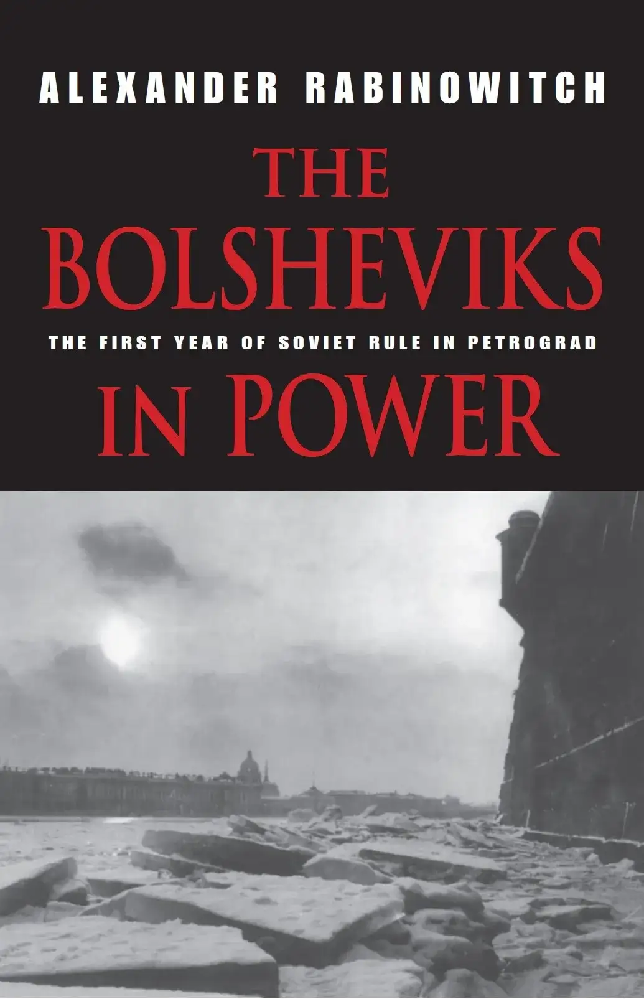
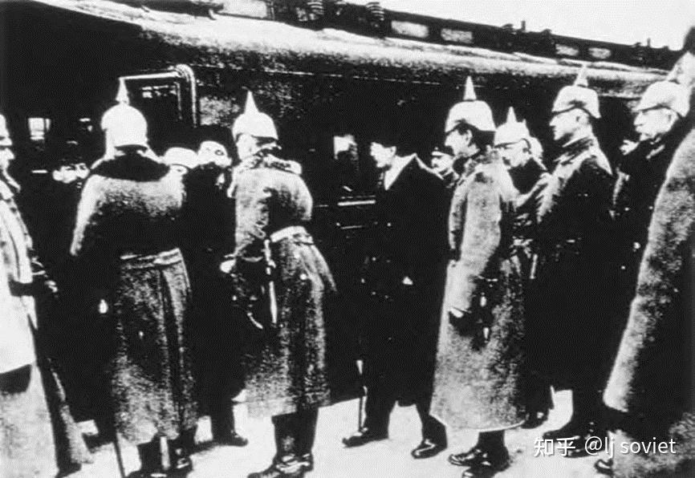

**第二部 战还是和？** 

**5. 战列宁** 

对疲于战争的俄国农民、工人和士兵来说，在广受欢迎的1917年布尔什维克纲领中，最吸引人的内容之一便是承诺立即实现不割地不赔款的和平。温和社会主义者曾试图在1917年夏的斯德哥尔摩召开一次和会。这一努力失败后，在俄国各主要政党当中，只有布尔什维克主张立即实现和平。由于对尽快结束世界大战噩梦的持久关切，像达维德·梁赞诺夫、所罗门·洛佐夫斯基和尤里·拉林这样的左翼孟什维克在1917年夏加入了布尔什维克党，并且尽管与占中央委员会多数的列宁派就政府组成问题存在根本的分歧，他们和像加米涅夫那样的布尔什维克温和派领导人在11月初没有退出布尔什维克。

作为10月26日全俄苏维埃第二次代表大会通过的最早一批法令之一，列宁的和平宣言呼吁各交战国立即展开和谈。在协约国未能积极回应苏维埃政府最初的和平倡议后，人民委员会与同盟国单独停战并举行和谈。谈判于1917年11月20日在布列斯特-立托夫斯克城展开，那里是波兰德战区的总部；两天后（11月22日），双方同意实施为期10天的停火，之后又顺延28天，且附有条件：除非一方在此后7天内提出异议，否则停火将自动延期。休战期间，将就永久性和约展开谈判。

苏维埃政府与同盟国单独展开和谈，这在俄国的前盟友之中，在苏维埃政权的国内批评界当中，在布尔什维克党的重要成分当中，引发了巨大的担忧。一般据信，激进的布尔什维克莫斯科区域局的领导人首先就此表示关切。[^1]但与此同时，在彼得格勒也出现了类似的反感。在彼得堡委员会11月16日的会议上，起初关注于解散和重选市杜马的相关问题，一名委员对于即将到来的对同盟国谈判表示关切。斯卢茨基在报告当前局势时，提出列宁和克雷连科有意单独与兴登堡达成和约。此后，维堡工人区的布尔什维克委员会代表维克托·纳尔丘克[^2]警告称，如果党不兑现实现普遍和平的承诺，便将丧失人民的支持。但对于大部分与会者来说，认为列宁和托洛茨基在对德谈判时会背信弃义，则未免荒谬。他们仍然表露出这样的看法，即通过选举新一届由单独媾和的激烈反对者（后来的“左翼共产主义者”）掌控的执行委员会（他们的主要领导机关）来实现和平。[^3]

彼得格勒布尔什维克担心，在与同盟国和谈进程中，可能背离“普遍的无产阶级和平”的目标。和谈期间没有出现任何英法参加的迹象，或者国外工人对于苏维埃呼吁他们将媾和掌握在自己手中反应平平，加剧了这种担忧。这种越发严重的关切在11月23日彼得堡委员会与区鼓动员的会晤中得到了体现。会议邀请了卡尔·拉狄克就对外事务阐述他的看法。以国际主义著称的拉狄克作为党的杰出领导人，因为自己战时在中欧的经历而相信，德国和奥匈帝国的工人和士兵已经成熟到足以追随革命俄国的领导，并且整个欧洲确实处于决定性的革命动乱的边缘。11月23日他向彼得堡委员会传递的信息是热烈呼吁反对一切“与资本家达成协议”。俄国如今为全世界群众指明了道路，他宣称并强调道，俄国革命和世界革命的命运是不可分割的。只有同时伴随着使外国工人革命化的激烈运动，并在党内发起反对妥协派的无情斗争，政府与德国人单独对话才是正确的。[^4]

大部分参加此次会议的地方领导完全同意拉狄克的结论，即与资本家的协议是不可接受的。但在他的论述中，拉狄克想当然地认为，相当一部分俄国前线士兵仍然能够打一场革命圣战。在之后的讨论中，德米特里·马努伊尔斯基（别兹拉博特内）[^5]对这一想法提出了挑战。他明确宣称，“不可能继续为俄国而战了”。但他并不觉得，这是值得担心的事情，因为不利的和约所带来的后果会迅速被国际革命会所消除。马努伊尔斯基对动员俄国士兵和工人进行革命战争之可能性的悲观态度，遭到了许多人的反对，其中就包括另一位维堡区代表格里戈里·叶夫多基莫夫[^6]和第2城区的帕维尔·帕霍莫夫[^7]。叶夫多基莫夫觉得，在必须重启军事行动的情况下，遣散不可靠分子，并为剩下的部队提供更好的补给，能够提升军队的士气。他强调指出，重要的是坦率地提出可能爆发革命战争，从而使工人、士兵和水兵能为此做好准备。帕霍莫夫附和着这种看法，坚称：“如果革命战争不可避免，那群众将会理解。”另一方面，对于或许必须进行革命战争的想法，帕霍莫夫在第2城区的同事莫伊塞·哈里托诺夫[^8]含蓄地表示反对，指出他无法想象德国人会坚持不利的和平条件。尽管这次会议并未就和平问题做出正式决议，但讨论表明，彼得堡委员会的大多数人以及区级活动分子强烈反对单独媾和。[^9]

---

布列斯特-立托夫斯克的正式和谈始于12月9日。[^10]当天，俄国代表团团长阿道夫·越飞重申苏维埃政府坚决要求实现不割地不赔款的和平。他随后阐述了苏维埃政府所认为的和谈主要基本原则。其中包括，外国军队迅速撤出所有被占领土；恢复1914年以来许多国家丧失的独立地位；就所有被统治民族是否从其现今所在国独立而出进行完全自由的公投。它们还规定保护各地少数民族的权利，并排除任何形式的割地和赔款。

对于上述原则，代表同盟国的奥匈帝国外交大臣采尔宁伯爵[^11]在12月12日的一次谈判会议上予以了回应。起初，他的说法令苏维埃方面欢欣鼓舞。他宣称，同盟国希望尽快达成公正全面的和约，并且越飞所说的、包括禁止割地和赔款在内的原则，为讨论这样的和平提供了基础。但采尔宁有两点至关重要的保留，尽管它们的实际意义似乎未得到越飞的理解：第一，接受苏维埃方面的原则，条件是所有交战国均不过分拖延地接受这些原则；并且第二，同盟国不能无条件接受所有被统治民族自决的原则。这些民族的未来必须由各国根据其自身宪法加以解决。

尽管对上述保留意见感到失望，但在采尔宁的回复当中，越飞和他的同事们觉得有积极友好的调子，并为此感到高兴。它不仅似乎能够使人民进一步施压，促使协约国加入和谈，而且还意味着无论协约国有何举动，同盟国都准备从前俄罗斯帝国的被占领土撤军。为了纠正苏维埃方面的这种理解，同盟国在两天后一份澄清被占领土地位的声明中，重申他们撤出俄罗斯领土的责任取决于协约国全面的对等行为。但是，他们出人意料地补充道，基于自决原则，被占领的波兰、立陶宛和拉脱维亚大部的各民族已经表示了从俄罗斯分离的意愿（这几乎意味着宣布他们有意将这些国家转变为保护国）。

革命和平原则得到了貌似积极的回应——越飞的这一消息已于12月12日电告斯莫尔尼，并按其字面意思而被理解为一种惊人的胜利。12月14日《真理报》头版头条宣布，德国人已接受俄方的原则作为和谈基础，并且已同意达成不割地不赔款的全面和平。这篇文章要求法国、意大利和英国士兵响应这些让步，起来反抗自己的政府。

在当日（12月14日）夜晚些时候的中执委会议上，苏维埃领袖们仍然兴高采烈。当托洛茨基起来报告谈判进程时，人们报以长时间的喝彩，而他也没有试图抑制这种兴奋情绪。他反而提出，布列斯特的发展给予革命外交以一次出色的证明。“德国已经完全接受了由苏维埃[第二次]代表大会设定的和平条件，”他高声赞扬道。“即便敌人们……最近曾预言德国外交官甚至不会跟我们对话，还会向我们开战。他们如今反而看到德国的提议成了我们政策的巨大胜利。”惯常在讲台上斥责布尔什维克的伊萨克·施泰因贝格也大加赞赏起他们的革命促和活动。“这是我们外交的第一个巨大胜利，”他宣称。“我们手无寸铁地走入敌营，不是以平等的而是以优越的口气说话。帝国主义遭受了致命一击。”他提出动议，热烈支持人民委员会的和平努力。动议得到了一致通过。季诺维也夫不甘人后，提议周日（12月17日）在全国举行“和平大游行”，以纪念布列斯特的伟大胜利。他的决议也得到一致通过。[^12]

斯莫尔尼宫可能是在16日夜才初步获悉采尔宁于12月14日做出的澄清，尤其是其中否定苏维埃代表团起初对同盟国谈判立场的乐观理解的内容。当时，布列斯特-立托夫斯克的对话已暂停，苏维埃代表团正在返回彼得格勒途中。代表团次日（12月17日）晨抵京后，径直来到斯莫尔尼宫，向人民委员会的晨会作报告。政府的大部分重要成员都在场。[^13]对于代表团的陈述，人民委员会的相关会议记录记得并不清楚。但在12月19日的中执委扩大会议上的长篇讲话中，加米涅夫透露了代表团2天前与人民委员会会晤时不得不说的内容。[^14]同盟国初步愿意以越飞提出的原则为基础进行谈判，这一点仍被视为卓越的胜利，尽管这些原则的落实显然会是假心假意的。关于未来的经济关系，代表团或许传达了其这样的印象，即德国人觉得，它们不会由于单独的协定而获得任何特殊好处或特权。但是，在软化德方对于至关重要的被占俄国领土问题的立场——尤其是德国人显然有意操弄自决原则，以保持对波兰、立陶宛和拉脱维亚大部的控制——方面，代表团无能为力。正如加米涅夫在其报告中向中执委所解释的那样：“德国人把自决原则从民族解放的公式转变为吞并的假面。”[^15]

在得悉代表团的报告后，人民委员会要求尽快发来德方条件的准确文本，并在同时继续讨论德国人的用意。[^16]似乎可以想见，基于间接的证据，加米涅夫和托洛茨基怀疑德国人是否有能力强行实现其吞并意图（他们都觉得，任何这样做的企图都会导致德皇被推翻）。两人似乎进一步地表达了这样乐观的愿景，即欧洲盟国不久会转向妥协，以及在其他努力失败后成功发动一场革命战争。

仍有一点不明的是，在和平进程的这一节点上，列宁是否也怀有类似的希望。但可以肯定的是，在同日（12月17日）晚些时候与当时在京参加复员问题大会的俄军前线部队、主要城市卫戍部队以及海军的代表进行的漫长会议上，他对革命战争的效力或许还抱有的一切期望遭受了严重打击。恰在同时，顿河流域的主要反革命威胁变得显著起来，以至要用火车将彼得格勒的赤卫队运往当地，与安东诺夫-奥弗申柯的部队并肩作战。[^17]由于尚未开始组织一支社会主义的军队，因而对列宁来讲，前线“旧军队”的战斗力至关重要。他不断地向军事代表提出口头问话，并让他们填写了有关如下问题的问卷：德军发动新一轮攻势并进军彼得格勒的可能性和可能结果，以及俄方一旦打破和谈，前线俄军战斗力会如何。[^18]

根据现存所有资料，列宁的调查结果是惊人的。大部分代表的回复是，如果战事重启，他们所能求得的最好结果是，俄军会有序撤退。但即便在这种最好的情况下，它也将损失炮兵部队，并在同时，复员会加速。大部分代表似乎觉得，如果德国人展开新一轮进攻，俄军部队将无法组织起认真的地方，也不能组织彼得格勒的迅速沦陷。因此，他们中的绝大多数人要求，尽量把布列斯特的谈判往后拖，并且如果必要的话，不惜一切代价达成和约。[^19]

这次调查的结果在当时鲜为人知。但及早以俄方条件达成和约的前景变得暗淡，这令中执委计划的和平游行的组织者们大为窘迫。他们已开始积极筹备12月15日的游行，并且次日更甚。单纯取消游行在政治上是尴尬的。因此，鉴于当时彼得格勒驻有德国高级代表团，决定将游行的主题从庆祝和平转为展示军事力量、人民对苏维埃政策的支持以及对革命的国内敌人的广泛敌视，以此给德国人留下深刻印象。于是在人民委员会听闻布列斯特代表团不祥地描述德方的领土野心时，约6000名彼得格勒卫戍部队的武装士兵、数百工厂代表和一些游行队列成群结队地穿过彼得格勒市中心，此后在战神广场列队经过站满苏维埃要人的检阅台。写有和平口号的横幅淹没于红旗和和标语牌——其中的内容或是赞美苏维埃政府，或是谴责立宪会议、各色“人民公敌”、“怠工分子”、“阿夫克先季耶夫分子和切尔诺夫分子”以及“科尔尼洛夫的卡杰特”——的海洋中。[^20]

鉴于列宁的调查所暗示的东西，无怪乎在12月18/19日深夜人民委员会的下一次会议上，与德方要求的意思相关的军队状况，成为主要的讨论话题。[^21]会上，列宁询问当时的军队总司令克雷连科[^22]，在他以及士兵委员会代表看来，德国人如果进攻，俄军士兵是否会作战。就像前一天被列宁询问的军事代表一样，克雷连科直言不讳地回答到，军队已丧失战斗力，且不能容忍推迟结束战争——简言之，除了接受德国人提出的所有条件之外，别无其他选择。[^23]

会前，列宁已经看过了军事代表昨日对其问卷的书面答复。就其个人而言，这些答复是极为可悲的。他让与会者（包括波德沃伊斯基和帕维尔·德边科[^24]这样的战争人民委员部官员）传阅了这些答复。[^25]虽然人民委员会12月18/19日会议的会议记录丝毫未有提及此后的讨论性质如何，但这一事实表明它是活跃的：参加讨论的有多名左翼社革党人（包括科列加耶夫、卡列林、施泰因贝格和特鲁托夫斯基[^26]）以及像柯伦泰、卢那察尔斯基、瓦列里·奥辛斯基（瓦·瓦·奥博连斯基）[^27]和乌里茨基那样未来的左翼共产主义者。最终决定，列宁问卷的结果“明确了”目前军队的状态。但也通过列宁提出的决议：进一步展开针对德国扩张主义的宣传鼓动并为此追加经费，和谈地点移至斯德哥尔摩，拖延对话并反对德方终结对话的企图，加强增加军队战斗力的措施，采取措施防范德军向彼得格勒突破，以及在国内宣传革命战争的必要性。[^28]

---

当时，虽然普遍认为旧军队完全丧失了士气，但人民委员会还是在为可能的重新开战做准备。在此节点上，克雷连科命令他的指挥官们，为可能重启的战事做准备。与此同时，他呼吁志愿者参加一支社会主义新军队。[^29]但布尔什维克的彼得堡委员会绝不是这样看待人民委员会的军事政策的。彼得堡委员会极为警惕政府的失败主义。在此节点上重要的是，12月19和21日的委员会会议上，最主要的议题是拉狄克有关“西欧与和谈”以及“国际形势”的报告。[^30]鉴于11月23日拉狄克向彼得堡委员会做的报告以及此后他的讲话和著述，几乎毫无疑问的是，在这次报告中，他会强烈要求在布列斯特的谈判中保持强硬，并且如有必要，抵抗德军的一切军事威胁。此时，拉狄克一门心思地劝阻苏维埃政府，不要采取任何可能有损中欧和西欧革命运动的措施。同样显而易见的是，彼得堡委员会的执行委员会以及整个委员会的多数派与拉狄克一样，坚决反对与帝国主义分子做任何交易。

在12月21日会议之后，执行委员会起草了一份和谈纲领，以备12月28日下一次彼得堡委员会例会的通过。尽管纲领文本目前下落不明，但其主旨和要点可见于那次会上雅科夫·费尼格施泰因（在介绍纲领时）代表执委会发表的讲话以及随后的讨论。在讲话开头，费尼格施泰因解释道，执行委员会决定将俄国的和平策略问题付诸投票，因为它坚信，这样至关重要的问题不应单由政府自行决策，广大群众通过其革命领导机构所进行的监督将会提供必要的指导。

在讲话的其余部分，费尼格施泰因不断攻击现行的和谈方式，并热烈呼吁追求革命目标。德军士兵，他说道，并没有战斗的意愿。另一方面，俄国武装力量坚决捍卫革命。在这种情况下，苏维埃政府应该怎么办？对于费尼格施泰因以及（进而言之）他在执委会的同事们来讲，答案是显而易见的。无论如何，绝没有理由在革命原则上做出妥协。“在我们公式[不割地不赔款的普遍和平]上的每一次退让，都将损害工人和农民，”他坚称。“我们只想为这种和平而战。”“如果我们无法在和谈中实现[我们的]目标，那我们该怎么办？”他反问道。“我们应该中止谈判。”由此，德国帝国主义者的吞并企图将暴露于全世界人民面前。“由这种政策造成的战争将不同于之前的一切战争，”费尼格施泰因继续说道。“政治上觉悟的工农兵群众将明白，别无其他选择。”“向群众灌输和谈的开启保证了和平的希望，对我们来讲是一个巨大的错误，”他补充道。“我们现在必须发起一场广泛的运动，说服群众不能接受德国的和平条件，并表明可能[进行]反德革命战争。”[^31]

接着，费尼格施泰因向执行委员会提交了纲领。从对这份纲领的活跃讨论来看，它的主旨在于提醒中央委员会，彼得堡委员会坚决反对任何形式的让步。讨论中最引人注目的或许是，所有代表都像执行委员会那样，担忧与德皇代表的勾连。一些来自各区的发言者对于俄国士兵和工人有意打一场革命战争，其乐观程度不亚于费尼格施泰因。但大多数人主要还是寄希望于欧洲无产阶级（如萨拉·拉维奇[^32]和费多尔·丁格尔施泰特[^33]）的及时援助，或者至少布列斯特和谈能够拖得足够晚，以为革命战争提供有利条件（如谢苗·谢姆科夫[^34]和莫伊塞·戈列利克[^35]）。

实际上，所有人全都要么直接要么间接地反对与同盟国的妥协。维堡区的伊万·瑙莫夫[^36]最担忧这样的危险，即俄国的前盟友或许会试图将自己与反对德国帝国主义的革命战争联系起来。一些人已经开始关心，在反帝战争中接受资本主义列强的援助是否恰当，而瑙莫夫觉得，这个问题原理当由费尼格施泰因来回答。大家也似乎都同意，彼得堡委员会有必要直接干预，以使政府和党的领袖挺直脊梁。正如来自纳尔瓦区的斯坦尼斯拉夫·科肖尔[^37]所言：“我们有足够的理由相信，党的上层在动摇。”局势呼唤着勇敢：“我们应该攻击帝国主义分子，而不是跟他们讨价还价。”“一些同志[如列宁]说，守住一些东西是好过战败，”科肖尔补充道，“我相信，就是战败也比妥协好。”[^38]

沃洛达尔斯基，这位彼得堡委员会在普通党员中最权威和最有人气的人物，或许最热烈地请求传统上激进的彼得堡委员会坚决维护革命原则。他有着费尼格施泰因和科肖尔那样的看法：觉得似乎随着新一轮和谈即将展开，上层显然正在发生一些没有被告诉彼得堡委员会的事；政府当中存在的极度危险的、接受下流的和平的倾向，会使全世界和平运动对布尔什维克感到愤慨；并且彼得堡委员会有必要像在1917年关键时刻所做的那样，加以干涉，以挽回局面。

这一次，沃洛达尔斯基出乎意料地对抵抗德国人以及在国外激起决定性的革命乐观起来了。与此同时，他抱持着宿命论，看到人们将经济混乱以及不可能供养1100万人的军队作为不惜一切代价接受和平的理由。他对此回应称，供养两三百万士兵跟供养1100万士兵不是一回事。布尔什维克已经摧毁了现行经济机构，而如果他们无法重新建立起一套经济机构，那么无论战争与否，他们都完蛋了。“进行妥协和指望两周内签署和约当然更容易得多，”他最后说道，但“这会把我们引向何方？”[^39]

接下来发言的拉维奇驳斥了她认为沃洛达尔斯基的评论中所包含的这种看法，既进行一场革命战争是容易的。但她随即补充道：“这不应当使我们停顿下来。”在她看来，革命俄国的生存希望与其说在于自己的力量，还不如说在于世界无产阶级。主要的任务是尽可能地引发国际革命。在她看来，执委会的纲领对于正在布列斯特谈判的和谈代表团是有帮助的。在12月28日会议的最后，彼得堡委员会通过了纲领。稍加编辑后，纲领被转交中央委员会。与此同时，彼得堡委员会考虑召集全国党大会“以明确党的政策路线”。但沃洛达尔斯基透露称，讨论目下争议问题的全国党代会已开始筹备，于是呼吁召开全国党大会的决定被推迟了。[^40]

---

12月24-27日，俄国史上最重要年份之一过去之时，列宁在芬兰休息。[^41]他于立宪会议开幕一周前的12月28日返回彼得格勒，并坚信：革命战争意味着自杀，接受一份合乎德方条件的割地合约是绝对至关重要的。历史学家们曾探讨过列宁在和平问题上的思想演变。一些历史学家认为，不仅列宁在1917年春季和夏季接受了德国人的条件，而且十月以及甚或布列斯特的出卖都不过布尔什维克和德国人共同搞乱俄国并结束东线战事的做法的一部分。[^42]且不论十月革命前德方金援布尔什维克的问题，通过阅读现存证据，我得出的结论是，列宁在走向政权时就相信，革命俄国要生存下去，就必须立即实现和平，但这种关切并没有令他多么烦心，因为对于国外即将发生决定性的社会主义革命，他抱有绝对的信心。可是到12月，对于能否寄希望于这些革命，和是否可能在短期内尽早实现普遍和平，他开始有所怀疑。在逗留芬兰之后，他做出了特有的180度转变，得出结论说，无论德国人提出怎样的和平条件，都只能接受。列宁担任苏维埃国家首脑期间最深刻的党内危机蓄势待发。

此时，同盟国已在布列斯特-立托夫斯克正式宣告，他们此前对于和平原则的谅解是无效的，因为协约国未能对此作出回应。此外，他们还向托洛茨基提交了一份有待签署的协议文本。实际上，他们甚至向他提交了一份地图，上面明确标出了那些将继续为德方占领的前俄国领土。此外，同盟国还私下与乌克兰拉达单独展开了和谈。在经数日而未能使对手作出让步后，托洛茨基电告列宁，不可能签署呈交给他的和约，并要求授权在未签署和约的情况下宣告战争中止、俄军复员。在电报中，托洛茨基信心满满地宣称，由于其国内局势困难，德国人无法重启战事，并请求列宁在回电当中作出决断。[^43]但在列宁看来，托洛茨基的设想是错误的。他判断，唯有立刻签署一份德方可以接受的正式和约，才能避免新一轮的德军攻势以及对布尔什维克的俄国事业的不可避免的破坏。1月3日，他回复托洛茨基，要求后者暂停谈判，并返回彼得格勒会商。[^44]

立宪会议的燃眉之急一俟结束，列宁便在《关于立刻缔结单独的兼并性和约问题的提纲》中概述了自己关于绝对需要立即缔结和约的看法，并安排68名来京参加全俄工兵农代表苏维埃第三次代表大会的党的重要领导人于1月8日召开一次非正式会议。列宁在提纲中提出，打败苏维埃政府的国内敌人、在社会主义基础上组织国家尚需时日，而社会主义革命虽然将不可避免地席卷欧洲，但其何时发生则无法预料。这是从十月及其后的立场上的重要退却。他因而提出，俄国有两种选择——要么立即展开一场革命战争，要么单独签署一份损失大量领土和赔款的和约。

支持立即进行革命战争的说法自始至终都是错误的，列宁接着说道。与他们的观点相反，只要利用和约所提供的时间来为革命战争做准备，苏维埃政府通过单独媾和，就既没有背叛国际社会主义事业，也没有违背十月前的诺言。最重要的是，正如列宁在提纲中所论述的那样，革命战争的拥护者们未能考虑到，前线的农民军队完全没有战斗力，并且无论如何都不会支持一场革命战争。同时，一支由工人和贫农组成的社会主义军队的组建工作才刚刚开始。没有欧洲的社会主义革命，俄国就会被击溃，苏维埃政府就会在几周内垮台，之后俄国将被迫接受一份甚至比如今更具有羞辱性的和约。革命战争不是一种选项；立即按照德方条件媾和虽然痛苦，却符合国际革命的利益。[^45]

提交了自己的提纲后，列宁遭到了革命战争支持者们——他们已被称为“左翼共产主义者”——的批判。在匆匆写成的说明中，他指出，莫斯科区域局的洛莫夫和瓦列里·奥辛斯基采取了与12月28日彼得堡委员会提纲相似的观点。[^46]在说明为何应结束和谈并展开革命战争时，奥辛斯基坚称，德国士兵会拒绝进攻革命俄国，并且德国即将发生一场反帝起义。来自萨拉托夫的瓦尔瓦拉·雅科夫列娃[^47]提出，要尽一切可能点燃欧洲的革命烈火，并且她已准备带着高扬的革命旗帜而为此牺牲。显然是在针对列宁担心俄国在军事上的虚弱，来自乌拉尔的叶夫根尼·普列奥布拉任斯基[^48]宣称，无法在前线保卫自己的革命就已经死亡了，法国大革命表明，在这种形势下必胜的信心是关键，并且无论如何，德国人是没有能力进攻的，因为俄国的冬季会使道路无法通行。[^49]

在这次大会上，托洛茨基持中间立场。这在他从布列斯特寄给列宁的信中得到了体现。他同意列宁的看法，即俄国不可能进行一场革命战争。但是，他和左翼共产主义者一样，怀疑德国人重启攻势的能力。因此他建议，干脆宣布结束战争，[俄国]军队复员并返乡建设社会主义俄国。在回忆录中，托洛茨基解释道，他并不确定德国人没有进攻的能力，但在（如有必要）签订一份割地和约前进行欺骗，是至关重要的；如有必要，在那之后也还来得及协商投降。[^50]一位与会者回忆称，对自己观点的无情攻击使列宁那样地沮丧，以至怒气冲冲地离开了会场。[^51]大会最后进行了投票，左翼共产主义者牢牢地战胜了列宁和托洛茨基（32名与会者投票支持革命战争，16人支持托洛茨基，仅有15人投票支持列宁）。[^52]

彼得堡委员会（更不要说莫斯科区域局）的成员无疑对这一投票结果感到欢欣鼓舞。但它不具有约束力。根据党的规则，正式全国党代会休会期间，决定全国性重要政策的最高权威是中央委员会。因此，在中央委员会1月11日的会议上，列宁发起另一次攻击，来赢得党的领导权。在这次会议之前，据托洛茨基说，他和列宁达成了谅解，如果尝试“不战不和”策略并归于失败，那么托洛茨基将支持“立即缔结和约”。[^53]1月11日中央委员会会议的大部分与会者参加了1月8日的非正式会议。因此，列宁能够继续自己未尽的事情。讨论开始时，他重申了自己纲领——它认为革命战争是无望的——的根据以及托洛茨基的提议，并最后总结称，后者是国际政治姿态，并不能阻止德国的扩张主义。如果苏维埃共和国不按照德方条件同意立即缔结和约，他补充道，就有德方发动攻势的危险，并且在那种情况下，俄国会不得不接受更为苛刻的和平条件。[^54]

令列宁气馁的是，与3天前全国各地党代表召开的扩大会议相比，中央委员会对他的论述的反应并没有更为积极。在与会的16名中央委员中，仅有3人——阿尔乔姆（费奥多尔·谢尔盖耶夫）[^55], 索科利尼科夫和斯大林——站在列宁一边。此外，相较于左翼共产主义者的热情，他们的评论仿佛例行公事。但这并不意味着1月8-11日之间，列宁敌手的看法没有发生变化。在1月8日，获得绝对多数票的是这种观点：立即停止与德国人和谈，宣布展开反资本主义的普遍革命战争。在3天后的中央委员会会议上，即便最热忱的左翼共产主义者也似乎在托洛茨基的主意——在宣布“不战不和”后离开谈判桌，以便尽可能拖延谈判；努力壮大国外革命运动，并加强国内军事力量——里面看到了可取之处。

在1月11日的讨论中，左翼共产主义者公认的领袖布哈林直截了当地宣称“托洛茨基的立场是最正确的”，并补充道：“德国人打击我们又如何，他们前进了一百俄里又如何——我们关心的是，这对国际[工人]运动的影响。”维也纳正在发生与布列斯特谈判有关的总罢工，而签订和约会对其造成严重的破坏。关键是要抓住一切机会拖延谈判，并且不签订一份下流的和约。这样便会将西欧的群众会鼓动起来。[^56]尽管承认革命俄国尚未准备好立即进行革命战争，但同样也是热忱的左翼共产主义者的乌里茨基补充称，接受一份割地和约将疏远彼得格勒无产阶级。“通过拒绝签署和约[并]复员军队……我们自然是在给德国人开道，”他观察到，“可那时，必定会在人民当中激起自我保存的本能，革命战争将开始。”[^57]

洛莫夫反对列宁的论点，认为喘息之机并不能实现社会改革，并坚称德国的反对会阻止它的发生。他宣称，缔结和约将使革命俄国向德国帝国主义投降，并提出：“我们不得不接受托洛茨基的立场，但同时要尽全力为革命战争做准备。”捷尔任斯基毫不含糊地插嘴道，签署和约意味着放弃整个布尔什维克纲领，并指责列宁是在“带着假面做季诺维也夫和加米涅夫在十月做的事情”，即仅仅考虑俄国，而忽视俄国各种事件的伟大国际影响。只有作为彼得堡委员会代表参会的科肖尔似乎仍然坚持左翼共产主义者的初衷——要求立即展开革命战争。他以12月28日彼得堡委员会纲领为指导，宣称：“彼得堡组织正在并将继续尽可能长地抗议列宁的看法，并认为革命战争的立场是唯一可能的立场。”[^58]科肖尔或许并没有意识到，此话并不全然为真。彼得格勒的一些区党委已更为接近托洛茨基而非彼得堡委员会的看法。[^59]

到1月11日中央委员会讨论结束时，列宁立场所获支持之微弱已是那样明显，以至它甚至未能付诸表决。以11票反对、2票支持和1票弃权，否决了立即展开革命战争。反之，以9票支持和7票反对，党的最高领导层采用了托洛茨基“不战不和”的公式，并且复员[旧]军队。同时，以12票支持和1票反对，采纳了列宁提出的、重在尽可能拖延和谈的决议。[^60]据报纸报道，当日夜，全俄工兵代表苏维埃第三次代表大会的左翼社革党党团局和左翼社革党中央委员会表决通过，如未达成令人满意的和约，便采取一切可能之手段继续战争。[^61]但这一立场迅速发生了变化。1月12或13日夜，在布尔什维克和左翼社革党中央委员会的联席会议上，大部分与会者对立即按德方条件接受和约不予理会，拒绝宣布革命战争，并且投票支持采取托洛茨基的策略。如今，这一决议是各方乐见的。在列宁看来，它意味着如果不能在布列斯特进一步拖延下去，那么将签署和约；左翼共产主义者和左翼社革党则认为，已经允许他们为革命战争做准备；而托洛茨基的结论则是，他现在被授权宣布“不战不和”。他还设想，万一德国重启战事，按德方条件签署和约将被拖延下去，直至德国表明有能力进行一次成功的进攻，以及欧洲工人的反应变得明确起来。

---

1月11日夜，列宁向全俄苏维埃第三次代表大会报告了其政府的目标和成就。在这份报告中，他回避了和谈相关问题，而将其留给了托洛茨基。[^62]因此在13日发言时，托洛茨基重点重述了布列斯特的谈判。据他说，通过明确暴露德国的帝国主义企图，他们将奥地利和德国的革命危机提升到了新的高度。[^63]加米涅夫在有关布列斯特的进展及其国际影响的补充发言中，重复了这一说法。[^64]根据已出版的记录，无论托洛茨基还是加米涅夫的讲话，抑或大会有关和谈的决议，都没有甚至提及“不战不和”的策略，以及可能有必要发动一场革命战争。大会于1月14日通过了布尔什维克和左翼社革党有关和约政策的联合决议，后者支持并且赞赏苏维埃政权为实现普遍的、民主的和平而做出的一切声明和采取的一切措施。决议明确表示，中欧的革命工人运动是达成反帝和约的最大保障，并指示俄国和谈代表坚持俄国革命纲领所体现的和平原则。[^65]人们可以得出结论说，未能如布尔什维克和左翼社革党中央委员会建议的那样，为托洛茨基的“不战不和”公式背书，是姗姗来迟地承认，在布列斯特进一步公开俄国的谈判立场会破坏这一策略。但造成这种沉默的原因更为复杂。当时一些左翼共产主义者（包括彼得堡委员会的领导层）[^66]认为，列宁派占多数的布尔什维克党团有意使代表大会通过的决议含糊其辞，以便将是否签署割地和约，留给列宁和人民委员会自行做出最终决断。正如我们会看到的，列宁和斯维尔德洛夫接下去正是这样解读决议的。[^67]

在他的讲话中，或许是出于对列宁的尊重，托洛茨基暗示道，布列斯特的工人代表会继续揭露德国人的假心假意，同时不能排除这样的可能，即俄国代表将被迫与资本主义代表签署一份明显背离工人利益的和约。[^68]在后来的一次大会讲话中，季诺维也夫也提高了俄国人或许被迫签署一份割地和约的可能性，但他立刻补充称，这份和约实际上只会是一份休战协定。[^69]尽管这些对俄国可能接受一份割地和约的暗示无疑增加了左翼共产主义者和左翼社革党的担忧，但它们却不被局外人所了解。因此，尽管厌恶布尔什维主义（毕竟离解散立宪会议仅一周有余），但即便马尔托夫在听了托洛茨基的讲话后，都称赞起“世界国际革命的培育者”为实现普遍和平而采取的“惊人的措施”。[^70]

马尔托夫如此评论，或许是对欧洲革命骚动短暂加剧的反映，而后者似乎与俄国的和谈政策相关。正当彼得格勒的苏维埃代表大会代表试图确定革命和谈政策之际，有那么短暂的一段时间，维也纳、布达佩斯特、华沙、赫尔辛弗斯、柏林和其他欧洲主要城市传来的最新消息似乎表明，人们焦急等待着的、决定性的西方社会主义革命可能即将到来。对于国外各种革命骚动迹象的新闻，其中的只言片语都得到了彼得格勒的布尔什维克媒体狂热的追捧，并向欣喜的代表大会代表加以宣布。

彼得格勒人在1月13日阅读布尔什维克的《红色公报》[^71]时，遇到了下面巨大的加粗标题：

> 在奥地利、匈牙利和华沙，革命工人正在组建他们自己的工人代表苏维埃……一团巨大的火焰包裹着全世界！[^72]

而在1月17日：

> 当工人、士兵和农民在十月推翻地主和产业家的时候，他们只知道一件事：没有其他国家的革命，我们的革命就不会取得胜利……仅仅几天之前，全世界的目光就转向了奥地利、匈牙利和波兰，那里的人民起义撼动着当地沙皇的王冠。

现在我们有了更好的消息：

> 在维保、赫尔辛弗斯、坦佩雷和芬兰的其他几座城市，芬兰的赤卫队正在对芬兰资本家发起一波又一波的打击……在法国南部也发生了同样的事情……[而]在英国已经爆发了数次大罢工……世界革命近在咫尺。[^73]

最令人充满希望的则来自1月19日：

> 据电报消息，德国的革命运动已经开始，并正在飞速发展……世界革命正胜利前进，并且现在毫无疑问，最后的胜利即将到来。[^74]

这一好消息的浪潮在1月21日达到了顶峰，当日《红色公报》的加粗标题是：

> 各国和各民族的人民起义继续发展……
> 
> 仅仅几天前，俄国革命似乎遭到了可怕的孤立……
> 
> 而如今呢？
> 
> 如今新生的力量正在打击我们共同敌人的后方……使世界革命的打击力量前所未有地加强了。[^75]

欧洲革命骚动扩大的迹象令左翼共产主义者激动不已，它似乎印证了他们对和谈的立场。1月15日人民委员会决定开始组建“工农红军”，并在军事人民委员部中设立一个部务委员会（collegium）来协调执行该决定，这或许也使他们大受鼓舞。[^76]同时，苏维埃代表大会对和谈问题的处置令他们大为光火，因为这可能使列宁不顾大多数党员的看法和国外似乎决定性的事件，而在一定程度上实现其与帝国主义德国单独缔结和约的目标。他们不能允许缔结这种和约。1月15日，12名最有影响力的左翼共产主义者联署声明，要求在一周内召开一次全国党大会，以就和谈问题做出明确的决定。如果在这次大会之前签署和约，那么他们将宣布辞去党和政府的领导职务。[^77]

同日（1月15日），彼得堡委员会执行委员会签署了一项类似的强硬宣言。这份由科肖尔、格列布·博基、费尼格施泰因、拉维奇和阿法纳西·普卢日尼科夫[^78]（都是左翼共产主义者）联署的宣言反映了彼得格勒组织对中央委员会深深的不信任：

> 致俄国社会民主工党中央委员会：
> 
> 据[第三次]全国代表大会布尔什维克党团的动议可知，如今中央委员会[在和谈问题上]遵循的政治路线倾向于达成所谓“下流的”和平，这会使我们的原则遭到放弃……并使我们党必定不再成为革命先锋队……执行委员会代表彼得格勒组织，强烈抗议[我们的和谈的]基本方向以及甚至我们最大党组织的负责机构都在秘而不宣地行事。
> 
> 我们有充分理由可以断言，签署一项“下流的”和约悖乎党内多数人的意见……如果我们继续选用当前的和谈政策……我们党将面临分裂的危险。由此，执行委员会要求立即召开一次特别党员大会。[在]当前形势下，只有它能确定我们的和谈立场。[^79]

在大约1月18日与“积极党务工作者”举行的一次会议上，彼得堡委员会全体成员就和平问题进行了长时间的讨论。此后在1月下半月，彼得堡委员会连续召开的几次讨论“战争还是和平”问题的会议。在第一次会议上，布哈林就该问题做了主旨报告。从同一时期他的其他声明和著述来看，在这次报告中，他显然强烈反对签署一项割地和约，并可能支持“不战不和”策略，同时又呼吁加紧准备为期不远的革命战争。他或许还怂恿向中央委员会施压，以在不久召开一次党大会。可布哈林向中央委员会发表的一份声明则显示，他不同意执行委员会1月15日宣言所谓之党存在分裂的隐患。[^80]

1月18日左右的会议上，除1票弃权之外，彼得堡委员会对和平问题的讨论最终一致通过了布哈林就该问题起草的另外一份纲领。这份纲领并未直接提及托洛茨基的“不战不和”公式抑或立即展开革命战争。也没有呼吁就和谈政策召开一次全国党大会。它们反而从国际角度出发，根据国外的最新消息，集中驳斥了列宁有关立即单独媾和的论点。和谈正在布列斯特-立托夫斯克进行，而这成为布哈林的首要关切。

这份纲领明确指出，接受还是拒绝不利的割地和约，其唯一有效标准在于，是否最有利于无产阶级革命的发展；国际无产阶级运动此时正经历一次决定性的突破，而和谈进一步推动了它，可接受一份“可耻的和约”将破坏它；即便革命俄国在前线的失败，也能通过进一步革命化敌军而有利于世界革命；和约能够提供喘息之机，从而确保苏维埃政权在俄国的存续，这种想法是一种幻想，国际帝国主义会尽快攻击革命俄国。[^81]

在1月19日（2月1日）布尔什维克中央委员会的一次会议上，对于召开党大会的要求如何回应成了头等议题。[^82]这次会议的所有与会者都承认，围绕战争还是和平的问题，党内存在着严重危机，并似乎决心阻止危机发展为正式的分裂。此外，对于下一步最宜采取何种措施，异议是很少的。此前，列宁提议称，他的政府最终可能按照德方条件签署一份和约，并且就他本人而言，他从全俄苏维埃第三次代表大会那里获得了如此行事的授权。[^83]对于立即召开正式党大会的要求，列宁在这次会上采用的应对策略是，一面呼吁中央委员会尽早与仍然在京参加苏维埃代表大会的党的主要区域组织领导人召开一次会议，一面维持召开决定性的全国党代会的前景。尽管党代会的决定对于新当选的中央委员会有权威性和约束力，但筹备一次代表大会至少需要一个月的时间。因此，党代会最早的开会日期可能太晚，以至无法在对德谈判中束缚住列宁的手脚。

斯大林、斯维尔德洛夫、斯塔索娃[^84]、阿尔乔姆和索科利尼科夫支持列宁的看法。此时，托洛茨基回到了布列斯特。与会的左翼共产主义者并不承认列宁所谓之其政府获得了和谈的授权。甚至列宁还没开口讲话，洛莫夫就表示，由于托洛茨基以及尤其是季诺维也夫在苏维埃代表大会上的讲话让许多党员怀疑已确定与德国单独媾和，故而有必要召开一次大会。因此，洛莫夫说道，有“必要倾听[全]党的声音，它已经沉默了很久”。[^85]而列宁刚要发言，乌里茨基便坚称，“托洛茨基的看法赢得了苏维埃代表大会”，并“得到了中央委员会的采纳”。左翼共产主义者一致同意，布尔什维克的和谈政策处于混乱之中，只有一次正式党大会才能将它确定下来。1月19日的中央委员会会议上，布哈林和洛莫夫最有力地表达了这一点。最终，中央委员会计划于2月20日（3月5日）召开一次紧急全国代表大会，并在1月21日召开一次非正式大会，会上将公开和平问题上的所有主要分歧。

中央委员会1月21日大会的14名与会者就10个问题进行了表决。仅有5名与会者——列宁、斯大林、穆拉诺夫、阿尔乔姆和索科利尼科夫——支持立即签署一份割地和约。包括列宁在内的大部分人，可能暂时受到国外革命事件的影响，[^86]支持拖延和谈。仅有因诺肯季·斯图科夫[^87]希望立即结束和谈。大多数人觉得，如果割地和约是作为最后通牒而提出的，那便可以允许签署。在这个问题上，只有左翼共产主义者奥辛斯基和斯图科夫投了反对票。布哈林和乌里茨基似乎在投票前离开了会场，但即便他们投票反对，就此的结果也还是一样的。基于提出的问题，有人推测在布列斯特指导托洛茨基的“不战不和”政策根本没有争议。此外，投票结果准确地反映出当时围绕分裂着党的和平问题的尖锐分歧。[^88]

如今似乎一切都取决于欧洲的革命进展，以及（当然还有）布列斯特-立托夫斯克的和谈。托洛茨基于1月17（30）日返回布列斯特。重启和谈时，正好碰上布尔什维克在芬兰和乌克兰的军事胜利。再加之欧洲的革命骚动——所有这些似乎都是俄国人的好兆头。但这暂时前途在望的局势并没有持续很长时间。最重要的是，德国所有重要的罢工和革命抗议运动都迅速遭到严厉镇压。局势的此种发展使列宁重新坚信，有必要尽快接受德国的和平条件。此时克雷连科向人民委员会书面报告了俄军前线和后方卫戍部队的最新状况，这进一步坚定了列宁的想法。同时在布列斯特，托洛茨基和他的同事们正同自己的同级别者争吵。而德国总参谋部越发不耐烦。在1月23-24日（2月4-5日）的休会期间，一方面是德国与奥匈帝国政府之间的商议，另一方面，德军高级司令部与前者达成共识，加快与乌克兰代表团单独缔约的步伐，并且一俟完成便向托洛茨基提出最后通牒，即在一周内结束布列斯特-立托夫斯克的和谈。托洛茨基要么不得不接受向他提出的条件，要么重启战事——这是德国外交大臣里夏德·冯·屈尔曼[^89]将向托洛茨基提出的最后通牒。

*苏方代表团抵达布列斯特-立托夫斯克。在德国军官中间的是列夫·托洛茨基。戴维·金特藏。*

尽管为使本国政府的吞并政策具有某种合法性，奥匈帝国和德国方面的温和派最后还争辩了一番，但马克斯·霍夫曼[^90]所代表的德军总参谋部对和谈的影响与日俱增，因此对俄方谈判人员来说，进一步拖延和谈显然不再可能。1月27日（2月9日），同盟国与乌克兰单独签署了一项协定。托洛茨基此前兴致盎然地预测的时刻紧随次日1月28日（2月10日）到来了。在同盟国代表似乎被哄骗得相信俄国将要有条件投降之后，托洛茨基扔出了他的“炸弹”。他宣布，尽管俄国拒绝签署正式和约，但它认为它与德国、奥匈帝国、保加利亚和土耳其的战争状态已告结束，并在复员自己的军队。[^91]

当日晚些时候，同盟国的首席代表们最后开了一次会。除霍夫曼将军外，所有人都强烈地处于得过且过状态。屈尔曼和切尔宁的立场是，既然俄国人的宣言已默认被占领领土继续为德方控制，那就不需要费什么劲了。但霍夫曼将军在其军事首长的指示下，坚称与俄国休战的目的在于达成和约，而这一点尚未实现，因此休战告于结束，需按休战协定的规定，在7天内重启战事。[^92]

德国人争论到晚上，而俄国代表们自信于（如果不是完全确信的话）对俄国来讲，漫长而可怕的大战梦魇结束了，他们去往火车站，预备返回彼得格勒。就在离开布列斯特之前，托洛茨基匆匆地将当时的情况电告了正在莫吉廖夫的俄军最高统帅部的克雷连科，并指示其下令复员。克雷连科迅速执行了托洛茨基的指示。在列宁的坚持下，复员令于次日撤回，但它们在心理上进一步瓦解了彻底丧失士气的俄军，这是不可挽回的。离开前，德国和奥匈国外交官们正迫使军方温和下来的消息，使俄国代表团进一步增强了对和平的希望。于是，他们带着欢声笑语走进自己的火车车厢，相互祝贺他们向德帝国主义施展的非凡妙计，并放松了下来。“在返回彼得格勒途中，我们都觉得，德国人不会展开攻势。”托洛茨基在数年后回忆道。[^93]

---

在1917年9月末和10月最初几周里，对于立即夺取政权，列宁的主要理由之一是，所有欧洲国家都处于无产阶级革命的分水岭，而俄国的布尔什维克，由于他们的有利状况，有机会和责任引发这场革命。他坚称，布尔什维克如果坐等苏维埃代表大会推翻临时政府，那就是背叛国际革命事业。

1917年12月初，德国与苏维埃政府开始在布列斯特-立托夫斯克单独和谈。此时，列宁仍然相信欧洲即将爆发决定性的社会主义革命。但到当月底，他曾自信满满地预测的回应性的（answering）革命并没有发生，前线俄军士气的极端低落得到了证实，且反革命军队开始在顿河流域扩张。有鉴于此，列宁得出结论，立即按德方条件签署和约，对革命俄国来说是生死攸关的。但对他而言不幸的是，党在彼得格勒、莫斯科和全国各地的领导机构中，许多最亲密的同志仍然保持着他先前热烈的国际主义（这在布尔什维克彼得堡委员会的领导人那里是最确定无疑的）。由于坚信与德皇政府单独媾和会破坏将于几年内爆发的德国革命，革命战争虽然痛苦但却可行，以及俄国的社会主义革命不能独力维生，他们拒绝接受列宁所坚持的不惜一切代价达成和约。

在这种情况下，托洛茨基的“不战不和”策略——前提是，一旦革命俄国干脆单方面宣布终战和复员，德皇的政府便无法让自己的部队上阵作战，从而对俄国来讲，战争终结——在布尔什维克和左翼社革党当中得到了广泛的认同。在1月中旬，两党的大部分领导人（尽管不包括列宁）接受了托洛茨基的办法。在欧洲一阵起初充满希望的劳工骚动浪潮被镇压下去后，1月28日（2月9日）托洛茨基突然在布列斯特向吃惊的德国谈判人员提出自己的宣言，然后带着智取敌手的乐观想法返回了彼得格勒。但理所当然，一切都取决于德方的回应。

## 参考

[^1]: 参见列宁，《全集》，第35卷，第253页。（《〈关于立刻缔结单独的兼并性和约问题的提纲〉的补充说明》，《列宁全集》第33卷，中央编译局编译，北京：人民出版社，1985年，第256页。——译者注）
[^2]: 维克托·尼古拉耶维奇·纳尔丘克（Виктор Николаевич Нарчук，1882-1920），早年为工人，1915年加入布尔什维克，次年开始在维堡区从事地下工作。二月革命后，在工厂从事组织动员工作，曾担任《工人与士兵报》的名义主编，并积极参加十月革命的准备工作。1918年末开始在沃罗涅日从事工人工作。次年秋参加红军，前往南方战线与白卫军作战。1920年因伤寒病逝。——译者注
[^3]: 《彼得堡委员会》，第571-576页。
[^4]: 《彼得堡委员会》，第579-593页。
[^5]: 德米特里·扎哈罗维奇·马努伊尔斯基（Дмитрий Захарович Мануильский，1883-1959），化名“别兹拉博特内”（Безработный，意为“失业的”），生于今乌克兰境内的东正教教士家庭。1903年进入圣彼得堡大学学校，同年加入俄国社会民主工党。1905年在圣彼得堡从事鼓动工作，次年参与组织了喀琅施塔得和斯韦阿堡要塞的武装起义。被捕后越狱，并于1910年流亡法国。1912年在圣彼得堡和莫斯科从事地下工作，次年再次流亡法国。二月革命后作为区联派成员返回俄国，后加入布尔什维克。十月革命时，担任彼得格勒军事委员会委员，年底开始在食品人民委员部工作。1918年被派往乌克兰从事革命工作。1922年起，长期在共产国际工作，1924年当选共产国际执委会主席团成员。卫国战争期间及其后，主要在乌克兰从事外交工作。1953年退休。——译者注
[^6]: 格里戈里·叶列梅耶维奇·叶夫多基莫夫（Григорий Еремеевич Евдокимов，1884-1936），生于小市民家庭，15岁时成为水手，1903年加入俄国社会民主工党。此后因参加革命工作而数次被捕。1917年成为布尔什维克彼得堡委员会的鼓动员，并参与了赤卫队的组建工作，后当选立宪会议代表。内战期间主要在彼得格勒从事军队政治鼓动和工会工作。1925年当选联共（布）彼得格勒省委第一书记，此后积极参与了季诺维也夫的反对派活动。1926年被选入联共（布）中央委员会，次年因托-季反对派的失败而被开除出党。1928年因承认错误而恢复党籍，此后主要从事农业和食品工作。1934年被捕，1936年被处以死刑。1988年平反。——译者注
[^7]: 帕维尔·列昂季耶维奇·帕霍莫夫（Павел Леонтьевич Пахомов，1890-1943），生于农民家庭，1911年加入布尔什维克。1914年因在造船厂工人当中从事宣传工作而被捕，并流放西伯利亚。二月革命后返回彼得格勒，在第2城区从事鼓动工作，并积极参加了十月革命。1918年起担任彼得格勒省苏维埃执委会主席，1920年被派往西伯利亚工作。——译者注
[^8]: 莫伊塞·马尔科维奇·哈里托诺夫（Моисей Маркович Харитонов，1887-1948），生于职员家庭，1905年加入布尔什维克，次年被捕后流放。后从流放地逃脱，1912年流亡瑞士，在苏黎世从事布尔什维克的党务工作。1917年同列宁一道回国，担任布尔什维克彼尔姆省委书记。1918年起在红军中从事政治工作。1921年起，分别在乌拉尔和萨拉托夫担任地区党委领导。1927年因参加左翼反对派而被开除党籍，次年声明退出反对派后恢复党籍，后从事外贸工作。1934年被捕，并被判处有期徒刑。1948年死于服刑期。1958年平反。——译者注
[^9]: 《彼得堡委员会》，第581-587页。
[^10]: 对于这次和谈富有洞见的分析，见理查德·肯·迪博（Richard Kent Debo），《革命与生存：苏维埃俄国的对外政策，1917-1918年》（Revolution and Survival: The Foreign Policy of Soviet Russia, 1917–1918），多伦多，1979年，第45-112页。
[^11]: 奥托卡尔·切尔宁（Ottokar Czernin，1872-1932），生于贵族家庭，1916年起任奥匈帝国外交大臣。——译者注
[^12]: 基普，《争论》，第213-217页；《第二届工人、士兵、农民和哥萨克代表苏维埃全俄中央执行委员会会议记录》，第152-155页。
[^13]: 俄罗斯国家社会-政治史档案馆，19号全宗，1号目录，28号案卷，第2张。
[^14]: 基普：《争论》，第223-239页。
[^15]: 基普：《争论》，第228页；《第二届工人、士兵、农民和哥萨克代表苏维埃全俄中央执行委员会会议记录》，第164页。
[^16]: 俄罗斯国家社会-政治史档案馆，19号全宗，1号目录，28号案卷，第2张。
[^17]: 参见上文，第2章。
[^18]: 米·克德罗夫（Михаил Сергеевич Кедров），《红色笔记本中关于伊里奇的片断》（Из красной тетради об Ильиче），载《回忆弗拉基米尔·伊利奇·列宁》（Воспоминания о Владимире Ильиче Ленине）第2卷，莫斯科，1957年，第97页；尼·伊·波德沃伊斯基，《从赤卫队到红军》（От красной гвардии к красной армии），载《马克思主义历史学家》（Историк-марксист），1938年第1期，第16-34页。列宁问卷的文本收于列宁，《全集》第35卷，第179-180页。（克德罗夫的中译文见《回忆列宁》第3卷，南京大学外语系俄罗斯语言文学教研室《回忆列宁》翻译组译，北京：人民出版社，1982年，第160-161页。这里所说的问卷文本中译见《向为复员军队而召开的全军代表大会的代表提出的问题》，《列宁全集》第33卷，中央编译局编译，北京：人民出版社，1985年，第182-183页。——译者注）
[^19]: 参见迪博，《革命与生存》，第60页；以及叶·瑙·戈罗杰茨基，《1917-1918年的军队复员》（Демобилизация армии в 1917–1918 гг.），载《苏联历史》（История СССР），1958年第1期，第15-19页。
[^20]: 《晚报》（Вечерний час），1917年12月18日，第2版。
[^21]: 俄罗斯国家社会-政治史档案馆，19号全宗，1号目录，29号案卷，第2张。
[^22]: 尼古拉·瓦西里耶维奇·克雷连科（Николай Васильевич Крыленко，1885-1938），生于前民粹派革命者家庭，1903年进入圣彼得堡大学学习。1904年加入布尔什维克，此后主要在工人当中从事鼓动工作。1907年两次被捕后，脱党。1911年重新开始为布党从事宣传工作，此后当选杜马代表。1912-1913年在沙俄军中服役，一战前夕流亡国外。1915年返回莫斯科从事地下工作，不久后被捕，次年被送上战场。二月革命后，在沙俄军队中从事宣传鼓动工作，后参与了十月革命的准备工作。十月革命后，担任陆海军人民委员和俄军总司令。1918年起，开始从事司法工作，历任苏俄总检察长和司法人民委员。大清洗期间被枪决。1955年平反。——译者注
[^23]: 俄罗斯国家社会-政治史档案馆，19号全宗，29号案卷，第2张；5号全宗，1号目录，2424号案卷，第19张；马·尼·西蒙尼扬（Марина Николаевна Симонян），《他的职业是革命：以文献为基础的尼·瓦·克雷连科生平与著作概述》（Его профессия революция: Документальный очерк о жизни и деятельности Н.В. Крыленко），莫斯科，1985年，第93-94页。在一封1920年代写给十月革命史与俄共（布）党史委员会的信中，克雷连科指出，军事代表会议过后，他向列宁提交了一份书面报告。他在报告中强调，依靠旧军队进行战斗是完全无望的。因为在旧军队看来，休战和开始和谈即表明战争结束了（十月革命史与俄共（布）党史委员会，《全联盟共产党[布]代表大会与代表会议会议记录：第七次代表大会，1918年3月》[Протоколы съездов и конференций Всесоюзной коммунистической партии (б): Седьмой съезд, Март 1918 года]，莫斯科-列宁格勒，1928年，第261-262页，注释48）。16（十月革命史与俄共（布）党史委员会[Комиссия по истории Октябрьской революции и РКП(б)，简称Истпарт，拉丁化Istpart]，是负责搜集和出版十月革命史和俄共[布]党史资料的研究机构，成立于1921年，前身为1920年建立的苏俄国家出版社党史委员会。该委员会起初隶属于苏俄教育人民委员部，后转归俄共[部]中央委员会管辖。1928年转为列宁研究院下辖，1939年解散。——译者注）
[^24]: 帕维尔·叶菲莫维奇·德边科（Павел Ефимович Дыбенко，1889-1938），柯伦泰的第二任丈夫，生于农民家庭，1907年参加布尔什维克的活动。1908年起在里加当工人，1911年开始在波罗的海舰队服役，此后在水兵中从事地下革命工作。1916年因从事反战宣传活动而被捕，获释后继续从事地下革命工作。二月革命后，成为波罗的海舰队中央委员会主席，后参加了十月革命。1917年11月当选立宪会议代表，并直接参与解散了立宪会议。此后，主要从事军事工作。大清洗期间被枪决，1956年平反。——译者注
[^25]: 列宁，《全集》，第35卷，第472页；亚·丘巴良（Александр Оганович Чубарьян），《布列斯特和约》（Брестский мир），莫斯科，1964年，第106页。（《全集》中译见《列宁全集》第33卷，中央编译局编译，北京：人民出版社，1985年，第486页。——译者注）
[^26]: 弗拉基米尔·叶夫根耶维奇·特鲁托夫斯基（Владимир Евгеньевич Трутовский，1889-1937），生于贵族家庭，1907年加入社会革命党，此后主要从事报刊文宣工作。1917年成为左翼社革党中央委员，并当选全俄农民代表苏维埃执委会委员和立宪会议代表。1918年任地方自治人民委员，并参加了左翼社革党暴动。暴动失败后转入地下，1920年被捕后旋即释放，但次年再次被捕。1926年被流放至阿拉木图，并在当地从事经济工作。大清洗期间再次被捕，并被处以枪决。——译者注
[^27]: 瓦列里安·瓦列里安诺维奇·奥博连斯基（Валериан Валерианович Оболенский，1887-1938），名字亦作“瓦列里”（Валерий），化名“尼古拉·奥辛斯基”（Николай Осинский），生于激进民主主义者家庭。在莫斯科大学学习时，参加了1905年革命。1907年加入布尔什维克，后成为召回派。第一次世界大战期间被征召入伍。二月革命后，在莫斯科活动。十月革命后，担任最高国民经济委员会主席，并成为左翼共产主义者。1920年代主要从事经济工作，并参加了当时的党内左翼反对派。1930年代主要从事学术工作。大清洗期间被处以枪决。1957年平反。——译者注
[^28]: 俄罗斯国家社会-政治史档案馆，19号全宗，1号目录，29号案卷，第28张；列宁，《全集》，第35卷，第181页。（《人民委员会关于同德国和谈等问题的决议草案》，《列宁全集》第33卷，中央编译局编译，北京：人民出版社，1985年，第184页。——译者注）
[^29]: 俄罗斯国家社会-政治史档案馆，5号全宗，1号目录，2423号案卷，第19张背面。
[^30]: 《彼得堡委员会》，第607、608页。
[^31]: 《彼得堡委员会》，第609-611、621-622页。
[^32]: 萨拉·瑙莫夫娜·拉维奇（Сарра Наумовна Равич，1879-1957），生于小店主家庭，1903年加入俄国社会民主工党。1906年离开俄国，后成为季诺维也夫的第一任妻子。二月革命后，与列宁一同乘车返回俄国，并成为布尔什维克彼得堡委员会委员。次年成为左翼共产主义者。1920年代参加了党内反对派活动，并因此而被开除出党，1928年又恢复党籍。大清洗期间及其后，数次被捕，1954年被释放。——译者注
[^33]: 费多尔·尼古拉耶维奇·丁格尔施泰特（Федор Николаевич Дингельштедт，1890-1938），生于作家家庭，1910年加入布尔什维克。二月革命后，在喀琅施塔得从事宣传鼓动工作。十月革命后，从事学术教育工作。1920年代参加了左翼反对派活动，后因此被捕、流放。大清洗期间，被处以枪决。——译者注
[^34]: 谢苗·莫伊谢耶维奇·谢姆科夫（Семён Моисеевич Семков，1885-1928），1902年加入俄国社会民主工党。1909年流亡国外，次年返回俄国领导，1913年被捕后逃亡国外。1917年11月返回俄国。后主要从事工会工作。——译者注
[^35]: 莫伊塞·萨穆依洛维奇·戈列利克（Моисей Самуйлович Горелик，1891-1920），化名“维克托”（Виктор），曾为沙俄军队士兵。二月革命后任彼得霍夫区苏维埃副主席和邮电委员、布尔什维克彼得堡委员会纳尔瓦区代表。在克里米亚从事地下工作时被白卫军杀害。——译者注
[^36]: 伊万·库普里亚诺维奇·瑙莫夫-戈列洛夫（Иван Куприянович Наумов-Горелов，1895-1938），生于农民家庭，后在莫斯科当工人。1913年加入布尔什维克，1915年参与创建了布党在图拉的地方组织，后进入彼得堡的工厂从事工运活动。二月革命后，当选彼得格勒苏维埃代表，并任布尔什维克彼得堡委员会执委会委员和维堡区代表。积极参加了十月革命的组织工作。后曾从事军队政治工作，担任党、苏维埃和工厂的领导职务。1934年被捕，大清洗期间被枪决。1963年平反。——译者注
[^37]: 斯坦尼斯拉夫·维肯季耶维奇·科肖尔（Станислав Викентьевич Косиор，1889-1939），生于波兰工人家庭。1907年在乌克兰加入俄国社会民主工党，并在工厂从事革命活动。二月革命后，迁徙至彼得格勒，并在纳尔瓦区从事党务工作，后任彼得格勒军事革命委员会委员。布列斯特-立托夫斯克谈判期间，为左翼共产主义者。1918年起，主要在乌克兰从事组织和领导工作。1930年当选联共（布）中央政治局委员，1934年就任乌克兰共产党（布）第一书记/总书记。1938年成为苏联人民委员会副主席。大清洗期间被处以死刑，1956年平反。——译者注
[^38]: 《彼得堡委员会》，第611-618页。
[^39]: 《彼得堡委员会》，第615-616页。
[^40]: 《彼得堡委员会》，第619页。
[^41]: 《弗拉基米尔·伊里奇·列宁年谱》，第5卷，第156-157页。25（《列宁年谱》目前仅第1-4卷有中译本。——译者注）
[^42]: 参见如德米特里·沃尔科戈诺夫（Дмитрий Антонович Волкогонов），《列宁：一部新传记》（Lenin: A New Biography），纽约，1994年，第109-128页；理查德·派普斯（Richard Pipes），《俄国革命的三个“为什么”》，纽约，1995年，第45-46页；理查德·派普斯，《俄国革命》（The Russian Revolution），纽约，1994年，第410-412、431-438和612-624页；以及理查德·派普斯编，《不为人知的列宁：来自秘密档案》（The Unknown Lenin: From the Secret Archive），纽黑文，1996年，第6、15-16页。
[^43]: 列·托洛茨基，《著作集》（Сочинения），第17卷，第1册，莫斯科-列宁格勒，1926年，第631页注释38。
[^44]: 列宁，《全集》，第35卷，第225页。（《同在布列斯特-里托夫斯克的苏维埃和谈代表团团长列·达·托洛茨基在直达电报中的谈话》，《列宁全集》第33卷，中央编译局编译，北京：人民出版社，1985年，第232页。——译者注）
[^45]: 列宁，《全集》，第35卷，第243-252页。（《谈谈不幸的和约问题的历史》，《列宁全集》第33卷，中央编译局编译，北京：人民出版社，1985年，第247-255页。——译者注）
[^46]: 苏共中央马克思列宁主义研究院，《列宁文集》（Ленинский сборник），第11卷，莫斯科，1929年，第43-44页；苏共中央马克思列宁主义研究院，《俄共（布）第七次特别代表大会，1918年3月：速记记录》（Седьмой экстренный съезд РКП(б), март 1918 года: Стенографический отчёт），莫斯科，1962年，第216-218页。（《〈关于立刻缔结单独的兼并性和约问题的提纲〉的补充说明》，《列宁全集》第33卷，中央编译局编译，北京：人民出版社，1985年，第256页。——译者注）
[^47]: 瓦尔瓦拉·尼古拉耶夫娜·雅科夫列娃（Варвара Николаевна Яковлева，1885-1941），出生于信仰东正教的犹太商人家庭。1904年加入布尔什维克，在莫斯科从事鼓动和组织工作，次年参加莫斯科的武装起义。后多次被捕、流放，二月革命后在布尔什维克的莫斯科区域局从事党务工作，并参与组织了十月革命期间莫斯科的武装起义。契卡成立后，在该组织中担任领导职务。1918年初，为左翼共产主义者。次年就任苏俄粮食人民委员。在1920年代的布尔什维克党内斗争中，参加领导了左翼反对派，但1926年宣布退出反对派。1930年起，先后就任苏俄教育副人民委员和财政人民委员。大清洗期间被捕并被判处有期徒刑。1941年被枪决，1958年平反。——译者注
[^48]: 叶夫根尼·阿列克谢耶维奇·普列奥布拉任斯基（Евгений Алексеевич Преображенский，1886-1937），生于教士家庭，1904年加入俄国社会民主工党，后成为布尔什维克，并参加了1905年革命的武装起义。1906年被捕，次年出狱后被派往乌拉尔从事党务工作。二月革命后，当选赤塔工兵代表苏维埃副主席，并作为代表参加了全俄工兵代表苏维埃第一次代表大会。十月革命后，主要在乌尔拉地区从事党务和苏维埃政权的组织工作。布列斯特-立托夫斯克谈判期间，为左翼共产主义者。1919年与布哈林合著了《共产主义ABC》。1920年代初，主要从事财政、教育和农业工作。1923年起，成为托洛茨基反对派的主要理论家，期间著有《新经济学》一书，提出了以工农剪刀差为基础实现快速工业化的“社会主义原始积累”理论。苏联工业化开始后，于1929年宣布与托派脱离关系。此后主要从事经济工作。1933年被捕，大清洗期间被处决。——译者注
[^49]: 苏共中央马克思列宁主义研究院，《俄共（布）第七次特别代表大会，1918年3月：速记记录》，莫斯科，1962年，第216-218页。
[^50]: 列·托洛茨基，《我的生平》，纽约，1970年，第382-383页。32（《托洛茨基：我的生平》，赵泓、田娟玉译，郑异凡校，上海：上海人民出版社，2007年，第334-335页。——译者注）
[^51]: 克德罗夫，《红色笔记本中关于伊里奇的片断》，第10页。33（《回忆列宁》第3卷，南京大学外语系俄罗斯语言文学教研室《回忆列宁》翻译组译，北京：人民出版社，1982年，第161页。——译者注）
[^52]: 《俄国社会民主工党（布）中央委员会会议记录》，第168页。另参加尼·尼·斯米尔诺夫，《全俄苏维埃第三次代表大会》，列宁格勒，1988年，第98页。
[^53]: 就此参见迪博，《革命与生存》，第79页。
[^54]: 《俄国社会民主工党（布）中央委员会会议记录》，第168-169页。
[^55]: 费奥多尔·安德烈耶维奇·谢尔盖耶夫（Фёдор Андреевич Сергеев，1883-1921），化名“阿尔乔姆”（Артём），生于农民家庭。1901年加入社会民主工党，次年因参加学运而流亡巴黎。1903年返回俄国，相继在顿巴斯和哈尔科夫从事农民和工人的组织工作。1905年革命期间，在哈尔科夫领导了武装起义。起义失败后，在乌拉尔地区从事党务工作，1910年流亡国外。二月革命后返回俄国，主要在乌克兰领导革命工作，并当选布尔什维克中央委员。1920年在螺旋桨驱动火车测试事故中身亡。——译者注
[^56]: 《俄国社会民主工党（布）中央委员会会议记录》，第169-170页。
[^57]: 《俄国社会民主工党（布）中央委员会会议记录》，第170页。
[^58]: 《俄国社会民主工党（布）中央委员会会议记录》，第172页。列宁对该次会议的评注收于《弗·伊·列宁：不为人知的文献，1891-1922》（В. И. Ленин. Неизвестные документы, 1891–1922），莫斯科，1999年，第223-224页。
[^59]: 例如，在奥赫塔区的布尔什维克当中就发生了这样的转变（中央国家历史-政治文献档案馆，10号全宗，1号目录，1号案卷，第1-2张）。
[^60]: 《俄国社会民主工党（布）中央委员会会议记录》，第173页。
[^61]: 《彼得格勒回声报》，1918年1月12日，第2版；《我们的消息报》（Наши ведомости），1918年1月13日，第2版。
[^62]: 《全俄工兵农代表苏维埃第三次代表大会》，第21-34页。
[^63]: 《全俄工兵农代表苏维埃第三次代表大会》，第48-55页；托洛茨基，《著作集》，第17卷，第1册，第53-69页。
[^64]: 《全俄工兵农代表苏维埃第三次代表大会》，第56-58页。
[^65]: 《全俄工兵农代表苏维埃第三次代表大会》，第71、92-93页。
[^66]: 参见《俄国社会民主工党（布）中央委员会会议记录》第180-183页的执行委员会声明。
[^67]: 参见俄罗斯联邦国家档案馆，1235号全宗，18号目录，7号案卷，第31张。
[^68]: 《全俄工兵农代表苏维埃第三次代表大会》，第52页。
[^69]: 《全俄工兵农代表苏维埃第三次代表大会》，第64页。
[^70]: 《全俄工兵农代表苏维埃第三次代表大会》，第59页。
[^71]: 《红色公报》（Красная газета）由沃洛达尔斯基创办于1918年1月，是一份在彼得格勒出版的日报。曾为彼得格勒苏维埃的机关报，1939年并入《列宁格勒真理报》。——译者注
[^72]: 《红色公报》，1918年1月13日，第1版。
[^73]: 《红色公报》，1918年1月17日，第1版。
[^74]: 《红色公报》，1918年1月19日，第1版。
[^75]: 《红色公报》，1918年1月21日，第1版。
[^76]: 俄罗斯国家社会-政治史档案馆，19号全宗，1号目录，47号案卷。
[^77]: 《俄国社会民主工党（布）中央委员会会议记录》，第181页。
[^78]: 阿法纳西·米罗诺维奇·普卢日尼科夫（Афанасий Миронович Плужников，1882-1946），生于农民家庭，木工，1913年加入布尔什维克。二月革命后，当选彼得格勒赤卫队主席团成员、布尔什维克彼得堡委员会彼得格勒区代表。1919年参加契卡，此后一直在苏维埃政权的秘密警察部门工作。大清洗期间被解除职务并开除党籍，1939年恢复党籍。——译者注
[^79]: 《俄国社会民主工党（布）中央委员会会议记录》，182-183页。
[^80]: 《俄国社会民主工党（布）中央委员会会议记录》，第176页；特别参见论题5至8。
[^81]: 《俄国社会民主工党（布）中央委员会会议记录》，第183-184页。
[^82]: 《俄国社会民主工党（布）中央委员会会议记录》，第174-180页。
[^83]: 《俄国社会民主工党（布）中央委员会会议记录》，第175-175页、第283-284页注释207。
[^84]: 叶连娜·德米特里耶夫娜·斯塔索娃（Елена Дмитриевна Стасова，1873-1966），生于贵族家庭，1898年参加俄国社会民主工党和工人阶级解放斗争协会。1903年俄国社会社会民主工党分裂时，成为布尔什维克。后长期从事地下工作和布尔什维克地方党务的领导工作，期间多次被捕。二月革命后，被任命为布尔什维克中央委员会书记。十月革命后，主要从事彼得格勒地方党务和共产国际工作。1946年退休。——译者注
[^85]: 《俄国社会民主工党（布）中央委员会会议记录》，第175页、第283页注释206。
[^86]: 就此，参见列宁于1月21日给他的《关于战争的提纲》补充的第22点。（列宁，《全集》，第35卷，第251-252页）。（这里《关于战争的提纲》即《关于立刻缔结单独的兼并性和约问题的提纲》。补充之第22点的中译见《列宁全集》第33卷，中央编译局编译，北京：人民出版社，1985年，第255页。——译者注）
[^87]: 因诺肯季·尼古拉耶维奇·斯图科夫（Иннокентий Николаевич Стуков，1887-1936），生于教士家庭，1905年参加布尔什维克。二月革命时，为布尔什维克莫斯科区域局成员，后当选立宪会议代表。1918年参加红军，次年担任乌法革命委员会主席。1920年加入民主集中派，1926年参加托季反对派。此后被开除出党，在莫斯科从事军事和经济工作，大清洗期间被处以枪决。——译者注
[^88]: 《俄国社会民主工党（布）中央委员会会议记录》，第190-191页。另参加《弗·伊·列宁：不为人知的文献》，第225-227页。
[^89]: 里夏德·冯·屈尔曼（Richard von Kühlmann，1873-1948），生于律师家庭，1917年8月至1918年7月任德国外交大臣。1944年，因涉嫌卷入刺杀希特勒而被捕。——译者注
[^90]: 卡尔·阿道夫·马克西米利安·霍夫曼（Carl Adolf Maximilian Hoffmann），生于法官家庭，1917年被任命为德军总参谋长。——译者注
[^91]: 托洛茨基，《著作集》，第17卷，第1册，第103-104、106页；马克斯·霍夫曼，《战争日记及其他文章》，埃里克·萨顿（Eric Sutton）译，第2卷，伦敦，1939年，第218-219页。
[^92]: 霍夫曼，《战争日记》，第2卷，第219页；约翰·惠·惠勒-贝内特（John W. Wheeler-Bennett），《布列斯特-立托夫斯克：被遗忘的和约，1918年3月》，伦敦，1963年，第229页。
[^93]: 托洛茨基，《我的生平》，第386页。（《托洛茨基：我的生平》，赵泓、田娟玉译，郑异凡校，上海：上海人民出版社，2007年，第338页。——译者注）