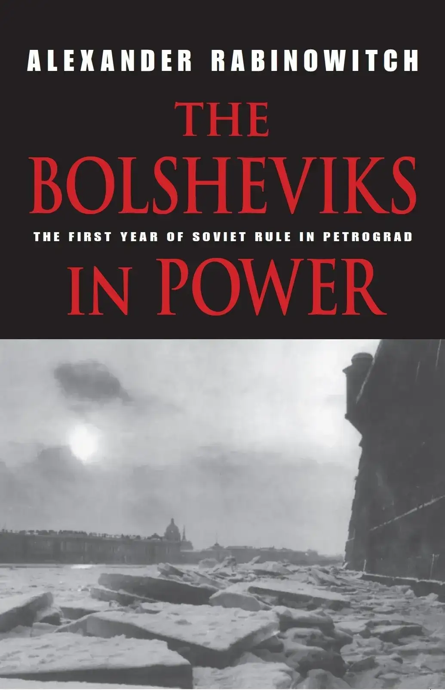
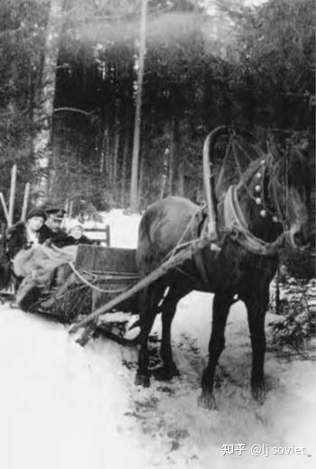
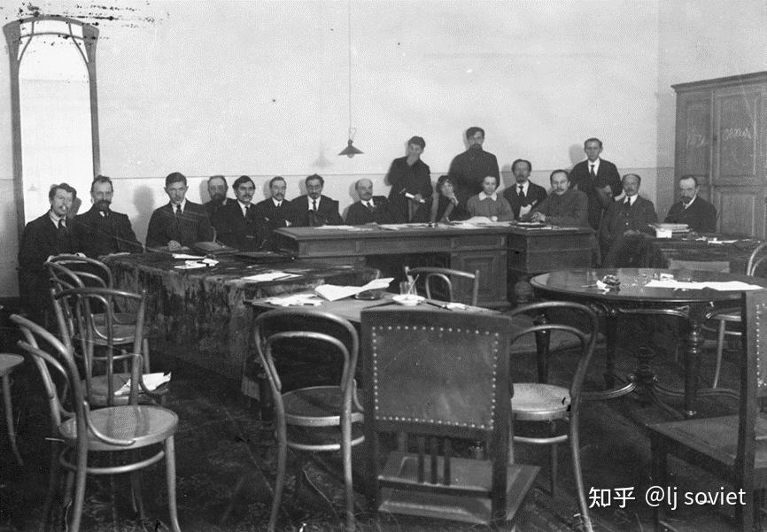

**6. “社会主义祖国在危急中”** 

最早于1月28/29日午夜，斯莫尔尼经专线得悉，托洛茨基以轰动性的方式宣布结束战争，并且似乎得到了同盟国的接受。季诺维也夫立刻向新闻界发表了一份欣喜的声明。对于这份声明，记者们必定像面对托洛茨基声明的布列斯特同盟国代表那样，是大惑不解的。当被一位困惑不已的记者问及“不战不和”的实际含义时，季诺维也夫信心满满地解释道，这相当于延长休战。“在我们看来，同盟国将无法发动攻势，因为它们的劳动群众是不会支持这样做的，”他说道，并迅速补充称，“不断并吞他国领土，不符合德奥两国的利益。”[^1]施泰因贝格回忆称，“自豪而忧虑的平静笼罩着彼得格勒”。[^2]

次日晨，布列斯特空前事变的消息传遍彼得格勒。布尔什维克和左翼社革党的中央委员会都召开紧急会议，支持托洛茨基的举动。[^3]在彼得格勒苏维埃的会议上，时任军事人民委员之一的布尔什维克军事组织前成员米哈伊尔·拉舍维奇直接宣称：“德军不会攻击那些已向全世界宣布无意让自己兄弟流血的人。”[^4]会议通过了季诺维也夫的动议《关于结束战争》。这份动议支持俄方在布列斯特-立托夫斯克的立场；呼吁德国、奥国、保加利亚和土耳其工人阻止帝国主义列强向波兰、立陶宛和库尔兰[^5]人民施暴；并宣布当前主要任务是新建一支社会主义红军。但动议首先关心的，与其说是招募一支新军，还不如说是让如今数以十万计乱哄哄地从前线涌回家乡的复员旧军人显得多少有点秩序。[^6]

可以想见，对于托洛茨基在布列斯特所作所为意义几何，彼得格勒新闻界看法不一。自由派和温和社会主义派的日报自始便对单独媾和态度谨慎。它们将托洛茨基的举动斥为一场灾难，称其注定要给饱受摧残、毫无防备的俄国带来新的考验、痛苦和沉沦。“革命开始走向终结，”孟什维克的《新光线报》就此如是说。另一方面，布尔什维克媒体则带着不加抑制的喜悦，欢迎布列斯特的消息。《红色报》的一条标题称，战争结束了：

> **在战争结束的次日** 
> 
> 我们正经历战争结束的次日……俄国的犁田人现在可以回到他梦寐以求的田地。俄国工人可以回到他离开已久的城市。全体俄国人民如今可以投身建设他们的自由新生活。[^7]

左翼社革党的媒体像布尔什维克的日报那样，倾向于认为，无论德国政府多么希望重启东线攻势，它都没有能力得偿所愿。“在发布[托洛茨基]这样的宣言后，由于无法给出侵略的理由，德军总参谋部难以让自己的部队攻击俄国，而德国士兵将明白，他的战斗只是有利于资产阶级吞并领土，”一位《劳动旗帜报》编辑在1月30日写到。“如今只是由于同盟国，和谈才破裂，革命运动自然将空前剧烈地爆发出来。”[^8]

当然，对于准备在西线进行一次决定性春夏攻势的西方盟国来说，东线停战可谓一种全然不妙的景象。例如两周前，英国外交部派了年轻而老练的俄国事务专员罗伯特·布鲁斯·洛克哈特[^9]作为特使前往彼得格勒。洛克哈特的首要任务是说服苏维埃政府继续与盟国协同作战。同时，英国海军当局委派新任驻彼得格勒海军随员弗朗西斯·克罗米[^10]上校负责从波罗的海地区撤出盟国战争物资。克罗米不久前负责指挥一支在波罗的海与俄国海军协同行动的潜艇编队。[^11]作为海军随员，他向海军情报部（Naval Intelligence）部长雷金纳德·“闪光灯”·霍尔[^12]上将报告。可是，克罗米此前并无谍报、颠覆甚或外交方面的经验。在8月的西北地区，曾为拉脱维亚军官的契卡线人将背叛他的信任，泄露其推翻苏维埃政权的努力。克罗米或许也受到了玛丽亚（穆拉）·本肯多尔夫[^13]（一位有魅力的俄国人，受雇担任英国使馆的文书和翻译）的欺骗。有证据强烈地倾向于，成为洛克哈特情人的穆拉是一名契卡线人。[^14]“播放使馆里各种可恶流言的留声机”，她在一封致洛克哈特的信中如此描述克罗米。[^15]

*1917-1918年冬，乘坐雪橇的英国驻彼得格勒海军随员弗朗西斯·克罗米上校。左侧是据称为契卡线人的穆拉·本肯多尔夫。蒙戈斯波特的王家海军潜艇博物馆允许使用。*

托洛茨基、拉狄克和卡列林于1月31日清晨5点自布列斯特抵达彼得格勒。托洛茨基立刻来到斯莫尔尼，向列宁简要汇报了谈判最后阶段的情况。托洛茨基和卡列林还于当日晚些时候向布尔什维克-左翼社革党中执委联席党团和人民委员会、于次日（即采用新历的首日——2月1日[14日]）[^16]夜向中执委特别全会汇报了谈判情况。[^17]

托洛茨基向中执委详细描述了他在布列斯特采取的策略。在谈判地位方面，1月袭击德国和奥匈国的罢工浪潮暂时地加强了俄国、削弱了德国。但在这一骚动被镇压下去后，德国代表团强势地（powerfully）重新提出自己的割地要求。在谈判的最后阶段，独立的乌克兰代表团和俄国媒体对俄军不断瓦解的生动报道进一步打击了俄国代表团。在1月27日（2月9日）同盟国与乌克兰代表团达成协议后，德国人显然不会就他们的要求作出退让，因此再也不能拖延结束谈判。在这种情况下，托洛茨基作出了他的退出声明。

托洛茨基带着毫不掩饰的欣喜，描述了对手震惊的反应，以及精挑细选后驻于布列斯特的德军士兵的看法。他说，后者向他全力保证，革命俄国不必担心会有一场德军攻势。即便他们的军官也宣称，无法令他们进军俄国。尽管托洛茨基警告称，不排除德方重新展开军事行动的可能，但他明确表示，这似乎不大可能。他此前已亲自巡视过俄军战线，在部队中目睹的混乱无序令他大失所望。由此，他不像左翼共产主义者那样，幻想如果德军进攻，俄军士兵会保卫革命。他的直接目标在于，公开且全面的复员将向全世界展示苏维埃俄国这样的坚定决心：退出战争，并使欧洲革命群众适当地承担起保卫俄国革命（如有必要）的负担。[^18]

卡列林向中执委强调指出，俄国代表团在布列斯特面临的基本问题，不是在于揭露同盟国提出的掠夺性条件（这是容易的），而是在于要求不仅仅单纯恢复战前领土状态。后者[^19]在本质上不符合要求实现不割地不赔款和约和各民族（无论它们何时丧失了独立地位）自决权的社会主义原则——这些原则由全俄苏维埃第二次代表大会的《和平法令》所规定，并在后来得到重申。[^20]托洛茨基在布列斯特的最终声明自然源于上述难题。俄国在布列斯特的立场使俄国革命成为各地被奴役人民的灯塔，卡列林继续说道。为了阐明这一点，他描述了自己和托洛茨基在布列斯特和谈间隙造访华沙时受到的友好欢迎。在人民当中，对俄国革命的崇敬替代了此前对俄国的敌意。卡列林和托洛茨基一样，承认单纯宣布战争结束并拒绝签署和约——这一冒险有挑起新一轮攻势的风险，但怀疑东线德军士兵是否可被用于进攻。[^21]

作为对托洛茨基和卡列林的回应，社革党代表蓬皮扬斯基赞扬了布列斯特代表团没有单独媾和；但他仍然认为，谈判的结果并不令人满意，因为它们使前线向德军的入侵门户洞开。正如自己此前在立宪会议上那样，蓬皮扬斯基在一片哄堂嘲笑中，呼吁在斯德哥尔摩组织一次国际社会主义和平大会，并通过立宪会议组织一个联合人民阵线政府。

代表左翼社革党发言的施泰因贝格给予苏维埃外交手段以更高的评价，辩称欧美劳工是俄国的天然盟友，而布列斯特使他们之间的纽带变得空前强大。对于蓬皮扬斯基的要求，施泰因贝格表示反对重新召集立宪会议，但却支持在斯德哥尔摩立即召开一次有广泛基础的社会主义和平大会，并停止不必要的国内倾轧以备同盟国或将重启战端。他警告称，俄国必须准备进行适当的防御战。“有鉴于此，首先必须结束目前正撕裂我国的民主派内战。”

对于托洛茨基所暗示的布列斯特削弱了奥-德方面，马尔托夫是不同意的。在他看来，一切迹象都指向相反的方向。尽管含蓄地支持“不战不和”公式，但他坚称，有必要考虑到同盟国会更为自信地面对俄国，并且首先需要创造条件，使全体俄国公民可能在德军入侵时参与保家卫国。

在他的结语中，托洛茨基回应马尔托夫，坚称防止俄国毁于德国人之手的首要责任在于德国人民。但他总结道，“如有必要，我们将不得不展开自卫”。这次会议通过了一份布尔什维克的决议。决议支持俄国代表团在布列斯特采取的立场，并相信这一立场会为各国社会主义工人所接受。决议相信，奥-德工人和士兵会争取已在维也纳和柏林开始的反对帝国主义分子和篡夺者的斗争的最终胜利。决议还警告称，俄国革命被敌人环伺，并指出当前的关键任务之一在于，组织一支自由的社会主义红军。[^22]加米涅夫现被派往英国和法国，以帮忙向西欧社会主义者解释俄国的和平政策。[^23]

次日（2月15日），托洛茨基看上去空前地相信，德国人不会进攻。他在彼得格勒苏维埃的晚间全会中提出，德国人有一成可能发起进攻，不进攻的可能性则有九成。[^24]在彼得格勒布尔什维克当中，广泛存在着这种想法：对俄国来说，战争已经结束；目下最重要的是解决国内危机。这一点在这一事实当中得到了反映：当日，托洛茨基承担起指挥食品采购和分配工作（这是当时革命俄国最棘手、最可怕的国内问题）的职责。[^25]

托洛茨基确实不大明白，他的预言会有多快遭受考验。围绕如何应对托洛茨基的“不战不和”宣言，德国民事和军事当局之间的争斗实际上在两天前（2月13日）的御前会议（Kronrat）上就决出了结果。会上，对于以何种政策对付革命俄国的争论最终决定，在东线展开一次有限的攻势。此次攻势的目的在于，将德军战线推进至纳尔瓦和普斯科夫，并（更重要的是）让“布尔什维克回到自己的位置”。攻势定于2月18日开始。[^26]

斯莫尔尼宫最早于2月16日得悉，德俄停战期已满并于18日中午重新恢复战争状态。[^27]收到载有这条消息的电报时，托洛茨基正在列宁的办公室，与列宁、卡列林和身份不明的卡列林党内同僚开会。显然对此深感不安的列宁悄悄地将电报递给了托洛茨基。在后来回忆这一幕时，托洛茨基写到，列宁迅速结束了会议，匆匆地把左翼社革党人弄出他的办公室，并脱口而出：“他们还是骗了我们……这头野兽不会放过任何东西。”[^28]

列宁提醒托洛茨基，根据他们之间的协议，他有责任支持立即达成和约。之后，托洛茨基回答到，德国人对俄国发动攻击的能力仍然有待考验。或许因此，消息暂时没有公布。[^29]它既没有被用于提醒负责俄国防务的高级军官，也没有告知人民委员会。[^30]18日夜，俄国情报机关截获一份发给德军指挥官的电报，内中宣布由于托洛茨基打破停战协议，德国人将重启攻势。直到此时，俄国军方才了解到正在发展的紧急事态。[^31]

---

德军重启攻势的消息立刻再次提出了那个为托洛茨基的“不战不和”策略所规避的、极具争议性的问题，即是否与同盟国单独媾和。实际上在2月17-24日之间，对这一问题重新展开的讨论（不断受到前线态势的影响，并且不确定德方的最终目的）不断地蔓延开来。新闻界、布尔什维克和左翼社革党中央委员会、人民委员会、布尔什维克和左翼社革党中执委党团、中执委全会、彼得格勒苏维埃、布尔什维克彼得堡委员会、彼得格勒布尔什维克第四次全市代表大会、彼得格勒各区苏维埃和布尔什维克各区委员会，以及工厂普通工人、兵营中的士兵、波罗的海舰队设施和舰艇上的水兵，都在进行这样的讨论。

讨论始于2月17/18日夜布尔什维克中央委员会的一次会议。已刊的当时中央委员会文献中有一份表格，表明了与会的11名委员就一系列战争与和平相关问题的表决情况。在列宁看来，这些问题中最重要的是，政府是否应当提出重启和谈，他将之理解为意味着请求立即按德方条件缔结和约。在这一问题上，列宁以6票对5票而失败。[^32]同样重要的是最后一个问题——如果德军果真发起攻势，且德、奥两国没有发生革命起义，那么是否应当缔结和约？列宁赢得了这次投票；托洛茨基兑现自己的承诺，投票支持列宁。

次日（2月18）上午，在德军军事行动预定展开前不久的会议上，中央委员会重新评估了发展中的局势。那时，前线附近已报告了许多密集的德军军事活动迹象。在正好切断德军战线的明斯克上空发现了敌机，似乎很快就将攻击雷韦尔[^33]重要的波罗的海海港。德方广播已经开始注重采取必要的保护措施，以防范东边的“传染病”。在中央委员会看来最糟糕的是，无论德军前线部队还是德国后方，都丝毫不见抗议迹象。不过，攻击尚未开始。结果，由于前一夜已花费那么多时间在偶发事件上，斯维尔德洛夫提议休会，直至实际情况变得更加明朗。列宁不许如此。出于对他的尊重，同意继续会议，并仅只集中讨论立刻电告德方、建议立即缔约是否可取。在上述讨论结束时，列宁的要求，即毫不迟疑地接受德方和平条件，再次以1票之差被否决。[^34]

这有助于解释出席当日夜（2月18/19日）早些时候开始的人民委员会会议的布尔什维克籍人民委员的言行。[^35]除了布尔什维克和左翼社革党阁员外，参加会议的还有中执委主席团、布列斯特和谈代表团、“旧”军队和酝酿中的红军和红海军总参谋部的代表。人民委员会的这次会议几次中断（以便许多与会者能够参加各自政党中央委员会的会议），并持续了整个晚上和清晨。很多讨论看上去集中于，如何克服实际上没有常设武装力量的困难，以及如何在国外援助到来之前保卫革命免于德国人的伤害。会议讨论的问题还包括：立刻宣布总动员（被认为时机尚不成熟，因为德国无产阶级或帝国议会的“干预”似乎还有希望）；游击战的可行性（被认为非常可行，因为“实际上人人都有武器”）；开始疏散彼得格勒（并不推荐，因为这有损防务）。

随着时间的推移，有关德军正展开攻势的报告变得益发渗人。敌人在几小时内夺取了德文斯克和明斯克，并在宽阔的战线上向彼得格勒进军。尽管组成攻击部队的是匆匆集结的非常规小分队，但惊慌失措的俄国士兵不做抵抗，一见德军逼近，连铁路线和桥梁都不加破坏，便仓皇逃窜。拿下德文斯克的部队规模还不到百人。

约莫午夜时分，人民委员会休会。在最后一刻，或许部分由于列宁急着电告宣布接受德方和平条件（以免德军进军彼得格勒），安排了布尔什维克中央委员会不久后召开一次深夜会议。这是中央委员会在24小时内召开的第三次会议。会上，列宁无情地请求立即实现有条件投降。[^36]“我们再也不能等下去了，因为局势已经明朗，”他坚称。“事情已经到了这种地步，如果我们继续坐以待毙，革命就一定会被摧毁。……如果德国人要求推翻布尔什维克政权，那么我们自然不得不战斗。[但]进一步拖延现在已经不是问题之所在了。”

*1918年1月，人民委员会的一次会议。从左至右分别是：伊·扎·施泰因贝格、伊·伊·斯克沃尔佐夫-斯捷潘诺夫、格·费·费奥多罗夫*[^37]*、弗·德·邦奇-布鲁耶维奇、弗·叶·特鲁托夫斯基、亚·加·施略普尼柯夫、普·佩·普罗尚、弗·伊·列宁、约·维·斯大林（站立者）、亚·米·柯伦泰、帕·叶·德边科（站立者）、伊·康·科克莎罗娃*[^38]*、尼·伊·波德沃伊斯基、尼·彼·戈尔布诺夫*[^39]*、弗·伊·涅夫斯基*[^40]*、亚·瓦·绍特曼*[^41]*和格·瓦·契切林。乔纳森·桑德斯特藏。*

正如在整个布列斯特危机期间一样，这次会上列宁的主要对手是布哈林。他虽然年轻，却最为镇定。他在讲话时提出，列宁和那些倾向于不惜一切代价达成和约的人是惊慌失措，那时发生的事情实际上都在预料之中。帝国主义势力一心要在革命进一步传播之前将其镇压下去。现在，关键是要进行不可避免的战斗。布哈林说道：“事情的发展恰如它所注定的样子。……一切都在我们的预料之中。我们说过，要么俄国革命传播开来，要么它会在帝国主义的压力下死亡。”

在列宁看来，布哈林所论是无望的空想。“如果我们没有[为一场革命战争]做好准备，我们就必须签订和约，”他愤怒地说道。“即便德国人增加例如不干涉乌克兰、芬兰、利沃尼亚和爱沙尼亚事务的要求，”他最后说道，“也绝对必须无条件接受。”[^42]对列宁来说，这是生存的代价！最重要的是拯救作为国际革命滩头堡的俄国革命。

尽管同意列宁所谓之苏维埃政府指挥的乌合部队不堪与德国人一战，但托洛茨基仍然期望欧洲工人会前来相救。在2月18/19日夜的中央委员会会议上，他敦促俄国不必立即投降，而是应致信柏林和维也纳，调查它们所提要求的性质——这显然是为了拖延时间。托洛茨基似乎相信，明示这些要求会有宣传价值。但在争论双方明确表示不接受这一想法后，他再次履行了自己与列宁达成的部分协议。在托洛茨基投出关键一票后，布尔什维克中央委员会以7票对5票以及1票弃权，转而建议立即通知德国政府，俄国准备签署和约。列宁和托洛茨基被授权按上述意思起草一份电文。不久后，左翼社革党中央委员会在15名委员中仅有6人到场的情况下，投票支持和约，并同意发送列宁和托洛茨基起草的投降电文。[^43]

尽管做出了上述决议，但一般而言，人民委员会在复会后，反对列宁的力量似乎没有发生明显的变化。有关德军进军速度的报告日益黯淡，重点却仍然在于抵抗。[^44]临近早晨的时候，第一次明确提出立即请求媾和，从而开启了新一轮激烈争论。列宁现在和托洛茨基一道，领导着争取立即投降的战斗。施泰因贝格和帕维尔·德边科成了革命战争的主要倡导者。有时，气氛变得如此对立，双方对于根本原则的分歧是如此巨大，以至在一位观察家看来，一些人民委员将不得不辞职。会议结束时，仍在会场的人民委员减少到9人，并以1票之差同意“立即签署和约”。[^45]在未与中执委协商的情况下，列宁和托洛茨基立刻向柏林发电，表示人民委员会准备按照在布列斯特-立托夫斯克提出的条件签署和约。[^46]

布尔什维克和左翼社革党之外的政治团体作何反应？实际上面对德军进攻的消息，它们都宣布准备捐弃前嫌，一致对外、保家卫国。于是无怪乎，对于俄国在24小时出头的时间里投降的消息，它们是一片愤怒。卡杰特、社革党和孟什维克报刊以极为尖锐的措辞，谴责政府接受德方和平条件，并要求立即重开立宪会议。

对列宁来讲，自由派和温和社会主义团体对于自己政策的激烈反对是可以想见的。更大的麻烦和更具潜在灾难性的是，对于未经一战便接受德方要求的决议，左翼社革党和很多布尔什维克关键人物所表现出的那种愤怒。这一问题持续而来的爆炸性立刻在2月19日下午召开的布尔什维克和左翼社革党中执委党团会议上表现了出来。召开这些会议是为了确定对于政府和平政策（这一点将在当日夜的中执委全会上加以讨论）的立场。除了耳熟能详的列宁派和左翼共产主义者之间、左翼社革党类似集团之间在立即签署割地和约与革命战争之争中的分歧之外，在这些党团会议上，还就发送已经声名狼藉的列宁-托洛茨基电讯相关的程序问题，出现了激烈的抱怨。布尔什维克和左翼社革党当中对有条件投降的批评者，都反对人民委员会在未达法定人数的情况下，对这一关键的基本政策以一票之差并抛开中执委而作出决定。即便正常来讲列宁最信赖、最顺从的副手——斯维尔德洛夫也抗议未经中执委同意便发送列宁-托洛茨基电报。[^47]庞大的左翼社革党党团是如此愤怒，以至立即重新试图从根本上加强中执委对人民委员会和人民委员个人举动的控制权。尽管左翼社革党中央委员会已同意发送列宁-托洛茨基电报，但许多左翼社革党代表仍然愤怒于本党领导层的行动被其中一小撮成员所决定。[^48]

因此，在2月19日下午的布尔什维克和左翼社革党党团会议上，关键问题在于接受德方和平条件的列宁-托洛茨基电报是否应当予以撤回，以及是否应当对整件事予以重新讨论。这一问题在布尔什维克和左翼社革党那里都造成了巨大的分歧。起初，革命战争（或者像左翼社革党更爱用的说法“反帝起义”）的提倡者在左翼社革党党团比在布尔什维克党团更为强大。2月19日夜，两党党团内部持续进行的激烈争论的结果是，让全体中执委赞同立即按德方条件媾和的可能性是如此之小，一场血战给布尔什维克-左翼社革党执政联盟以及甚至现行政府架构带来灾难性结果的可能性是如此之大，以至布尔什维克中执委领导层在最后关头取消了夜间全会。取而代之的是极不寻常的布尔什维克与左翼社革党中执委党团闭门联席会议。[^49]

在会上，列宁发表了时长2小时的讲话。其间，他穷尽了一切可以想见的、立即媾和的理由。可是，他的论说并没有说服以谢尔盖·姆斯季斯拉夫斯基（来自左翼社革党）和拉狄克（来自布尔什维克）为首的反对者，并且据报，在大约午夜时分联席会议休会时，是反列宁派得势。整夜和次日，两党党团断断续续地或分别或联席开会。两党党团都收到了坚决要求立即投降的克雷连科的秘密简报。他的简报似乎没有多大影响。目前，两个党团都无法达成共识。[^50]

如果说塔夫利达宫的布尔什维克和左翼社革党中执委党团仍然争论不休、犹疑不决，那么在彼得格勒其他地方也是如此。在德军重启攻势后不久，布尔什维克彼得堡委员会询问了下辖所有区委员会的意见。除维堡区党委意见不一之外，所有其他党委都压倒性地反对投降。[^51]在这次军事危机新爆发之际，正在召开彼得格勒市布尔什维克第四次代表会议。这次由彼得堡委员会和区党委当选代表参加的会议，是在2月17日开幕的。当时，党员计有36000人，比年初少了12000人。[^52]但这是一个概数，因为尚无任何追查党员人数的措施——最重要的是，没有追踪夺取政权以来从彼得格勒不断流出的老党员。那时，还有很大一部分仍然留在彼得格勒的老布尔什维克全职担任政府或军事职务；他们实际上已经切断了与党组织的联系。

为了弥补上述损失，市代表会议的与会者通过了新的党务条例。[^53]彼得堡委员会的规模从各区委按比例代表制选举的至少40人，减少到一般由每季度市代表会议选举的9人。因此，如今并非所有16个区党委都在彼得堡委员会当中有代表。作为对这一变化的补偿，新条例规定创建一个全新的、代议制的代表苏维埃。代表苏维埃主要由各区委按500：1的比例选举产生的代表组成，并将替代彼得堡委员会而成为两次季度市代表会议之间的地方最高党务机构。大约同时，还创建了一个新条例未提及的咨议机构，即[党的]组织员大会（Собрание организаторов）。它将由彼得堡委员会召集，并由各区有偿责任组织员组成。或许部分由于这些责任组织员中一些人兼任区党委书记，他们当中有异常多富有献身精神的女青年。[^54]

尽管组织员大会一直存在，[^55]但选举产生的代表苏维埃从未如预期般运作。[^56]结果事后来看，布尔什维克彼得格勒第四次市代表会议对彼得格勒党组织的精简和重塑严重破坏了相对的党内民主（这是1917年布尔什维克的一个主要力量来源）。虽然如此，对于就接受德方和平条件而进行的激烈争论来说，最重要的是，市党代会和彼得堡委员会一样，都由左翼共产主义者掌控。因此无怪乎会议在2月20日转而讨论政府那富有争议的求和决定。[^57]对于战还是和，列宁和拉狄克分别阐述了各自相互对立的看法。之后，与会者甚至都没有讨论这些看法。会议不顾列宁的警告“彼得格勒无产阶级的精华将在一场对德斗争中牺牲掉”，通过了一份措辞尖锐的决议，责备中央委员会，并要求撤回人民委员会接受德方和平条件的决定。[^58]

就许多方面而言，在此时对人民委员会和平政策的抗议中，最不祥的是由4名少数派中央委员（布哈林、乌里茨基、洛莫夫、布勃诺夫）和其他7名党的杰出领导人（雅科夫列娃、波克罗夫斯基、斯米尔诺夫、皮达可夫、梅奇斯拉夫·布龙斯基[^59]和亚历山大·斯蓬德[^60]）联署的一份声明。这份声明实际上是对布尔什维克中央委员会多数派的宣战书。它谴责中央委员会有意按德方条件达成和约是“对国际无产阶级事业特别恶毒的一击”，这将不可避免地“摧毁十月革命以来[俄国]无产阶级在建设社会主义方面已经完成的所有工作”。在列宁看来，其中最吓人的莫过于，署名者宣布决心在党内鼓动反对并在近期的党代会上推翻多数派的和平政策。[^61]

此时左翼社革党的中央和地方委员会，也通过了类似不合作的、反对媾和支持开战的决议。最重要的是，2月20日，左翼社革党中央委员会的相当多数表示反对单独媾和，由此便逆转了委员会在2月18/19日夜通过的立场。通常可靠的《新生活报》报道称，在这次会议上，反对接受单独媾和的情绪是如此高涨，以至除非列宁和托洛茨基取消接受德方条件，否则多数中央委员准备立即与布尔什维克拉开距离。[^62]

在左翼社革党中央委员会反悔后不久，左翼社革党中执委党团形成了支持革命战争的共识。[^63]此外，大约同时，布尔什维克中执委党团内的力量对比，据称在彼得格勒市党代会形势发展的影响下，甚至更加强烈地转向了左翼共产主义者。[^64]

---

在列宁-托洛茨基投降电报发出后的最初几天里，德国政府显然并不急于做出回复，这进一步加剧了布尔什维克和左翼社革党阵营当中日益浓厚的好战情绪。德军继续沿着广阔的战线前进，沿着联通里加、雷韦尔和普斯科夫的铁路干线夺取了一座又一座城镇。很快，彼得格勒自身就面临着它在心理和军事上都未有准备的迫近的攻击危险。

德军进攻的消息使苏维埃政府和军事人民委员部当局大吃一惊。对于俄国的不堪一击，俄军军官是比其他人（或许列宁除外）更为敏感的。他们在托洛茨基宣布“不战不和”之后，对德国人会满足现状抱着一丝希望。而使旧军队复员显得有些秩序以及着手建立一支社会主义新红军的努力，进展并不顺利。在多年后所写的回忆录中，伊利因-热涅夫斯基[^65]记起了这些担惊受怕地等待的日子里自己的感受：“和平度过的每一天都带来了新鲜的希望，而之后是晴天霹雳。德国人开始进军，并以难以置信的速度向彼得格勒扑来。”“我绝不会忘记，在我们的党和苏维埃当中，笼罩着人们的那种沉重压抑的情绪，”他继续写到。“许多人觉得，现在似乎失去了一切，我们将被德帝国主义的武装力量摧毁，苏维埃共和国注定要成为德国的殖民地。”在第一批向普遍的绝望屈服的人当中，有伊利因-热涅夫斯基的妻子。她于2月20日饮弹自尽。[^66]

2月19/20日深夜，人民委员会已经讨论过组织防御并在必要时进行革命战争的可能。[^67]据报道，这次讨论的焦点更多地在于，生存至德国无产阶级能够“从背后打击德帝国主义”的前景，而非以传统方式组织防御行动的可行性。此外，鉴于旧军队成员、赤卫队和匆匆集结的红军部队在与德军的冲突中不断惨败，游击战再次作为有希望的战略而被提出。[^68]安东诺夫-奥弗申柯的非常规部队在顿河流域的胜利进军无意中加强了这种想法。

2月20日，人民委员会听取了克雷连科和海军总参谋部代表瓦西里·阿尔特法特尔[^69]有关前线日益扩大的混乱的报告，通过了诸多应急措施，以动员彼得格勒人民保卫首都、创建战争基金并疏散不适于兵役的市民。在左翼社革党的发起下，人民委员会组建了一个由布尔什维克的列宁、托洛茨基和斯大林，以及左翼社革党的卡列林和普罗什·普罗尚组成的临时执行委员会。在紧急情况下，该委员会代表休会期的人民委员会活动。[^70]

2月21/22日夜在斯莫尔尼宫召开了持续三小时的彼得格勒苏维埃紧急全会。这次会议反映了当时支持立即媾和的布尔什维克所面临的两难困境，即他们需要考虑到德国人似乎越来越不可能同意可以接受的投降条件，而同时正在动员工人、士兵和农民参加似乎越来越像事关革命存亡的斗争。[^71]季诺维也夫召集此次会议的首要目的在于，争取它支持接受德方条件。布尔什维克的彼得格勒苏维埃党团在激烈论争的党团会议（时长远超计划，以至全会推迟了两个多小时）上，终于就此问题达成了共识。无论2月18/19日中央委员会以微弱优势表决支持媾和，还是20日市党代会高声支持革命战争，对仍不受党的外部监督的党团都没有约束力。季诺维也夫在拉舍维奇的帮助下，努力使党团接受列宁的观点。拉狄克和梁赞诺夫领导着左翼共产主义者的战斗。他们呼吁党团：不要通过列宁-托洛茨基电报，要求人民委员会和中执委停止与德国人的交易、专注于军事防御。根据掌声判断，党团是同情拉狄克和梁赞诺夫的。但是，它投票支持了季诺维也夫和拉舍维奇。这一决定对整个党团都有约束性；散会时，季诺维也夫坚持了这一点。[^72]

季诺维也夫为政府行为所做的冗长而热烈的辩护拉开了全会的序幕。[^73]“最大的耻辱是，”他绘声绘色地说道，“我们必须承认，我们的士兵无论如何实际上都没有进行抵抗。……已经发生过这样的情况：几群**没有武装** 的德军士兵驱散了我军数百人”（黑体为原文如此）。同时，他坚称，如果德国人不给俄国以喘息之机，那就只能捍卫革命直到“最后一人和最后一弹”。在整篇讲话中，季诺维也夫摇摆于两种在策略上不协调的立场之间：一方面，完全有必要立即投降；另一方面，重中之重是为了革命防御战而把其他所有问题放到一边。季诺维也夫尤其强调后者，并宣布“社会主义祖国在危急中”（这是在当天早些时候苏维埃报纸刊出的保卫革命的高调口号）。

克雷连科进一步证实了前线日益扩大的灾难及其经济影响。在他的描述中，俄国铁路网由于逃离战场的俄军士兵，而充斥着极端的混乱。他断言，无论采取了何种措施来立即结束目下战事，如果不在某种程度上堵住这一人潮，彼得格勒将不可避免地发生饥荒，并会完全丧失建设社会主义的可能性。克雷连科呼吁立即征兵，并从彼得格勒最老练有力的工人和士兵之中向前线派遣大量鼓动员。如果这些鼓动员使前线部队恢复了一定秩序，他暗示称，那么日益严重的食品供应危机便会得到减轻，彼得格勒也会得到防御（如果有必要的话）。[^74]

在季诺维也夫和克雷连科的上述讲话之后，彼得格勒苏维埃各党团的代表被给予时间陈述自己的立场。米哈伊尔·利文森[^75]代表左翼社革党，叶夫列姆·贝格[^76]代表社革党和孟什维克提出了反映各自立场的决议。利文森的决议要求取消列宁-托洛茨基电报，并动员全国力量来与德国人战斗。这使得季诺维也夫责备左翼社革党“在其最关键的时刻之一”与革命分道扬镳。贝格的社革党-孟什维克联合决议呼吁立即任命一个具有广泛代表性的新政府，“再次召集”立宪会议，并召开一次国际社会主义和平大会。

安东·斯卢茨基代表布尔什维克提出的决议反映了该党在策略上的两难困境。它在表示支持发出列宁-托洛茨基电报后，明确表示德国人有摧毁革命的企图。因此，决议呼吁彼得格勒工人和士兵“立即起来保卫社会主义俄国和她的革命首都”。决议准备组建彼得格勒革命防卫委员会（Комитет революционной защиты Петрограда），以指挥和协调防御准备工作。[^77]最后，它呼吁区苏维埃组建派往前线的鼓动员队伍，以使复员进程具有一定秩序。与会者就以上三个决议进行表决，并通过了布尔什维克的决议。组建彼得格勒革命防卫委员会也得到了批准，并且它的主要职能被认为是领导防御战的准备工作。[^78]

---

2月21/22日夜10时，彼得堡苏维埃开始审议人民委员会的和平政策，与此同时斯维尔德洛夫召开了拖延已久的中执委会议（表面上是为了讨论相同的问题）。[^79]不能忽视两次会议在政治意义和面貌上的差异。最重要的是，在彼得格勒苏维埃当中，左翼社革党和布尔什维克之间就战与和的问题存在难以调和的冲突；但支持列宁的布尔什维克占多数。在这次中执委会议上，部分由于许多左翼共产主义者缺席，左翼社革党占据了明显多数。[^80]最有责任避开这颗致命子弹的个人是策略机敏的中执委主席斯维尔德洛夫。对于和平问题的反复无常，以及中执委日益愤恨于人民委员会未征询其意见便发送列宁-托洛茨基投降电报，他比自己党内的其他同事更为敏感。为了使热忱冷却下来，他推迟了中执委会议。似乎由于他的作用，列宁相信上述愤恨的可能意义，并他被迫承诺无论德方作何反应，人民委员会经与中执委再做商议之后，才会采取进一步的和谈措施。[^81]

在中执委主席团会商夜间全会的议程时，甚至列宁都开始承认防御的必要性。这有益于斯维尔德洛夫。完全由布尔什维克和左翼社革党人组成的主席团领导层，以未来任何关乎和平问题的决定均服从中执委的专权为基础，制定了议程和步骤，以确保全会不出现激烈对立。特别是同意，会议甫一开幕，斯维尔德洛夫便报告迄今为止的和平进程；此后会要求中执委搁置政策分歧，通过一份照例支持政府的媾和努力并表示相信工人、士兵和农民会团结起来捍卫“社会主义苏维埃政权免于一切攻击”的主席团决议。[^82]从国内外敌人手中拯救社会主义革命将是会议的主题。

计划如此，并且实施得严丝合缝。尽管在其开场报告中，斯维尔德洛夫没有完全排除这种可能性，即德国人或许会对列宁-托洛茨基电报报以可接受的和平条件，但显然他像人们普遍所设想的那样，觉得这是不可能的。以这样的精神，他高声念出了一连串已由人民委员会发布的振奋人心的武装呼吁（其中包括“社会主义祖国在危急中”）。念出这些呼吁的意图，一方面在于表明政府尽管努力争取立即媾和，但承诺捍卫革命，另一方面则在于传递军事紧急状态即将来临的气氛。斯维尔德洛夫接着宣布，他已征得主席团同意，不会开放讨论，“因为中执委所有成员都已经相当充分地思考和讨论过当前局势了，”就此他也提议不经讨论而通过一项支持政府和平努力并准备捍卫革命的决议。孟什维克国际派拉斐尔·阿布拉莫维奇徒劳地抗议称，主席团提出的决议未能处置任何需要立即澄清的、与和平相关的问题，并问道，哪个国家的最高政府机构会被禁言两天——确实，为什么仍然不许“反对派”发声。[^83]与会的150名中执委委员中，仅有6人投票反对主席团的决议；仅有1张反对票来自温和社会主义者。[^84]拖延已久的中执委全会由此闭幕。它开了还不到一小时。

---

2月22/23日夜，被苏维埃官员作秘密通讯之用的皇村无线电台（因其是彼得格勒地区最安全的长波通讯设施）收到了布列斯特俄方代表团团长格奥尔基·契切林的两封电报。第一封电报告知人民委员会，德方对俄方媾和提议所作之回复已交予一名苏方信使，后者正将其带回彼得格勒。第二封电报告知托洛茨基，奥匈国及其盟国准备结束和谈。[^85]条件于上午10:30送达，尽管苛刻，但未必令列宁吃惊。除了此前在布列斯特坚持的条件之外，德国人如今还要求俄国转交利沃尼亚和爱沙尼亚的控制权；退出并承认芬兰、乌克兰和格鲁吉亚的独立；立即复员旧俄军、新建的红军和赤卫队；封闭俄国海军[^86]或解除其武装，恢复1904年贸易协定，并且事实上付出相当数量的赔款；停止在同盟国领土内进行革命宣传。苏维埃政府被限期48小时内接受条件。新条件送达时，期限已经过半，情况由此变得更为复杂。[^87]

列宁在头脑中如何考虑德国人的新条件，这是令人好奇的。他是否会因为它们也就这般苛刻而松了一口气？它们毕竟类乎他在2月18/19日中央委员会深夜会议上提出的俄国或许不得不接受的条件。另一方面，这几天已经表明，许多（如果不是大部分）列宁最亲密的战友是如何深刻、广泛地厌恶向德帝国主义屈膝。他在这个布尔什维主义和俄国革命的关键历史关头决绝地克服自己的反对者——很少有其他事例能更好地表现出列宁传奇般的坚韧和意志力。

给2月23日下午商议德方新条件的布尔什维克中央委员下的赌注不能输。对于如何确保革命的存续，两种看法针锋相对。此外，即将展开斗争的党内各派都觉得其他派别鼓吹的政策一定是自杀性的。

书记员对这次会议所做的机械式的简要记录看上去尤其别扭。[^88]“斯维尔德洛夫同志念出了德方条件，”记录开头写到。列宁几乎立刻把自己的牌全都摊到了桌上。记录写道：“列宁同志认为，喊革命口号的政策已经结束。如果现在继续这一政策，他将辞去政府和中央委员会的职务。革命战争需要一支军队，[而]现在还没有。这意味着必须接受条件。”左翼共产主义者立刻明白：列宁威胁辞职不是随便一说，也不是虚张声势；如果反对接受德方条件，他们将不得不承担管理苏维埃俄国的责任，并负责领导对德帝国主义和俄国资产阶级的战斗；会有多少无产阶级支持列宁。列宁煞费苦心，消除了这一问题上的一切犹疑。

大部分中央委员相继表示接受和平条件。托洛茨基宣称：“列宁的论说并不完全令人信服。”季诺维也夫则相反地宣称：“从过去几天的经验来看，显然没有[为无产阶级而战的]热忱。……我们如今必须接受[德方]提议。”布哈林猛烈抨击德方条件，并称它们“不支持列宁的预测[即有可能提供在短时期内准备革命战争的‘喘息空间’]”。斯大林支持列宁。“要么我们获得喘息空间，要么革命死亡——没有其他可行的选项。”他插话道。斯维尔德洛夫和索科利尼科夫表示，他们会投票支持列宁、季诺维也夫和斯大林。乌里茨基和洛莫夫同样明确表示，他们坚决反对签署和约，并将据此投票。乌里茨基坚称：“签署和约救不了苏维埃政权。”洛莫夫对于群众情绪，做出了迥异于季诺维也夫的估计。“这里所说的惊慌是不存在的，”他说道，“我们[通过进行防御]会受益良多。”

左翼共产主义者当中唯一公开接受抛开列宁的洛莫夫提出：“没有理由被列宁的辞职威胁所吓倒。我们[左翼共产主义者]必须接手没有弗·伊·[列宁]的政权。”但显然，许多左翼共产主义者对这种前景惴惴不安。捷尔任斯基、克列斯京斯基[^89]、越飞和托洛茨基亦然。托洛茨基并不同意列宁所谓的如果拒绝德方条件，革命注定灭亡。相反，他表达了这样的信心，即如果党团结一致，便有可能组织起对德防御战，并取得成果。舍此便不可能领导一场革命战争。

在是否接受德方条件付诸表决之前，布哈林再次攻击了列宁及其党羽，但战斗失败了。表决结果是7票赞成接受德方条件（列宁、斯塔索娃、季诺维也夫、斯维尔德洛夫、斯大林、索科利尼科夫和斯米尔加），4票反对（布勃诺夫、乌里茨基、布哈林和洛莫夫），4票弃权（托洛茨基、克列斯京斯基、捷尔任斯基和越飞）。在一份克列斯京斯基紧接表决之后念出的书面声明中，克列斯京斯基、越飞和捷尔任斯基辩称，他们弃权的理由是，虽然反对签署和约，但列宁威胁的那种党的分裂更具灾难性。[^90]乌里茨基代表像他那样投反对票的委员，宣读了一份宣言。在宣言中，乌里茨基、布哈林、洛莫夫和布勃诺夫，以及雅科夫列娃、皮达科夫和斯米尔诺夫注意到，实际上大部分中央委员并未向德国人妥协，而是提出辞去党和政府的高级职务，以便在党内外自由地进行反对和约的战斗。[^91]左翼共产主义者的直接关切显然在于，阻止布尔什维克中执委党团和中执委通过和约。在列宁看来，由于两方面的原因，事情仍有变数：第一，存在新的危险，即左翼共产主义者或许会一方面在布尔什维克中执委党团中取胜，同时另一方面又联合左翼社革党、孟什维克和右翼社革党，在中执委取得成功；第二，在当时情况下，左翼共产主义者的辞职很可能在党内造成决定性的分裂，并且几乎必定造成布尔什维克-左翼社革党联盟的瓦解。

鉴于此，列宁准备尽可能把左翼共产主义者留在党内。早在这次会议上，当被洛莫夫问及是否会允许左翼进行反对和约的鼓动时，列宁迅速做出了肯定回答。此外，斯维尔德洛夫在讨论接近尾声时，默认了乌里茨基提出的条件，即他和自己的同事能够完全自由地在中执委游说甚至投票反对协议（从而推迟辞职）。后来，列宁鼓励但没有坚持要求左翼共产主义者在表决时留在会场。结果，带着这种暧昧的理解（即暂时不提出辞职，以待明天更进一步的商讨），委员们讨论了布尔什维克与左翼社革党中央委员会联席会议、布尔什维克与左翼社革党中执委党团联席会议，以及中执委与彼得格勒苏维埃联席全会的计划。根据计划，所有这些会议应当立刻前后相继地在塔夫利达宫召开。布尔什维克中央委员会会议接近结束时，列宁给皇村的无线电台匆匆写了一封短笺，指示后者准备于早晨7时（德方设定的截止时间）之前向德国政府发出电报。[^92]

---

布尔什维克-左翼社革党中执委党团联席会议于2月23日夜11时召开。会议一开始，克雷连科再次可怖地汇报了俄军士兵逃离前线，并绝望地要求立即投降。左翼社革党人觉得克雷连科的评论实在片面，便用抗议声将之打断。听众席上有人喊道“舰队呢？”——拉斯科尔尼科夫绝望地挥手答道：“没有舰队。……士兵逃回家了，把他们的船留给了敌人。”[^93]

两党党团都仅被允许进行两次发言（一次支持媾和，一次反对），并且不许讨论。在布尔什维克这边，列宁发言支持接受德国的最后通牒，拉狄克则发言反对。[^94]左翼社革党拒绝派人发言支持媾和，卡姆科夫顽固地坚称，他的党团一致反对接受德国的和平条件。结果，唯有热烈提倡革命战争的施泰因贝格发表了讲话。在这次联席会议结束时，没有进行表决，因为左翼社革党党团已经决定不接受新条件，而布尔什维克党团尚未就此进行讨论。

随后，斯维尔德洛夫迅速召集布尔什维克中执委党团开会，并提议与会的布尔什维克不再进一步讨论是否接受德方和平条件，而是直接就此进行表决。“但我们连问题都不能问吗？”一位党团成员谨慎地问道。“当然能问。”斯维尔德洛夫答道。据与会的斯图波琴科称：“如今发生的可算我所听说过的最有意思的讨论之一了。”媾和的反对者不断地向列宁提问，“每一个都比上一个更恶毒”。[^95]领导这波攻击的是尤里·斯捷克洛夫[^96]。最后投票时，列宁的立场据报得72票，左翼共产主义者则得25票。[^97]后者还遭受了另一重打击：斯捷克洛夫提议党团成员不应受此次讨论的约束，以便他们能像中央委员会默许的那样，在中执委会议上按自己的良心投票，但这一提议未得通过。[^98]

由于所有这些预备活动，斯维尔德洛夫直到凌晨3时才得以召开中执委全会。[^99]那时距离德国最后通牒的时间仅剩4小时。以此为由，斯维尔德洛夫代表主席团提议，在听取德方和谈条件和人民委员会代表的15分钟报告后，各党团的一名代表有机会就接受还是拒绝德方和谈条件表达所在党团的看法。然后将该问题付诸表决。这一提议被接受，从而使甚至阐述左翼共产主义者的观点都不再可能。

在斯维尔德洛夫念出德方条件后，列宁作为人民委员会首脑发言。其间最值得注意的是，内阁对于新条件既未审议也未表决。严格来讲，列宁的发言仅代表了他本人对签署和约的看法。实际上，会上就和平问题出现了三种立场：（1）列宁和季诺维也夫表达的布尔什维克多数派立场；（2）卡姆科夫表达的左翼社革党立场；（3）分别由马尔科夫、米哈伊尔·利哈奇[^100]和加夫里尔·林多夫[^101]代表的孟什维克国际派、社革党和统一社会民主党人-国际派的立场。

列宁和季诺维也夫的发言无需详述，因为他们谈的还是之前的看法。[^102]卡姆科夫代表左翼社革党的发言表明，和平问题上的分歧给布尔什维克-左翼社革党的伙伴关系造成了何等深刻的裂痕。他明确有力地阐述了进行战斗的理由，还对列宁指控反对和约者逃避可厌现实和举止轻率报以嘲笑。相反，对于列宁所谓的除签署和约之外别无他选，卡姆科夫坚称，只有明确拒绝德国的新条件并宣布进行反对世界资产阶级的普遍“起义”（即便这意味着，在被中欧革命解救之前，俄国需要放弃彼得格勒和广大领土），作为一场社会主义革命的俄国革命才有得救的希望。[^103]

在马尔托夫看来，和平条件本身证明，接受它们便注定了俄国革命的早夭。他宣称，“喘息空间”的想法（正是以此为基础，列宁才得以期望早日复兴俄国革命）不过“自欺”而已。他表示，德方条件实际上确保了“苏维埃政权一旦签署和约，便会沦为德国人的囚徒”。他还补充道：“你们必须明白这一点，并问问自己，为了苏维埃政权的生存，是否允许付出这样的代价。”在马尔托夫看来，仅有两种可接受的进程：或者在希望的鼓舞下战斗，或者如不能取胜，便像巴黎公社那样光荣战死。可是，他明确表示，他觉得，局势尚存希望，一种可行的策略是退入俄国腹地，并在那里以各主要革命力量的团结为基础而组织起一条防线。另一方面，列宁所要求的极端解决方案，即立即有条件投降，不是解决而是造成了灾难。[^104]马尔托夫强调，同意德国的和谈条件是不可接受的，并且无论存在怎样的困难，都必须尝试与德国人一战，利哈奇和林多夫的讲话对此表示附议。[^105]

在反对者发表上述讲话时，列宁站在主席座位旁，紧张地等待投票开始。一切迹象都表明，表决结果会极为接近。又是由于相当一部分委员（其中许多人是左翼共产主义者）的缺席，布尔什维克在近230名与会者当中没有占据多数。[^106]即便所有到场的左翼共产主义者遵守布尔什维克党团多数派强加的纪律，投票接受德国的和平条件，列宁仍然需要另外四分之一与会者的帮助，才能保证它们被接受。同时在幕后，布列斯特和约的左翼社革党反对者试图把左翼共产主义者吸引到他们这边来。[^107]同意以举手方式进行预备投票，然后立即唱票。斯维尔德洛夫先唱了同意票——112票。结果太过接近以至难以宣布。然后点了反对票和弃权票——分别是86票和22票。一些布尔什维克士兵对这一结果鼓起掌来。掌声中，施泰因贝格愤怒地尖叫起来，用拳头敲击着自己政府座位[^108]的扶手。[^109]

清晨4:30，在距离德方最后通牒时间2个半小时之前，列宁获得了授权。当他匆匆离开，以便从人民委员会获得同意致德国政府的接受电讯文本时，开始了唱票表决。中执委委员相继地走上讲台，宣布自己的表决情况。当布哈林投票反对接受和平条件时，温和社会主义者和左翼社革党在这一进程当中早早地鼓掌。[^110]卢那察尔斯基据说在起而投出赞成票时流下了眼泪。唱票结果仅仅和预备投票的结果略有不同：116票支持，85票反对和26票弃权。“你不能就靠5票出卖俄国，”大厅后排的人叫道。22名反对和约的左翼社革党人弃权。显然，他们帮了列宁一个大忙。彼得堡委员会当中几位最热忱的左翼共产主义者（包括博基、沃洛达尔斯基、科肖尔和拉维奇）遵守党纪，也投票支持接受德方和谈条件。梁赞诺夫和皮亚特尼茨基像布哈林那样，表示异议，反对接受和约。那些“没有露面”的重要左翼共产主义者则包括柯伦泰、捷尔任斯基、克列斯京斯基、越飞、布勃诺夫和乌里茨基。[^111]

2月24日晨近7时，皇村的无线电台电告柏林：“根据中执委决议……人民委员会同意接受德国政府的和约条件，并将派代表团前往布列斯特-立托夫斯克。”[^112]

---

托洛茨基在布列斯特-立托夫斯克刚一宣布“不战不和”，许多（尽管不可能是全部）彼得格勒革命者便庆祝起“战争的终结”。即便托洛茨基都自信地觉得，他的以退为进之策已获成功。但德国人于2月18日做出回应，发起了旨在使己方战线大为逼近彼得格勒的攻势。

这轮攻势在布尔什维克领导层中引起了新一轮有关单独媾和的讨论。最初，在中央委员会和人民委员会中，多数人都坚决反对列宁所提出的请求立即媾和，以待观察欧洲无产阶级对德方行动的反应。但前线俄军兵败如山倒，以至2月18/19日深夜，托洛茨基为列宁提供了关键一票，使布尔什维克中央委员会得以表决接受德方条件。当日夜，与会者寥寥的左翼社革党中央委员会会议和人民委员会会议，以类似的微弱优势接受了立即媾和；列宁和托洛茨基则向柏林发出了他们声名狼藉的“接受”电报。

此后，在布尔什维克和左翼社革党阵营中，有关单独媾和的冲突变得空前激烈。例如布尔什维克的彼得堡委员会，照旧严辞批判党和政府的媾和举动。在这种情绪中，彼得格勒布尔什维克第四次全市代表会议在讨论完组织改革（以便在某种程度上补偿严重的人员损失，同时保持决策的民主性）问题之后，责备中央委员会，并要求撤回人民委员会接受德方条件的决定。

同时，德军继续迅速推进。彼得格勒很快便似乎面临行将沦陷的危险。这一严峻的现实将党和政府领导层内的列宁多数派置于自相矛盾的立场上：一方面试图继续支持单独媾和，另一方面又要组织彼得格勒防务。令人讽刺的是，在2月21/22日夜的中执委，这一难题使斯维尔德洛夫将决策重心从媾和转到防务，进而由此通过决议，在照例为人民委员会的媾和政策背书后，呼吁俄国群众保卫革命到底。

但紧随其后，接受德方更为苛刻的和平条件再次引起了对战还是和的争论。在此关头，列宁威胁辞去党和政府的领导职务。由此似乎决定性地说服了多数布尔什维克中央委员支持接受德方新条件。但布哈林领导的左翼共产主义者和左翼社革党仍然激烈反对。这些深刻的裂痕在历史性的2月23/24日夜中执委会议上得到了最为充分的表现。会上，列宁领导的立即媾和派赢得了一次结果极为接近的表决。毫无疑问，在通向退出战争的道路上，一个主要障碍被克服了。但由于德军日益逼近彼得格勒，由于相当一部分布尔什维克和左翼社革党人仍旧坚决反对单独媾和，前路依然障碍重重。

## 参考

[^1]: 《新公报》（Новые ведомости），1918年1月29日，第2版。
[^2]: 伊·纳·施泰因贝格，《在革命的作坊里》（In the Workshop of the Revolution），纽约，1953年，第237页。
[^3]: 《社会民主党报》，1918年2月13日，第2版。
[^4]: 《消息报》，1918年1月31日，第3版。
[^5]: 库尔兰（Kurland）是拉脱维亚西部一片地区的旧称，历史上曾在此建立库尔兰公国。——译者注
[^6]: 俄罗斯联邦国家档案馆，1235号全宗，18号目录，4号案卷，第 1张。
[^7]: 《红色公报》，1918年1月31日，第1版。
[^8]: 《劳动旗帜报》，1918年1月30日，第1版。
[^9]: 罗伯特·汉密尔顿·布鲁斯·洛克哈特（Robert Hamilton Bruce Lockhart，1887-1970），英国外交官、记者和间谍。1912年首次担任英国驻俄外交官，十月革命前离开俄国。1918年作为英国特使返回俄国，并从事间谍工作。其间因被控谋刺列宁而被苏维埃政权逮捕，后经囚犯交换而返英。此后，主要从事外交、记者和写作工作。——译者注
[^10]: 弗朗西斯·牛顿·艾伦·克罗米（Francis Newton Allen Cromie，1882-1918），英国海军军官，情报人员。生于军官家庭，1897年参加英国王家海军，1900年参与八国联军侵华。一战期间，作为潜艇指挥官在波罗的海参加军事行动。1917年5月被任命为英国驻俄使馆海军随员。1918年4月，负责撤离和造成滞留波罗的海的英军潜艇。是年8月，契卡以联络和窝藏反革命分子为由搜查英国使馆，随后与使馆人员交火。此间，克罗米中弹身亡。——译者注
[^11]: 克罗米的最新传记，见罗伊·班顿（Roy Bainton），《为陌生人荣耀：王家海军杰出服役勋章与三等巴斯勋章获得者弗朗西斯·克罗米上校生平》（Honored by Strangers: The Life of Captain Francis Cromie CB DSO RN），什鲁斯伯里，2002年。
[^12]: 威廉·雷金纳德·“闪光灯”·霍尔（William Reginald “Blinker” Hall，1870-1943），英国海军军官。生于高级军官家庭，1884年参加王家海军。1914年起担任海军情报部部长，1919年退休后从政，成为保守党议员。因面部痉挛而致经常眨眼，仿佛闪烁的海军信号灯，故得绰号“闪光灯”。——译者注
[^13]: 玛丽亚（穆拉）·伊格纳季耶夫娜·扎克列夫斯卡娅-本肯多尔夫-布德贝格（Мария (Мура) Игнатьевна Закревская-Бенкендорф-Будберг，1892-1974），生于贵族家庭，父姓扎克列夫斯基（Закревский）。1911年与贵族外交官本肯多尔夫结婚，次年其随夫在俄国驻德使馆工作，后返回俄国。1918年成为英国间谍洛克哈特的情妇，同年因协助英方间谍的嫌疑被契卡逮捕，不久后获释。次年成为高尔基的秘书和情人，此后主要从事高尔基作品和其他俄国文学作品的英译工作。1920年结识英国科幻作家威尔斯，并成为其情妇，次年与尼古拉·冯·布德贝格男爵结婚，不久后离婚。高尔基去世后，离开苏联，并定居英国。她被怀疑为苏联和英国情报机构的双面间谍。——译者注
[^14]: 尼娜·别尔别罗娃（Nina Berberova/Нина Николаевна Берберова）的经典作品《铁娘子，1892-1974》（Железная женщина, 1892-1974），纽约，1991，尽管多少有些陈旧，但仍然是对穆拉·本肯多尔夫最好的研究，这部作品杰出的英文缩译本见玛丽安·施瓦茨（Marian Schwartz）和理查德·迪·西尔维斯特（Richard “Dick” Sylvester）译，《穆拉：布德贝格男爵夫人的危险人生》（Moura: The Dangerous Life of the Baroness Budberg），纽约，2005年。（书名中的“布德贝格男爵夫人”，拉宾诺维奇原文为“穆拉·布德贝格”，系误。——译者注）
[^15]: 胡佛研究所，洛克哈特特藏，6号盒，悉尼·赖利（Sidney Reilly）。
[^16]: 幸运的是，这次中执委特别会议留存了一份详细记录（见俄罗斯联邦国家档案馆，1235号全宗，18号目录，5号案卷，第 1-25张。）。这份记录原本准备于1918年付梓，但终未公布。我对2月1日（14日）会程的重建即以该档案记录为基础，并补充以《新生活报》1918年2月15日号第2版、《我们的时代报》1918年2月15日号第2版和《劳动旗帜报》1918年2月15日号第4版的描述。
[^17]: 这一天（2月1日[14日]），俄国由儒略历转而使用格里高利历。此后日期，除标明为“旧历”[o. s]者之外，均为西方使用的“新式”格里高利历的日期。
[^18]: 俄罗斯联邦国家档案馆，1235号全宗，18号目录，5号案卷，第 1-4张。
[^19]: 当指“单纯恢复战前领土状态”。——译者注
[^20]: 见前文，第1章；《苏维埃政权法令》，第1卷，第39-41页；以及《全俄苏维埃第三次代表大会》，第43-44页。
[^21]: 俄罗斯联邦国家档案馆，1235号全宗，18号目录，5号案卷，第 4-11张。
[^22]: 俄罗斯联邦国家档案馆，1235号全宗，18号目录，5号案卷，第11-21、23张。
[^23]: 加米涅夫的任务惨遭失败。他在英国没待多长时间。离英后，他悄然返回俄国时被芬兰白军逮捕，并在奥兰群岛一直被关到了1918年8月。
[^24]: 《消息报》，1918年2月19日，第2版。
[^25]: 据斯维尔德洛夫称，不仅托洛茨基，而且许多政府政府成员都觉得，在经过了三个月的休战后，德国和俄国士兵都不可能参战了。
[^26]: 迪博，《革命与生存》，第116-120页；兹·安·博·泽曼（Zbyněk Anthony Bohuslav Zeman）编，《德国与俄国革命：来自德国外交部档案馆的文献》（Germany and the Revolution in Russia: Documents from the Archives of the German Foreign Ministry），第274-275页；惠勒-贝内特，《布列斯特-立托夫斯克》，第229-232页；戈登·克雷格（Gordon Craig），《德国，1866-1945》（Germany, 1866–1945），纽约，1959年，第391页；托洛茨基，《我的生平》，第386页。
[^27]: 苏联外交部，《苏联对外政策文件》（Документы внешней политики СССР），第1卷，莫斯科，1957年，第105页；谢·米·马约罗夫（Семен Михайлович Майоров），《苏维埃俄国争取退出帝国主义战争的斗争》（Борьба Советской России за выход из империалистической войны），莫斯科，1959年，第217页；亚·萨莫伊洛（Александр Александрович Самойло），《两重人生》（Две жизни），莫斯科，1958年。
[^28]: 托洛茨基，《我的生平》，第387-388页。（《托洛茨基：我的生平》，赵泓、田娟玉译，郑异凡校，上海：上海人民出版社，2007年，第338页。——译者注）
[^29]: 直到19日，彼得格勒的报纸才开始报道战事的重启，那时德国人已全力进军。
[^30]: 这在2月17日发布的紧急军事指令中显而易见（俄罗斯国家海军档案馆[РГА ВМФ]，Р-342号全宗，1号目录，144号案卷，第1张）。至于人民委员会，萨莫伊洛的消息或许是在2月16日的一次人民委员会会议后送达的，并且据档案记录来看，取消了一次原定于17日的内阁会议。
[^31]: 见俄罗斯国家海军档案馆，Р-342号全宗，1号目录，20号案卷，第14张。
[^32]: 《俄国社会民主工党（布）中央委员会会议记录》，第194-195页。
[^33]: 雷韦尔（Revel/Ревель）是塔林旧称。——译者注
[^34]: 《俄国社会民主工党（布）中央委员会会议记录》，第197-199页。
[^35]: 有关这次会议的信息简略而矛盾。我的重建基于一份非常简略的会议记录（俄罗斯国家社会-政治史档案馆，19号全宗，1号目录，64号案卷）和如下报纸的报道：《新生活报》，1918年2月20日，第3版；《暮星报》，1918年2月19日，第1版；《新日报》（Новый день: орган социалистической мысли），1918年2月20日，第3版；《新晚间报》（Новий вечерний час），1918年2月20日，第1版；《新光线报》（Новий луч），1918年2月20日，第1版；（Новые ведомости），1918年2月19日，第1版；《彼得格勒回声报》，1918年2月19日，第1版，和1918年2月20日，第1版；《红色公报》，1918年2月20日，第1版。
[^36]: 《俄国社会民主工党（布）中央委员会会议记录》，第197-199页，第200-205页。亦参见《彼得格勒之声报》（Петроградский голос），1918年2月21日，第2版；以及《弗拉基米尔·伊里奇·列宁年谱》，第5卷，第263页。
[^37]: 格里戈里·费奥多罗维奇·费奥多罗夫（Григорий Фёдорович Фёдоров，1891-1936），生于工人家庭，1907年成为工人，并参加布尔什维克地下组织，从事宣传和工运工作。1911年被捕，后被驱逐至赫尔辛基。1912年返回彼得堡，继续从事革命工作，此后多次被捕。积极参加了二月革命，并当选彼得格勒苏维埃的代表和执委会委员。1917年5月当选布尔什维克中央委员，后作为彼得格勒军革委委员参加了十月革命。1917年末至1918年初，在劳动人民委员部工作。内战期间，在红军中从事政治工作。1934年，因参加托派而被开除党籍，后死于大清洗。1959年平反。——译者注
[^38]: 伊丽莎白·康斯坦丁诺夫娜·科克莎罗娃（Елизавета Константиновна Кокшарова, 1892-1973），1917年3月加入布尔什维克，后参加布尔什维克。1917年末至1918年8月，在人民委员会担任第二秘书，后在坦波夫省从事党务工作。1923-1930年担任苏俄小人民委员会顾问，后在最高苏维埃工作。——译者注
[^39]: 尼古拉·彼得罗维奇·戈尔布诺夫（Николай Петрович Горбунов, 1892-1938），生于工程师家庭，1917年8月加入布尔什维克。1917年10月至1920年12月，担任苏俄人民委员会秘书和列宁的私人秘书。期间，曾负责领导苏俄最高经济委员会的科技部门，并在红军中从事政治工作。内战结束后，主要从事经济和科技工作。1935年当选苏联科学院院士。大清洗期间被处以死刑，1954年平反。——译者注
[^40]: 弗拉基米尔·伊万诺维奇·涅夫斯基（Владимир Иванович Невский, 1876-1937），生于富商家庭，中学期间即接触革命思想。1898年加入俄国社会民主工党，次年被捕，并被流放至顿河畔罗斯托夫监视居住。1904年流亡至日内瓦，并在当地会见了列宁。在列宁的建议下，回国继续从事革命工作，此后多次被捕、流放和逃亡。1913年被增补为布尔什维克中央委员。1917年3月，被党组织调至彼得格勒从事军事工作，当选布尔什维克彼得堡委员会执行委员和彼得格勒军革委委员。十月革命后，调入铁道人民委员部工作。1918年6月起，担任铁道人民委员。1919年4月起，从事动员、宣传、教育和党务工作，曾参加工人反对派。1922年起，担任俄共（布）中央下属的十月革命史与俄共（布）党史委员会副主席，此后一直从事历史研究工作。1925年后，担任苏联国立图书馆馆长。大清洗期间，被处以死刑，1955年平反。——译者注
[^41]: 原文为“弗·伊·绍特曼”（V. I. Shotman），系误。亚历山大·瓦西里耶维奇·绍特曼（Александр Васильевич Шотман, 1880-1937），生于工人家庭，1899年参加俄国社会民主工党地下组织，并从事工运工作。1903年作为彼得堡地方组织代表参加在国外召开的俄社民工党二大，并迅速加入布尔什维克。回国后，继续从事革命工作，并多次被捕。1913年被增补为布尔什维克中央委员，不久后被捕，流放至托木斯克。二月革命后，相继在托木斯克、芬兰和彼得格勒工作。十月革命后，担任副邮电人民委员和最高经济委员会主席团成员。1920年后，主要从事经济、地方和纪检工作。大清洗期间，以参加托派组织的罪名而被处以死刑。1955年平反。——译者注
[^42]: 参见《在俄国社会民主工党（布）中央委员会会议上的讲话》，《列宁全集》第33卷，中央编译局编译，北京：人民出版社，2017年，第351-352页。——译者注
[^43]: 《新生活报》，1918年2月20日，第3版。
[^44]: 《俄罗斯新闻》（Русские ведомости），1918年2月21日，第2版；《彼得格勒回声报》，1918年2月19日，第1版。
[^45]: 《新生活报》，1918年2月21日，第3版；《新日报》，1918年2月20日，第3版；《我们的消息报》，1918年2月20日，第2版；《俄罗斯新闻》，1918年2月21日，第2版；《彼得格勒之声报》，1918年2月21日，第2版。
[^46]: 《彼得格勒之声报》，1918年2月21日，第2版。
[^47]: 《彼得格勒之声报》，1918年2月21日，第2版；和《新日报》，1918年2月21日，第3版。
[^48]: 《社会民主报》，1918年2月20日，第2版；《彼得格勒回声报》，1918年2月19日，第1版。
[^49]: 俄罗斯联邦国家档案馆，1235号全宗，33号目录，10号案卷，第1张。
[^50]: 此间布尔什维克和左翼社革党中执委党团会议以及布尔什维克-左翼社革党党团联席会议的记录未见于俄罗斯档案馆。对于2月19-20日的这几次会议，我见到的最佳媒体报道来自《我们的时代报》，1918年2月21日，第2版；《新日报》，1918年2月21日，第3版；《新生活报》，1918年2月20日，第3版，以及1918年2月21日，第2版；《社会民主报》，1918年2月21日，第2-3版。
[^51]: 《共产党人》（Коммунист），1918年3月14日，第2版。
[^52]: 这一数字是斯维尔德洛夫在1918年3月初的第七次全国党代会上给出的。《俄共（布）第七次特别代表大会》，第4页。
[^53]: 中央国家历史-政治文献档案馆，4000号全宗，7号目录，814号案卷，第12-17张；《共产党人》，1918年3月5日，第4版。
[^54]: 芭芭拉·埃文斯·克莱门茨在《布尔什维克女性》（剑桥，1997年）中，对重要的女布尔什维克（包括数位彼得格勒的责任组织员）做出了令人瞩目的研究。
[^55]: 3月、4月和6月的组织员大会会议记录见中央国家历史-政治文献档案馆，1号全宗，1号目录，66号案卷，第1-25、50-33（译者注：原文如此，此处当有误）张；和4000号全宗，7号目录，814号案卷，第1-81张。组织员大会继续运作到了至少1918年12月25日，目前所知的大会会议记录最晚到这一天。
[^56]: 1918年4-7月的代表苏维埃会议记录，见中央国家历史-政治文献档案馆，4000号全宗，7号目录，820号案卷。
[^57]: 《共产党人》，1918年3月5日，第4版；《真理报》，1918年2月19日，第4版。
[^58]: 中央国家历史-政治文献档案馆，12号全宗，1号目录，4号案卷，第1张背面；《共产党人》，1918年3月5日，第4版；《我们的时代报》，1918年2月21日，第2版；《俄罗斯新闻》，1918年2月21日，第2版。
[^59]: 梅奇斯拉夫·亨里科维奇·布龙斯基（Мечислав Генрихович Бронский/Mieczysław Broński，1882-1938），生于波兰工厂主家庭，1900年起参加革命活动。1902年加入波兰王国和立陶宛社会民主党，此后主要从事鼓动和宣传工作。参加了1905年革命，次年加入俄国社会民主工党。后流亡国外，在瑞士继续从事革命工作。一战期间，为齐美尔瓦尔德左派。二月革命后，返回俄国，为布尔什维克从事宣传鼓动工作。十月革命后，从事《真理报》编辑工作，并任副贸易与工业人民委员。1920年代，主要从事外贸工作。1928年，因庇护资产阶级经济学家而被撤职，此后主要从事经济教育工作。大清洗期间被处以死刑，1956年平反。——译者注
[^60]: 原文为“安德烈·斯蓬德”（Andrei Spunde），恐误。亚历山大·彼得罗维奇·斯蓬德（Александр Петрович Спундэ，1892-1962），生于工人家庭，1909年加入拉脱维亚社会民主党。1917年成为布尔什维克乌拉尔局成员，次年担任苏俄人民银行人民委员。1919-1921年，从事地方工作。此后，主要从事银行、农业、财政和铁道工作，1931年退休。大清洗期间被开除出党，1956年平反。——译者注
[^61]: 《俄国社会民主工党（布）中央委员会会议记录》，第209-210页。
[^62]: 《新生活报》，1918年2月21日，第2版。左翼社革党第三次彼得格勒代表会议迅速支持了这一转向（《劳动旗帜报》，1918年2月26日，第1版）。
[^63]: 《我们的时代报》，1918年2月21日，第2版。
[^64]: 《我们的时代报》，1918年2月21日，第2版。亦参见德·弗·奥兹诺比申（Дмитрий Владимирович Ознобишин），《从布列斯特到尤里耶夫》（От Бреста до Юрьева），第88页。
[^65]: 亚历山大·费奥多罗维奇·伊利英-热涅夫斯基（Александр Фёдорович Ильин-Женевский，1894-1941），生于贵族家庭，国际象棋大师。1912年加入布尔什维克，1914年返回俄国参加一战，后参加1917年革命，曾为彼得格勒军革委委员。后主要从事国际象棋运动相关工作。——译者注
[^66]: 伊利英-热涅夫斯基，《掌权的布尔什维克》，第22页。
[^67]: 俄罗斯国家社会-政治史档案馆，19号全宗，1号目录，65号案卷，第1张。
[^68]: 《新生活报》，1918年2月23日，第3版。
[^69]: 瓦西里·米哈伊洛维奇·阿尔特法特尔（Василий Михайлович Альтфатер，1883-1919），生于高级军官家庭，1902年从海军军校毕业。1902年起担任沙俄海军军官，曾参加日俄战争。1916年起担任大本营海军参谋部参谋长。1917年末转向布尔什维克，并作为海军专家参加了布列斯特谈判，次年起在陆海军人民委员部任职。1918年10月，被任命为苏俄海军司令。1919年因心脏病去世。——译者注
[^70]: 俄罗斯国家社会-政治史档案馆，19号全宗，1号目录，65号案卷，第1张背面-第2张；《我们的时代报》，1918年2月22日，第2版。
[^71]: 《消息报》，1918年2月22日，第2-3版；《新晚间报》，1918年2月22日，第2版；《我们的时代报》，1918年2月22日，第3版。
[^72]: 斯图波琴科（Л. Ступоченко/L. Stupochenko），《在布列斯特的日子里》（В Брестские дни），莫斯科，1926年，第10-12页。
[^73]: 《我们的时代报》，1918年2月22日，第3版；《消息报》，1918年2月22日，第3版；《新晚间报》，1918年2月22日，第2版。
[^74]: 对于这些部队当中几乎全面的混乱，值得注意的文字描述见一位红军政委的报告，俄罗斯国家社会-政治史档案馆，146号全宗，1号目录，169号案卷，第30张。
[^75]: 米哈伊尔·阿布拉莫维奇·利文森（Михаил Абрамович Левенсон，1888-1938），生于犹太商人家庭，1905年加入社会革命党。后因试图刺杀参与镇压1905年革命的俄军高级军官而被捕，1909年越狱并流亡国外，在索邦大学取得博士学位。二月革命后返回俄国，并被选入彼得格勒苏维埃主席团，后参加左翼社革党。1918年起，在伊尔库茨克从事打击白卫军的工作。1920年后，从事劳动监察和贸易工作。大清洗期间被处以死刑，1956年平反。——译者注
[^76]: 叶夫列姆·所罗门诺维奇·贝格（Ефрем Соломонович Берг，1875-1937），出生于犹太家庭，后参加社会革命党。1917年当选社革党中央委员，后被捕、判刑。大清洗期间被处以死刑，2001年恢复名誉。——译者注
[^77]: 《消息报》，1918年2月22日，第3版。据斯维尔德洛夫称，该委员会将具有不受限制的权力（俄罗斯联邦国家档案馆，1235号全宗，18号目录，8号案卷，第40张）。
[^78]: 就此，见安·利·弗赖曼（Антон Львович Фрайман），《1918年2-3月彼得格勒的革命防卫》（Революционная защита Петрограда в феврале-марте 1918 г.），莫斯科-列宁格勒，1964年，第82页。彼得格勒革命防卫委员会最初的成员有布尔什维克季诺维也夫、斯维尔德洛夫、拉舍维奇、沃洛达尔斯基和扎卢茨基，以及左翼社革党人雅科夫·菲什曼（Яков Моисеевич Фишман）和米哈伊尔·利文森。委员会后来增补了1名军事人民委员代表、当日（2月21日）早些时候组建的彼得格勒军区特别指挥部（Чрезвычайный штаб Петроградского военного округа）全部5名成员、5名中执委代表和2名分别来自布尔什维克和左翼社革党的成员（《真理报》，1918年2月23日，第2版）
[^79]: 俄罗斯联邦国家档案馆，1235号全宗，18号目录，7号案卷，第32-41张；俄罗斯国家社会-政治史档案馆，86号全宗，1号目录，76号案卷，第1-15张。
[^80]: 俄罗斯联邦国家档案馆，1235号全宗，18号目录，7号案卷，第30-32张。
[^81]: 俄罗斯联邦国家档案馆，1235号全宗，18号目录，7号案卷，第39张。
[^82]: 俄罗斯联邦国家档案馆，1235号全宗，18号目录，7号案卷，第37张。
[^83]: 俄罗斯联邦国家档案馆，1235号全宗，18号目录，7号案卷，第34-38张。
[^84]: 俄罗斯联邦国家档案馆，1235号全宗，18号目录，7号案卷，第38张。
[^85]: 《我们的时代报》，1918年2月24日，第2版。
[^86]: 指“军舰驶回俄国海港并在普遍性和约订立以前留在港内”，见《布列斯特-立托夫斯克和约》，载《俄国十月社会主义革命》，徐天新选译，北京：商务印书馆，1997年，第102页。——译者注
[^87]: 迪博，《革命与生存》，第142页；惠勒-贝内特，《布列斯特-立托夫斯克》，第255-257页。
[^88]: 《俄国社会民主工党（布）中央委员会会议记录》，第211-218页。
[^89]: 尼古拉·尼古拉耶维奇·克列斯京斯基（Николай Николаевич Крестинский，1883-1938），生于教师家庭，1903年参加俄国社会民主工党，后成为布尔什维克。1906年起在布尔什维克西北区域委员会工作，1908年起以合法身份参加杜马工作。二月革命后，当选布尔什维克叶卡捷琳堡省委员会主席。1917年8月，当选布尔什维克中央委员。十月革命期间，担任叶卡捷琳堡军事革命委员会主席，并当选立宪会议代表。当年末，开始从事财经工作。布列斯特谈判期间，为左翼共产主义者。1918-1922年，担任苏俄财政人民委员。1919年当选布尔什维克中央政治局委员。1920年代，为左翼反对派和托-季反对派联盟成员，并曾在德国从事武装起义的准备工作。1930年代，主要从事外交工作。大清洗期间被处以死刑，1963年平反。——译者注
[^90]: 《俄国社会民主工党（布）中央委员会会议记录》，第216页。
[^91]: 《俄国社会民主工党（布）中央委员会会议记录》，第216页。
[^92]: 《弗拉基米尔·伊里奇·列宁年谱》，第5卷，第274页。短笺刊于《列宁文集》，第11卷，第27页。（《给皇村无线电台的指令》，《列宁全集》第33卷，中央编译局编译，北京：人民出版社，2017年，第388页。——译者注）
[^93]: 斯图波琴科，《在布列斯特的日子里》，第18-19页。
[^94]: 对列宁发言的概述见列宁，《全集》，第35卷，第372页。（《在全俄中央执行委员会布尔什维克党团和左派社会革命党团联席会议上的讲话》，《列宁全集》第33卷，中央编译局编译，北京：人民出版社，2017年，第391页。——译者注）
[^95]: 斯图波琴科，《在布列斯特的日子里》，第24页。
[^96]: 尤里·米哈伊洛维奇·斯捷克洛夫（Юрий Михайлович Стеклов，1873-1941），生于犹太资本家家庭，早年即参加革命活动。1893年参加社会民主主义运动，次年因工运活动被捕，后被流放。1899年从流放地脱逃，后从事宣传工作。俄社民工党二大上支持布尔什维克，参加了1905年革命，并被捕。1909年皈依基督教，后参与社民党人的杜马工作，1910年流亡国外。持革命护国主义立场，曾积极参加二月革命，当选彼得格勒苏维埃执委会委员。十月革命后，主要从事报刊编辑和教育科研工作，曾参与起草苏俄宪法和苏联宪法。大清洗期间被捕，并被判处有期徒刑，1941年因病死于狱中。1956年平反。——译者注
[^97]: 《我们的时代报》，1918年2月26日，第2版。
[^98]: 斯图波琴科，《在布列斯特的日子里》，第27页。
[^99]: 俄罗斯联邦国家档案馆，1235号全宗，18号目录，8号案卷，第91-110张；《我们的时代报》，1918年2月26日，第2版。
[^100]: 米哈伊尔·亚历山德罗维奇·利哈奇（Михаил Александрович Лихач，1887-1931），生于警察家庭，1903年加入社会革命党，次年被捕。获释后在彼得堡组织战斗队，1907年流亡国外，后返回俄国。1916年被征召入伍，后从事兵运工作。1917年当选社革党中央委员和立宪会议代表。1918年参加反布尔什维克暴动，1921年被捕。1922年被判处死刑，后减刑为有期徒刑。获释后于1930年因从事政治异见鼓动活动而再次被捕，1931年被判处有期徒刑，同年因肺炎死于狱中。——译者注
[^101]: 加夫里尔·达维多维奇·莱特伊仁（Гавриил Давидович Лейтейзен/Gawriił Dawidowicz Lejtejzen，1874-1919），化名“林多夫”（Линдов），生于铁匠家庭。1890年代初即参与社会民主主义运动，1895年逃亡国外，后参加劳动解放社。俄国社会民主工党二大期间，加入布尔什维克。1905年末返回俄国，在彼得堡工人当中从事组织和宣传工作。1907年当选俄社民工党中央委员会，同年被捕，并流放图拉。此后主要在图拉从事革命工作。一战爆发后，被征召入伍。二月革命后，返回图拉，并参加统一社会民主党人-国际派。1918年4月，脱离统一社会民主党人-国际派，重返布尔什维克。内战期间在红军中从事军事和政治工作，1919年在战斗中牺牲。——译者注
[^102]: 俄罗斯联邦国家档案馆，1235号全宗，18号目录，8号案卷，第98、101张。
[^103]: 俄罗斯联邦国家档案馆，1235号全宗，18号目录，8号案卷，第99、102张。
[^104]: 俄罗斯联邦国家档案馆，1235号全宗，18号目录，8号案卷，第95-97张。
[^105]: 俄罗斯联邦国家档案馆，1235号全宗，18号目录，8号案卷，第97-98、103-104张；《我们的时代报》，1918年2月26日，第2版。
[^106]: 关于此次会议的与会人数，说法不一。投票数约230票。毫无疑问，布尔什维克不占多数。各党团与会者总数和对各党投票人的官方统计分析，见俄罗斯联邦国家档案馆，1235号全宗，18号目录，8号案卷，第70、109-110张。
[^107]: 1924年，数名前左翼共产主义者承认，卡姆科夫已经向布哈林和皮达可夫建议，他们应当与列宁分道扬镳，利用他们在中央委员会所占多数，并与左翼社革党一道组建一个反布列斯特的政府。这些前左翼共产主义者称，卡姆科夫的提议也就随口一说，而且他们也没把它当回事（《真理报》，1924年1月3日，第5版）。或许这很可能是真的，但没有理由去怀疑，卡姆科夫的提议是认真的。
[^108]: 指议会大厅中专为政府人员设置的座位。——译者注
[^109]: 《我们的时代报》，1918年2月26日，第2-3版。
[^110]: 克·季·斯维尔德洛娃（Клавдия Тимофеевна Свердлова-Новгородцева），《雅科夫·米哈伊洛维奇·斯维尔德洛夫》（Яков Михайлович Свердлов），莫斯科，1960年代，第350页。
[^111]: 俄罗斯联邦国家档案馆，1235号全宗，18号目录，8号案卷，第109-110张。
[^112]: 列宁，《全集》，第35卷，第381页。（《人民委员会关于接受德国和约条件的决定》，《列宁全集》第33卷，中央编译局编译，北京：人民出版社，2017年，第400页。——译者注）